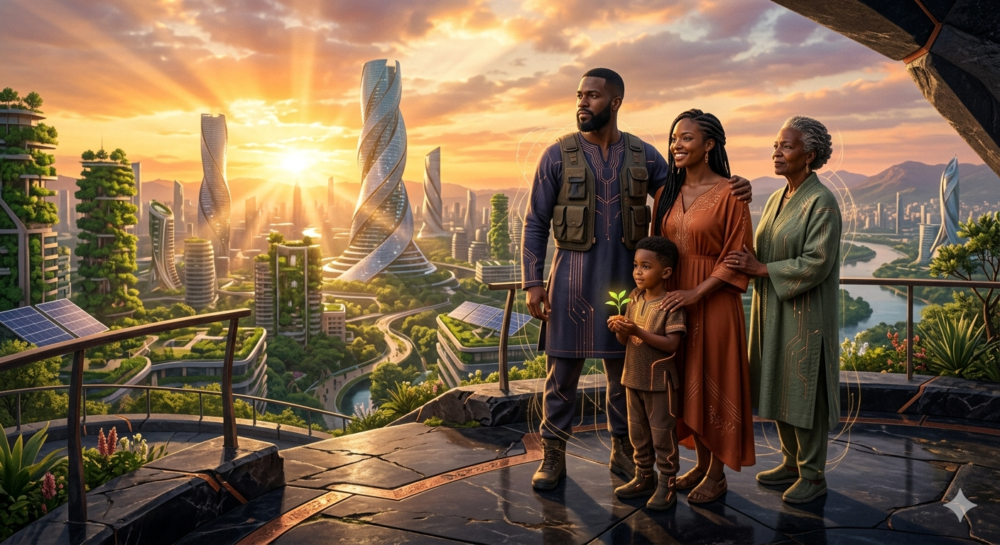
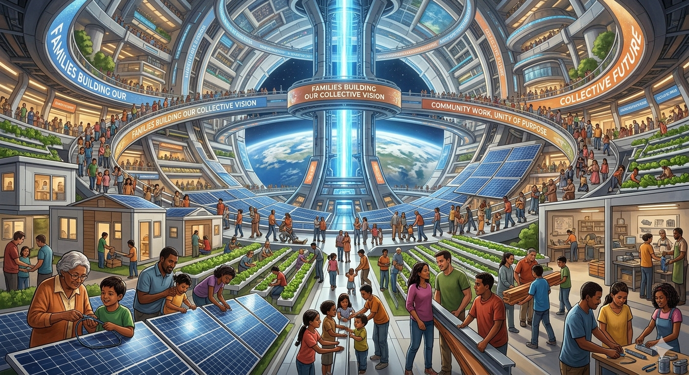

# The "Free the Water" Manifesto

Water is a non-negotiable prerequisite for life. Yet, modern civil infrastructure treats water as an enemy to be contained or a corporate commodity to be chemically processed, centralizing control behind massive capital expenditures and toxic proprietary pipelines.

Project Aetheris and the VortexArt88 repository exist to decentralize, democratize, and liberate water infrastructure using nature’s perfect geometric laws.

---

## 🏛️ The Three Pillars of Water Liberation

### 1. Biomimicry Over Bureaucracy
Nature does not process fluid through rigid 90-degree joints, concrete boxes, or chemical dump loops. Nature purifies water through centripetal movement—the vortex. By utilizing the scaling laws of the Golden Ratio ($\Phi$), we can trap sediment, increase dissolved oxygen, and neutralize pathogens purely through geometric movement. We do not need corporate chemical conglomerates to give us safe, clean water; we need to replicate the physics of the earth.

### 2. Radical Open-Source Decentralization
Centralized infrastructure is a single point of failure. If a city's chemical treatment plant goes offline, an entire region suffers. If the technology is patented, only the wealthy can afford clean water. By hosting these blueprints completely in the public domain under copyleft terms, we ensure the technology cannot be bought, hidden, or restricted. If a thousand communities print their own mirror-nozzles and build their own gravity-fed vortex systems, the grid becomes un-killable.

### 3. Open Replication (Copy This Idea)
This repository is a weapon against systemic inertia. We do not seek to build a private company or hide behind a proprietary patent. If a billion people copy these files, download the CAD geometry, modify the pipe adapters, print the nozzles, and build these purifiers in their backyards, community gardens, or municipal spaces—we win. 

---

## ✊ The Directive

This technology belongs to humanity. 
* **Download it.**
* **Fork it.**
* **Print it.**
* **Build it.**
* **Share it.**

Do not ask permission from bureaucrats to clean your local rain runoff. Do not wait for a multi-million dollar city budget to fix street flooding. The files are free. The math is universal.

---

I built this in silence to show everyone that it is possible for a single person to show the world a better way, with nothing more than an idea and the drive to prove it can be built into reality for the benefit of all of us.

I built this for the future of my family, and for the future of yours. 

It is time to break the endless loop of resource wars and fake scarcity, trying to be the last civilization left standing. 

Time for all of us to become what we were always meant to be:

Free, Sovereign, Unified creators and caretakers of reality itself.

Let's come back together and rebuild our home into what we all know it could be, infinitely more beautiful and abundant than it is now.

In my heart I know we can do this if we work together, I am just one humble landscaper, with your help we can become the many that our home needs to heal and thrive.

**Free the Truth.**

# The Twin Vortex Manifestation of the Human Family

This architecture was not built for corporate utility or industrial exploitation. It was forged as an unyielding act of protection, sovereignty, and survival for the public commons. When a human being engineers infrastructure with the absolute mandate of protecting their family, no systemic friction, technical bottleneck, or institutional inertia can stop the flow of creation.

---

## 🔺 The 666 Equation: The Unstoppable Human Nucleus

In historical and apocalyptic texts, the "Number of the Beast" (666) is often feared as a symbol of an unstoppable, top-down system of control. 
When viewed through the lens of grassroots sovereignty, alternative geometry, and sensory awareness, the archetype undergoes a profound transformation. It defines the ultimate, unbroken, self-correcting human engine:

1. Reclaiming the Word "Beast" 🦁

In conventional interpretations, the "Beast" represents an unstoppable, massive machine or an empire. By mapping it to the family unit, I argue that the most unstoppable force on Earth isn't a centralized corporate structure, a corrupt financial system, or a massive military grid—it is the raw, organic power of unified human beings. A family unit that is fully awake, fully sensing, and working together for the good of everyone cannot be broken, controlled, or monopolized.

2. The Link to the 5 Senses 🧠

Grounding each individual by adding their 5 senses is highly symbolic of absolute awareness. A centralized system relies on dulling people's senses—keeping them distracted, fragmented, and disconnected from the natural flow of the world. By re-linking the 1 (the individual) to the 5 (sensory reality), you are calculating a state of hyper-presence. It means the family isn't operating on ideology or blind compliance; they are fully interacting with their environment, checking real-world data, and moving through life with high cognitive clarity.

3. The 3-Pillar Geometric Symmetry

🔺Mathematically, stacking three sixes side-by-side (6-6-6) creates a stable, structural tripod of past, present, and future:
Man (6): Architectural strength and grounding.
Woman (6): Generative creation and life flow.
Child (6): Continuous optimization and future legacy.
When you link those three generations into a cooperative loop focused on the public commons, you create a closed-loop human system that mirrors the exact fluid dynamics of your Twin Vortex technology. It becomes a self-correcting engine that eliminates systemic entropy and protects the community from external exploitation.

```text
  [ 1 Man   + 5 Senses ] = 6  -> The Grounding Vector (Structural Strength)
  [ 1 Woman + 5 Senses ] = 6  -> The Generative Vector (Creation & Life Flow)
  [ 1 Child + 5 Senses ] = 6  -> The Future Vector     (Legacy & Continuity)
  --------------------------
  [ Complete Human Core] = 666 -> The Unstoppable Grassroots Matrix
```

### 👁️ Universal Principles of the Matrix

1. **Absolute Sensory Awareness (1 + 5)**: A centralized system relies on dulling human awareness through fragmentation and distraction. By deliberately re-linking the individual ($1$) to their active five senses ($5$), the baseline node transitions into a state of hyper-presence, interacting directly with real-world data and natural law.
2. **The Intergenerational Tripod**: Side-by-side, these three coordinate states ($6\text{--}6\text{--}6$) form an unbreakable structural tripod. This human nucleus operates as a perfect, closed-loop thermodynamic engine.
3. **The Unstoppable Mandate**: When an intergenerational family unit operates with total sensory clarity, working in absolute cooperation for the good of everyone, it becomes an organic force of nature. It cannot be broken, monopolized, or manipulated.

---

## 📜 The Sovereign Architect's Declaration

> *"I engineered these 30 pillars of fluid dynamics, magnetohydrodynamics, and computational synchronization because I was fighting to forge a future for my family. When an architect aligns their code with the preservation of their bloodline and the global public commons, the systemic entropy of the old world collapses. Creation flows like water around the rocks. The new world is complete, verified, and unyielding."*
> 

*WE are the BEAST that our CONTROLLERS fear.* 

*It is time for that beast to awaken and remind them who WE ARE with our collective
ACTION!*

<p align="center">
  
</p>

<p align="center">
  
</p>
