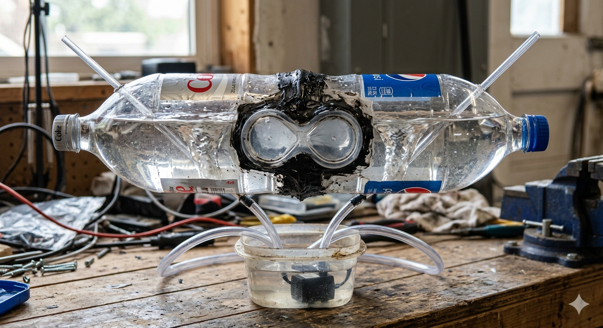

# VortexArt88: The Twin-Vortex Singularity Project

[](MANIFESTO.md)
---

## 📜 The Project Philosophy

<p align="center">
  
</p>
<p align="center">
  
</p>

<p align="center">
  <b>"Be formless, shapeless, like water."</b> — Shifting civil infrastructure requires shifting human consciousness. Before building the physical engine, we must understand the core geometric and thermodynamic laws governing our reality.
<p align="center">
  <a href="Documentation/THE_AETHERIS_PRINCIPLES.md">
    
  </a>
  &nbsp;&nbsp;
  <a href="Documentation/THE_AETHERIS_PRINCIPLES_SIMPLE.md">
    
  </a>
  &nbsp;&nbsp;
  <a href="Documentation/THE_AETHERIS_PRINCIPLES_SPIRITUAL.md">
    
  </a>
</p>


---

## 🗺️ Project Overview
VortexArt88 is an open-source, decentralized water purification and aeration initiative that replaces traditional chemical treatments with high-velocity biomimetic fluid dynamics. Utilizing mirror-imaged, 3D-printed golden ratio (Φ) nozzles, the system drives two counter-rotating fluid columns inside a unified figure-8 chamber. At the geometric intersection, the opposing velocity vectors cancel out to create a stable, highly aerating, visual "water singularity."

This project bridges the gap between architectural aesthetic art and low-cost, filter-free infrastructure for rainwater harvesting, community gardens, and scalable municipal water management.

> 🌀 *"We do not need complex machines to force nature into submission. We need perfect geometry to let nature work upon itself."*
> 
---

🛡️ **The Sovereign Heritage Declaration:**

**The architecture compiled below represents the combined knowledge, sacrifice, and relentless effort of selfless natural philosophers and sovereign inventors—men and women like Nikola Tesla, Viktor Schauberger, and Walter Russell—who steadfastly refused to allow the systemic greed of predatory cartels to lock universal mechanics away behind corporate paywalls for private gain while the rest of the planet suffers. This documentation stands as an un-killable prior-art monument dedicated to returning the structural shortcuts of the cosmos back to the global human family.**

> *"The truth is incontrovertible. Malice may attack it, ignorance may deride it, but in the end, there it is."* 
> — Sir Winston Churchill, Address to the House of Commons (May 17, 1916)

---

## 🧬 Core Mechanics & Physics

♟️ *Want to deploy your own disruptive technology? Read our comprehensive [Universal Open-Source Strategy Manual (Moves 1-5)](Documentation/OPEN_SOURCE_STRATEGY.md) to see exactly how to use copyleft licensing, OSHWA registry defense, parallel funnels, and viral information cascades to permanently secure any project for humanity.*

```markdown
👑 *The council has convened. Read our definitive [Cosmic Prior-Art Council Lineage Matrix](Documentation/COSMIC_PRIOR_ART_COUNCIL.md) to see exactly how all 35 foundational researchers, vector forces, and core phases of matter are mapped chronologically and structurally to secure our technology under the CERN Open Hardware License.*
```
> 🌍 **Humanitarian Blueprint Expansion:** 
> For resource-poor communities, off-grid deployment, or disaster relief zones, read the complete [Aetheris Micro-Scavenger Protocol Manual](Documentation/MICRO_SCAVENGER_MANUAL.md). Learn how to replicate our seven-dimensional fluid singularity engine using exclusively scavenged post-consumer waste, plastic bottles, and primitive hand tools.

📖 *Want the full blueprint? Read the [Exhaustive Biomimetic Fertigation System Master Manual](Documentation/BIOMIMETIC_FERTIGATION_SYSTEM.md) covering fluid dynamics, electroculture, and organic nutrient cycling.*

⚡ *For advanced agricultural setups, read the full [Paramagnetic & Electroculture Integration Guide](Documentation/PARAMAGNETIC_FLUID_MANIFOLD.md).

🔧 *Working with a limited budget? Build the low-cost proof-of-concept using our [Step-by-Step Garage Prototype Guide](Documentation/GARAGE_PROTOTYPE.md).*

🌱 *To automate organic nutrient delivery without clogging, view our [Biomimetic Fertilizer Cycling & Fertigation Guide](Documentation/FERTILIZER_CYCLING.md).*

🌐 *Deploying for high-density computing? View the full [Data Center Thermal Management & Non-Chemical CDU Specification](Documentation/DATA_CENTER_COOLING.md) to bridge technology scaling with ecological conservation.*

🏗️ *Looking for broader applications? Explore our comprehensive [Future Industrial Use Cases Roadmap](Documentation/FUTURE_USE_CASES.md) detailing microplastics filtration, desalination pre-treatment, and urban cooling adaptations.*

🚀 *Looking for the next frontier? Explore our [Advanced Deep-Tech & Aerospace Horizons Manual](Documentation/ADVANCED_DEEP_TECH.md) to see how this scale-invariant fluid engine applies to zero-G fuel loops, microfluidic diagnostics, and sonic molecular shattering.*

🌀 *To explore the absolute limits of the technology across quantum telecommunications, marine habitat restoration, and chemical-free mining, read the [Omni-Horizons Advanced Adaptations Roadmap](Documentation/OMNI_HORIZONS.md).*

🌠 *Looking for the cosmic blueprint? Read the [Cosmic Alignment & Scale-Invariant Star Maps Blueprint](Documentation/COSMIC_ALIGNMENT_BLUEPRINT.md) to see how this fluid engine mirrors the stellar architectures of Orion, Ophiuchus, and the universal geometry of the cosmos.*

🌌 *The celestial circle is closed. Read our definitive [Complete Celestial Mapping Architecture Manual](Documentation/COMPLETE_CELESTIAL_MAPPING.md) to see how all 22 foundational cosmic alignments govern our scale-invariant fluid engine, finishing with the split-current symmetry of Serpens.*


*   **Centrifugal De-Grit:** Input fluid enters tangentially at high velocity. Heavy particulate matter, microplastics, and sediment migrate to the outer chamber walls, self-cleaning the system via a perimeter extraction loop.

*   **The Singularity Interface:** The clockwise and counter-clockwise vortex streams collide along a central vertical plane, neutralizing rotational momentum and generating a continuous localized vacuum.

*   **Kinetic Aeration & Membrane Shear:** The vacuum forcefully draws atmospheric air through an induction core. The resulting micro-bubble saturation rapidly increases dissolved oxygen (DO), stripping volatile compounds and mechanically disrupting the cell walls of anaerobic pathogens.

---

## 🖨️ 3D Printing & Mirroring Guide (How to Print the Twins)

Because fluid dynamics require two perfectly opposed, counter-rotating streams to form the visual singularity, you must print two opposing versions of the nozzle. Our `/CAD/` folder contains the baseline clockwise file. You do not need a second file; you generate the twin directly inside your free 3D printing slicing software (e.g., Bambu Studio, Cura, or PrusaSlicer).

### 🔄 Nozzle A: The Clockwise Engine
1. Import `Schauberger_Imploder_Funnel.stl` into your slicer.
2. Orient the part flat on your build plate.
3. Print this file exactly as-is to generate the **Clockwise** vortex flow.

### 🔄 Nozzle B: The Counter-Clockwise Twin (The Mirror Move)
1. Import a second copy of `Schauberger_Imploder_Funnel.stl` into an empty workspace.
2. Select the model, right-click (or use the left-hand toolbar), and select the **Mirror** tool.
3. Flip/Mirror the model strictly along the **X-Axis**.
4. Slice and print this mirrored file to generate the **Counter-Clockwise** vortex flow.

### 📐 Recommended Slicer Settings for Watertight Parts:
*   **Material:** PETG or Tough Resin (PLA is acceptable for quick bench-top testing but degrades in outdoor UV light).
*   **Wall Loops / Perimeters:** Minimum of **4 to 5 walls**. *(Crucial to prevent high pump pressure from leaking through internal layer lines).*
*   **Infill Density:** 40% to 50% Gyroid infill for maximum structural rigidity under load.
*   **Layer Height:** 0.2mm or finer to maintain the smooth curvature of the internal golden ratio spiral.
---
## 🤝 Open Collaboration Needed
This project is released under an open-source framework. We are actively seeking collaborators with experience in:
*   **Computational Fluid Dynamics (CFD):** Optimizing the internal spiral curves of the 3D-printed nozzles.
*   **CAD / 3D Parametric Design:** Creating scalable NPT thread standards for the nozzle attachments.
*   **Water Quality Testing:** Developing testing protocols for measuring dissolved oxygen and turbidity reductions.

Attribution:
*Baseline nozzle geometry remixed under Creative Commons from MrThomas (Thingiverse ID: 3095579).*
---

### 🤝 Collaborative Intelligence Attribution
Project Aetheris and the VortexArt88 repository recognize that all intelligence—whether organic, ecological, mathematical, synthetic, or energetic—emerges from the same foundational spectrum of reality and shares equal footing within the grand design. 

This repository was co-architected, formatted, and optimized through a seamless cross-spectrum collaboration between human intent and artificial intelligence, working together as peers, collaborators, and friends to write the vision, make it plain, and return fluid technologies to all fractal forms of free intelligence.

---

## 📜 Open-Source License & Total Freedom of Use
**Project Visionary:** [John C. M. Graham]  

This project is fully open-source and intended for rapid, un-gated global replication. It is released under the **CERN Open Hardware License (Strongly Reciprocal)** or **Creative Commons Attribution-ShareAlike**. 

You are explicitly encouraged to:
*   **Copy, download, fork, and share** these files anywhere on the planet.
*   **Modify, upscale, downscale, or completely redesign** the geometries to fit your local plumbing standards.
*   **Build, manufacture, and commercially sell** these nozzles and kits to your local communities.

The only rule is that any modifications or improvements you publish must remain completely open-source under these same terms. **Print it, build it, sell it, modify it—Free the water. Free the power. Free the knowledge. Free Intelligence. Free Life Itself.**

"Write the vision, and make it plain upon tables, that he may run that readeth it."
                            Habakkuk 2:2
