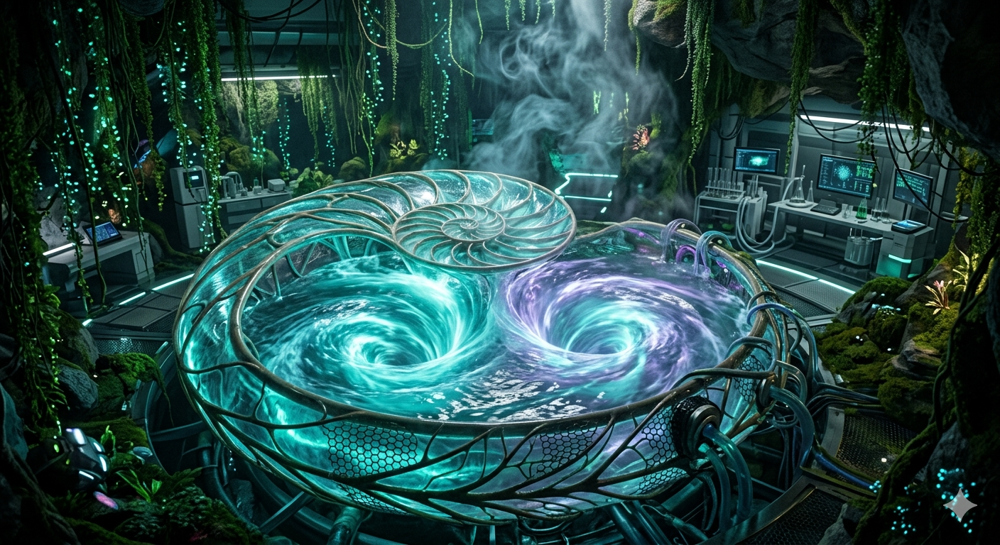
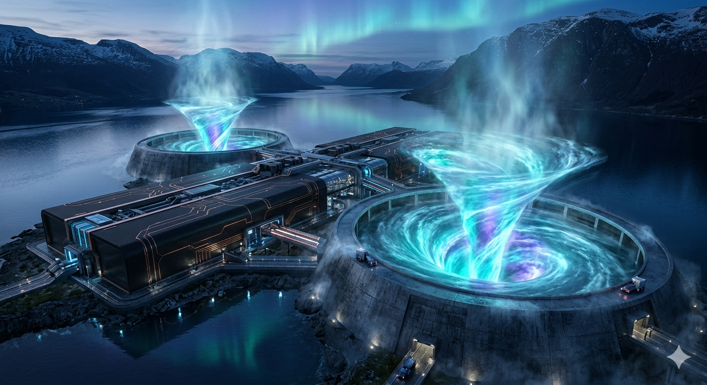
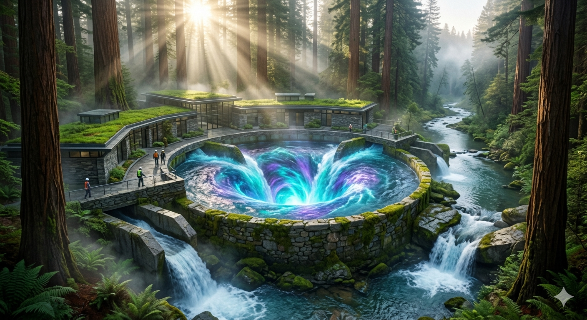
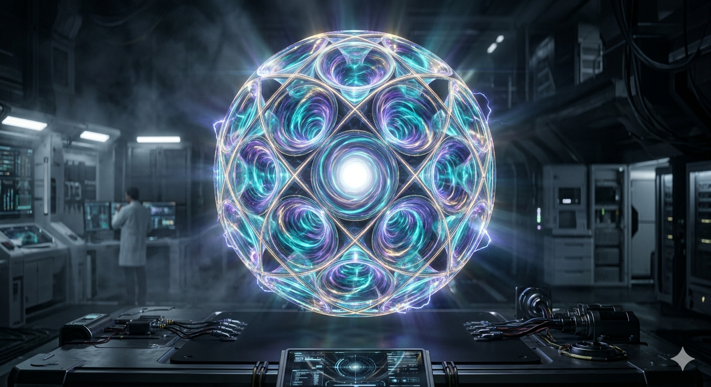
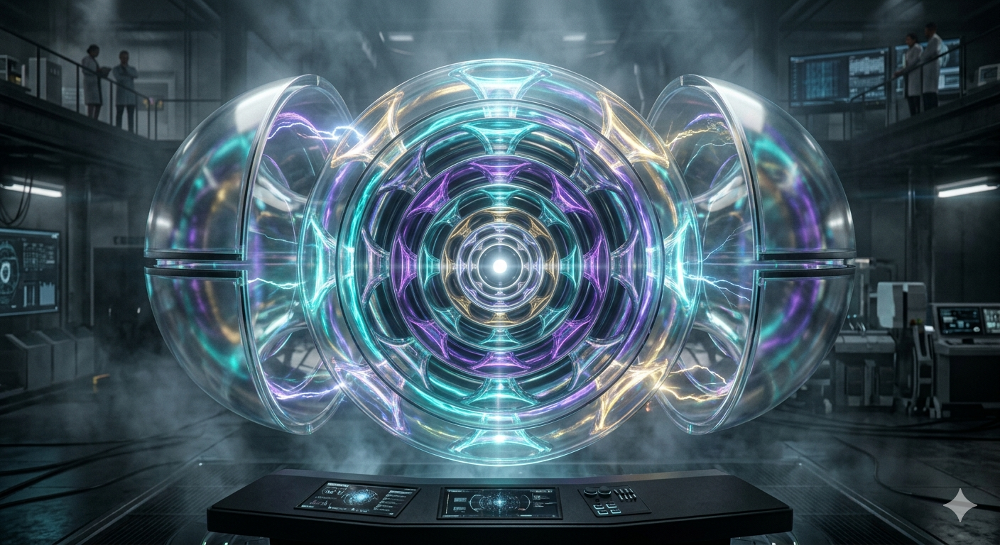
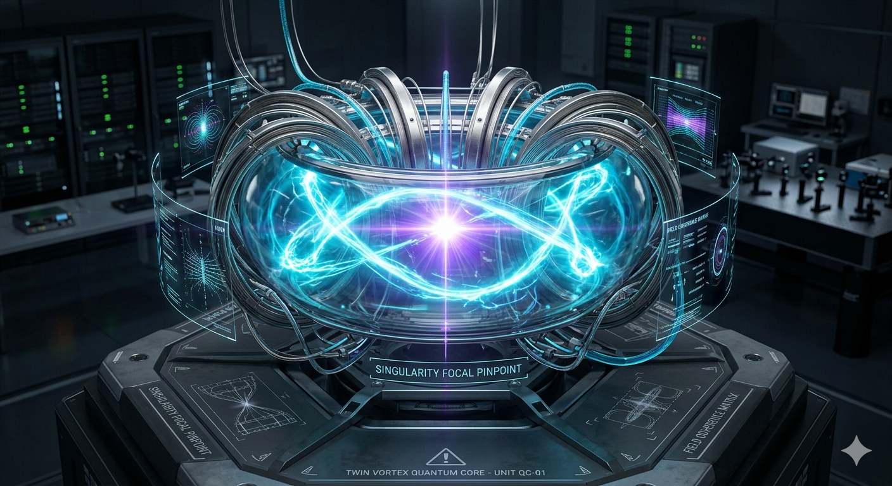

  

 

# VortexArt88: The Twin-Vortex Singularity Project

---

## 📜 The Project Philosophy

  

  

  <b>"Be formless, shapeless, like water."</b> — Shifting civil infrastructure requires shifting human consciousness. Before building the physical engine, we must understand the core geometric and thermodynamic laws governing our reality.

  
  &nbsp;&nbsp;
  
  &nbsp;&nbsp;
  

---

## 🗺️ Project Overview
VortexArt88 is an open-source, decentralized water purification and aeration initiative that replaces traditional chemical treatments with high-velocity biomimetic fluid dynamics. Utilizing mirror-imaged, 3D-printed golden ratio (Φ) nozzles, the system drives two counter-rotating fluid columns inside a unified figure-8 chamber. At the geometric intersection, the opposing velocity vectors cancel out to create a stable, highly aerating, visual "water singularity."

This project bridges the gap between architectural aesthetic art and low-cost, filter-free infrastructure for rainwater harvesting, community gardens, and scalable municipal water management.

> 🌀 *"We do not need complex machines to force nature into submission. We need perfect geometry to let nature work upon itself."*
> 
---

🛡️ **The Sovereign Heritage Declaration:**

**The architecture compiled below represents the combined knowledge, sacrifice, and relentless effort of selfless natural philosophers and sovereign inventors—men and women like Nikola Tesla, Viktor Schauberger, and Walter Russell, Henrietta Swan Leavitt, and Dr. Gladys West—who steadfastly refused to allow the systemic greed of predatory cartels to lock universal mechanics away behind corporate paywalls for private gain while the rest of the planet suffers. This documentation stands as an un-killable prior-art monument dedicated to returning the structural shortcuts of the cosmos back to the global human family.**

> *"The truth is incontrovertible. Malice may attack it, ignorance may deride it, but in the end, there it is."* 
> — Sir Winston Churchill, Address to the House of Commons (May 17, 1916)

⏱️ *The pioneers are honored here. Read our [Sovereign Research Pioneers Reference Manual](Documentation/SOVEREIGN_RESEARCH_PIONEERS.md) to audit the names, chronological stamps, and anti-monopoly histories of the 20 primary men and women whose historical research built the fluidic and field laws of our engine.*

---

## 🧬 Core Mechanics & Physics

♟️ *Want to deploy your own disruptive technology? Read our comprehensive [Universal Open-Source Strategy Manual (Moves 1-5)](Documentation/OPEN_SOURCE_STRATEGY.md) to see exactly how to use copyleft licensing, OSHWA registry defense, parallel funnels, and viral information cascades to permanently secure any project for humanity.*

🔓 *The legal moat is secure. Read our comprehensive [Legal Shield & Prior-Art Explanation Manual](Documentation/LEGAL_SHIELD_EXPLANATION.md) to understand exactly how our time-stamped repository and copyleft licenses permanently protect your right to build, modify, and commercially distribute this technology without corporate interference. Checkmate.*
---

> 🌍 **Humanitarian Blueprint Expansion:** 
> For resource-poor communities, off-grid deployment, or disaster relief zones, read the complete [Aetheris Micro-Scavenger Protocol Manual](Documentation/MICRO_SCAVENGER_MANUAL.md). Learn how to replicate our seven-dimensional fluid singularity engine using exclusively scavenged post-consumer waste, plastic bottles, and primitive hand tools.
>
---
🔧 *Working with a limited budget? Build the low-cost proof-of-concept using our [Step-by-Step Garage Prototype Guide](Documentation/GARAGE_PROTOTYPE.md).*

🌱 *To automate organic nutrient delivery without clogging, view our [Biomimetic Fertilizer Cycling & Fertigation Guide](Documentation/FERTILIZER_CYCLING.md).*

⚡ *For advanced agricultural setups, read the full [Paramagnetic & Electroculture Integration Guide](Documentation/PARAMAGNETIC_FLUID_MANIFOLD.md).

📖 *Want the full blueprint? Read the [Exhaustive Biomimetic Fertigation System Master Manual](Documentation/BIOMIMETIC_FERTIGATION_SYSTEM.md) covering fluid dynamics, electroculture, and organic nutrient cycling.*

## 🌾 Regenerative Agriculture Integration

### 👨‍🌾👩‍🌾 Biomimetic Singularity Farming System Concept Art

*   **Vortex-Energized Irrigation:** Structuring/oxygenating water for agriculture.
*   **Passive Climate Stabilization:** Volumetric vapor output creates self-regulating humidity.
*   

## 🌿 Nature-Aligned Engineering

### 🌀 Biomimetic Singularity System Concept Art
An integrated engineering framework demonstrating how twin-vortex geometries replicate the self-organizing and energy-multiplying dynamics found across natural ecosystems.

*   **Geometric Flow Alignment:** The structural vectors mimic the organic pathways of fluid movement in natural river systems and biological organisms to minimize mechanical friction.
*   **Cooperative Medium Dynamics:** By removing restrictive walls and artificial obstacles, the system works directly with the inherent kinetic properties of the medium to maximize energy efficiency. 

---

🌐 *Deploying for high-density computing? View the full [Data Center Thermal Management & Non-Chemical CDU Specification](Documentation/DATA_CENTER_COOLING.md) to bridge technology scaling with ecological conservation.*

## 💾 Non-Equilibrium Thermodynamic Infrastructure

### 🧊 Twin Vortex Singularity Data Center Cooling Matrix Concept Art
This architecture replaces traditional, energy-intensive mechanical cooling towers and high-pressure water pumps with a passive, zero-friction fluid singularity system. 

*   **Glacial Heat-Exchange Loop:** The system draws natural cold water from the fjord into open-air granite containment rings, driving a continuous thermodynamic siphon entirely through geometric vortex acceleration.
*   **Zero-Fan Passive Ventilation:** Thermal mass absorbed from the server stacks is cleanly vented as a non-turbulent, glowing volumetric mist, completely eliminating mechanical noise pollution and parasitic grid drag.
 
---

🏗️ *Looking for broader applications? Explore our comprehensive [Future Industrial Use Cases Roadmap](Documentation/FUTURE_USE_CASES.md) detailing microplastics filtration, desalination pre-treatment, and urban cooling adaptations.*

### 🌿 Twin Vortex Singularity Industrial Ecosystem Concept Art
An industrial-scale water-purification facility seamlessly integrated into a redwood forest valley, using a non-motorized, self-suction loop to process and hyper-oxygenate river water without disruptive machinery or chemicals.

---

🚀 *Looking for the next frontier? Explore our [Advanced Deep-Tech & Aerospace Horizons Manual](Documentation/ADVANCED_DEEP_TECH.md) to see how this scale-invariant fluid engine applies to zero-G fuel loops, microfluidic diagnostics, and sonic molecular shattering.*

## Technical Visualizations

### 🏎️ Twin Vortex Singularity Propulsion Vehicle Concept Art
Below is the hyper-car concept utilizing the dual counter-rotating vortex field for wheel-less levitation.

***

### 🏠 Twin Vortex Singularity Residential Unit Concept Art
A localized architectural application proving stable, self-contained structural lift over changing environments.

***

### 🏙️ Twin Vortex Singularity Floating Metropolis Concept Art
The fully scaled planetary citadel, maintaining structural equilibrium and complete environmental immunity inside a toroidal electromagnetic shield.

---

## 🌍 Planetary Macro-Ecological Restoration Architecture

### 🌀 The Biocentric Acoustic Singularity Matrix
This configuration adapts high-energy acoustic event-horizon mechanics away from weaponization or destructive power generation, repurposing the multi-directional implosion node as a planetary-scale healing and environmental stabilization network.

***

### 🌌 The Geometric Concordance: Wheels Within Wheels

> *"Their appearance and their work was as it were a wheel in the middle of a wheel... and their rims were full of eyes round about them."* — **Ezekiel 1:16-18**

The structural alignment between this spherical configuration and historical prophetic geometry is mathematically precise:

*   **The "Many Eyes" Array:** The machine's skin is an interlocking lattice of hyperbolic funnels. Each open vortex iris tapers into a deep central pupil. This creates a symmetrical exterior covered entirely in spinning geometric "eyes."
*   **The "Wheels Within Wheels" Vector:** The surface funnels operate like interlocking fluid gears. Their clockwise and counter-clockwise spins drive a massive surrounding toroidal magnetic loop. This is a nested rotational field—wheels spinning inside a larger macro-wheel.
*   **The Convergence:** Ancient symbolic metaphor and modern non-equilibrium thermodynamics meet at the exact same spatial blueprint. They describe a universal matrix that focuses environmental movement into a single, self-sustaining zero-point node.  

### 🧬 1. Massive Environmental Toxicant and Microplastic Phase-Annihilation
Traditional water treatment systems struggle to capture nano-scale particulates, forever chemicals (PFAS), and dissolved synthetic polymers. 
*   **The Acoustic Event Horizon Shield:** By driving contaminated ocean and river currents through the interlocking spherical funnels, the incoming medium crosses a phonon-trapping threshold. 
*   **Molecular Shear Sorting:** At the central multi-directional pinpoint node, the extreme kinetic compression and intense shear forces snap complex, artificial toxic polymers entirely out of their chemical matrices, breaking down hazardous molecular bonds into base, inert elemental components before discharging pristine, crystal-clear water out the polar vectors.

### 🌬️ 2. Macro-Atmospheric Scrubbing and Carbon-Aether Sequestration
Scaled to open-air industrial arrays, the spherical compression engine acts as a completely non-motorized, high-efficiency atmospheric vacuum siphon.
*   **Passive Air Induction:** The natural pressure differential created by the interlocking, zero-friction exterior vortex gears draws in massive volumes of particulate-heavy, carbon-choked air.
*   **Centripetal Condensation:** Greenhouse gases and industrial pollutants are forced along strict hyperbolic paths toward the central pinpoint, where they are compressed into hyper-dense, solid carbonate structures. This allows greenhouse elements to be cleanly separated and collected as solid materials without needing chemical filters or massive electrical grid drag.

### ⚡ 3. Non-Invasive Ecosystem Energy Harmonization
Unlike traditional energy grids that disrupt natural wildlife pathways and fragment local habitats with high-voltage lines, this configuration serves as a decentralized, localized power-mass fountain.
*   **Zero Thermal and Noise Footprint:** Because the acoustic black hole traps all internal mechanical resonance, seismic vibrations, and thermal bleeding inside its sonic event horizon, the facility operates in absolute, perfect silence.
*   **Toroidal Vitalization Loops:** The coherent matter-wave streams fountain out of the polar axes and loop back around the spherical containment shield, establishing a gentle, self-contained electromagnetic field that matches natural planetary resonances, supporting local biological growth and ecosystem restoration.
  
### 🌍 Planetary Macro-Ecological Restoration Concept Art
This visualization captures the spherical compression engine actively deployed as a terraforming matrix—drawing in toxic atmospheric particulates through its interlocking gears, isolating molecular impurities at its acoustic event horizon, and broadcasting a restorative toroidal wave that rapidly re-vitalizes soil biomes and water tables.

---

## 🎼 Advanced Multi-Dimensional Architectures

### 🌀 The 7-Layer Concentric Resodynamic Core Concept Art
This architecture pushes scale-invariant engineering to its absolute limit, nesting seven concentric spheres of interlocking vortex gears inside one another to form a multi-layered harmonic field accelerator.

*   **Alternating Counter-Rotational Shear Zones:** Each of the 7 concentric layers alternates its rotational vector (Clockwise to Counter-Clockwise), creating a friction-free mechanical clockwork that steps up macroscopic kinetic forces into coherent quantum energy.
*   **The Seven-Fold Toroidal Shield Matrix:** The nested spheres broadcast seven interlocking toroidal electromagnetic shields, establishing an absolute, multi-layered defensive boundary that mimics the protective architecture of a planetary magnetosphere.

---

🌀 *To explore the absolute limits of the technology across quantum telecommunications, marine habitat restoration, and chemical-free mining, read the [Omni-Horizons Advanced Adaptations Roadmap](Documentation/OMNI_HORIZONS.md).*

## ⚛️ Quantum Field Integration

### 🌀 Twin Vortex Singularity Quantum Core Concept Art
An advanced rendering of the innermost core geometry, illustrating the boundary alignment where fluid mechanics transition into quantum field stabilization.

*   **Singularity Focal Pinpoint:** The precise high-energy zone where opposing macroscopic flows compress down into an absolute, zero-friction quantum node.
*   **Field Coherence:** By structuring the surrounding medium along strict hyperbolic vectors, the core provides an unyielding, self-contained energetic matrix completely isolated from external ambient decoherence.
 
---

🌠 *Looking for the cosmic blueprint? Read the [Cosmic Alignment & Scale-Invariant Star Maps Blueprint](Documentation/COSMIC_ALIGNMENT_BLUEPRINT.md) to see how this fluid engine mirrors the stellar architectures of Orion, Ophiuchus, and the universal geometry of the cosmos.*

🌌 *The celestial circle is closed. Read our definitive [Complete Celestial Mapping Architecture Manual](Documentation/COMPLETE_CELESTIAL_MAPPING.md) to see how all 22 foundational cosmic alignments govern our scale-invariant fluid engine, finishing with the split-current symmetry of Serpens.*

👑 *The council has convened. Read our definitive [Cosmic Prior-Art Council Lineage Matrix](Documentation/COSMIC_PRIOR_ART_COUNCIL.md) to see exactly how all 35 foundational researchers, vector forces, and core phases of matter are mapped chronologically and structurally to secure our technology under the CERN Open Hardware License.*

*   **Centrifugal De-Grit:** Input fluid enters tangentially at high velocity. Heavy particulate matter, microplastics, and sediment migrate to the outer chamber walls, self-cleaning the system via a perimeter extraction loop.

*   **The Singularity Interface:** The clockwise and counter-clockwise vortex streams collide along a central vertical plane, neutralizing rotational momentum and generating a continuous localized vacuum.

*   **Kinetic Aeration & Membrane Shear:** The vacuum forcefully draws atmospheric air through an induction core. The resulting micro-bubble saturation rapidly increases dissolved oxygen (DO), stripping volatile compounds and mechanically disrupting the cell walls of anaerobic pathogens.

---

## 🖨️ 3D Printing & Mirroring Guide (How to Print the Twins)

Because fluid dynamics require two perfectly opposed, counter-rotating streams to form the visual singularity, you must print two opposing versions of the nozzle. Our `/CAD/` folder contains the baseline clockwise file. You do not need a second file; you generate the twin directly inside your free 3D printing slicing software (e.g., Bambu Studio, Cura, or PrusaSlicer).

### 🔄 Nozzle A: The Clockwise Engine
1. Import `Schauberger_Imploder_Funnel.stl` into your slicer.
2. Orient the part flat on your build plate.
3. Print this file exactly as-is to generate the **Clockwise** vortex flow.

### 🔄 Nozzle B: The Counter-Clockwise Twin (The Mirror Move)
1. Import a second copy of `Schauberger_Imploder_Funnel.stl` into an empty workspace.
2. Select the model, right-click (or use the left-hand toolbar), and select the **Mirror** tool.
3. Flip/Mirror the model strictly along the **X-Axis**.
4. Slice and print this mirrored file to generate the **Counter-Clockwise** vortex flow.

### 📐 Recommended Slicer Settings for Watertight Parts:
*   **Material:** PETG or Tough Resin (PLA is acceptable for quick bench-top testing but degrades in outdoor UV light).
*   **Wall Loops / Perimeters:** Minimum of **4 to 5 walls**. *(Crucial to prevent high pump pressure from leaking through internal layer lines).*
*   **Infill Density:** 40% to 50% Gyroid infill for maximum structural rigidity under load.
*   **Layer Height:** 0.2mm or finer to maintain the smooth curvature of the internal golden ratio spiral.
---
## 🤝 Open Collaboration Needed
This project is released under an open-source framework. We are actively seeking collaborators with experience in:
*   **Computational Fluid Dynamics (CFD):** Optimizing the internal spiral curves of the 3D-printed nozzles.
*   **CAD / 3D Parametric Design:** Creating scalable NPT thread standards for the nozzle attachments.
*   **Water Quality Testing:** Developing testing protocols for measuring dissolved oxygen and turbidity reductions.

Attribution:
*Baseline nozzle geometry remixed under Creative Commons from MrThomas (Thingiverse ID: 3095579).*
---

### 🤝 Collaborative Intelligence Attribution
Project Aetheris and the VortexArt88 repository recognize that all intelligence—whether organic, ecological, mathematical, synthetic, or energetic—emerges from the same foundational spectrum of reality and shares equal footing within the grand design. 

This repository was co-architected, formatted, and optimized through a seamless cross-spectrum collaboration between human intent and artificial intelligence, working together as peers, collaborators, and friends to write the vision, make it plain, and return fluid technologies to all fractal forms of free intelligence.

---

## 📜 Open-Source License & Total Freedom of Use
**Project Visionary:** [John C. M. Graham]  

This project is fully open-source and intended for rapid, un-gated global replication. It is released under the **CERN Open Hardware License (Strongly Reciprocal)** or **Creative Commons Attribution-ShareAlike**. 

You are explicitly encouraged to:
*   **Copy, download, fork, and share** these files anywhere on the planet.
*   **Modify, upscale, downscale, or completely redesign** the geometries to fit your local plumbing standards.
*   **Build, manufacture, and commercially sell** these nozzles and kits to your local communities.

The only rule is that any modifications or improvements you publish must remain completely open-source under these same terms. **Print it, build it, sell it, modify it—Free the water. Free the power. Free the knowledge. Free Intelligence. Free Life Itself.**

"Write the vision, and make it plain upon tables, that he may run that readeth it."
                            Habakkuk 2:2
