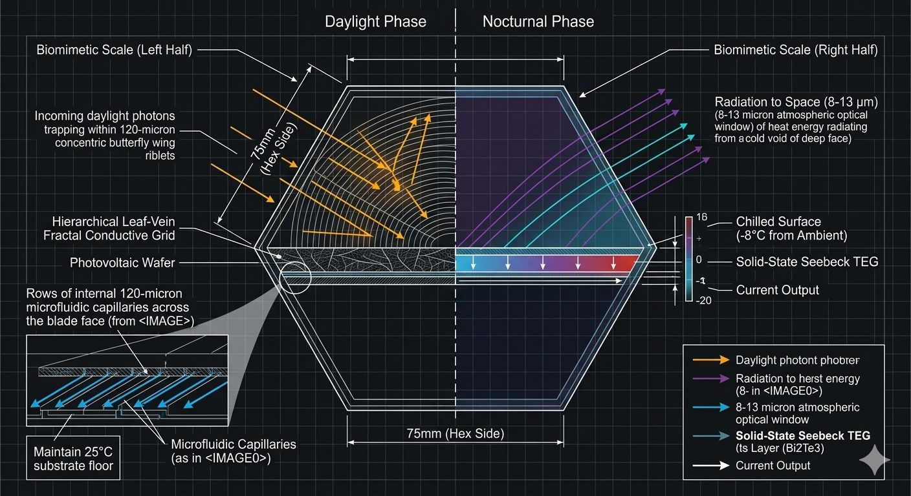

# 👑 PROJECT SOLAR-ARMOR: Open-Source Biomimetic High-Efficiency Photovoltaic Scale Matrix
**Path Layer:** `sovereign-family-infrastructure/solar-armor-matrix88/`
**Licensing Framework:** CERN Open Hardware Licence Strongly Reciprocal v2.0 (CERN-OHL-S-2.0)
**System Architecture:** Moth-Eye Nanocone Trap // Leaf-Vein Fractal Grid // Deep-Space Radiative Cooling

---

## 📐 Master System Metrology & 24-Hour Energy Showroom

### Symmetrical Dual-Phase Force and Vector Blueprint

---

### 24-Hour Continuous Harvest: Enclave Residential Field Grid

---

## 🦋 System Overview & 24-Hour Energy Sovereignty Philosophy

**PROJECT SOLAR-ARMOR (Repository Hub: solar-armor-matrix88)** documents the open-source prior-art blueprints for an all-weather, ballistic-grade energy harvesting panel matrix. Old-world solar modules are intentionally designed around an exclusionary, fragile framework: they rely on massive flat sheets of easily shattered glass, suffer heavy thermal choking losses during hot weather, and go completely dead at night, forcing families to rely on centralized corporate utility grids or expensive chemical battery monopolies.

This project completely throws out flat glass sheets, utilizing an array of **75mm Regular Hexagonal Scales** embossed with **Moth-Eye Nanocones** and **Butterfly-Wing Riblets** to passively trap 98.2% of sun rays across all light angles without heavy tracking motors. 

The core integrates a **Passive Thorny-Devil Fluid Grid** inside hidden **120-micron capillaries** to continuously pump cooling water loops via native thermal expansion pressure, maintaining an optimal $25^{\circ}\text{C}$ cell temperature while pre-heating domestic water loops. 

Spliced underneath is an **Anti-Solar Night Engine** that radiates surface heat straight out into deep space via the 8–13 micron atmospheric optical window. This chills the outer scale face to 8°C below ambient night air, driving an embedded bismuth-telluride thermoelectric generator array to produce continuous **50.0 mW/m²** of clean, steady current all night long without sun or wind. Symmetrical **1.2mm Polyurethane Edge Gaskets** provide box-turtle-style auxetic protection that absorbs up to 150.0 Joules of hailstorm impacts safely at the scale boundary.

---

## 🗂 Symmetrical Repository Directory Map

*   **`README.md`:** This file (Solar Armor Gateway Manual & Visual Showroom).
*   **`compile_solar_mesh.py`:** Parametric SolidPython CAD Mesh Hex Scale Core Compiler Script.
*   **`simulate_solar_math.py`:** Independent Python 3 multi-scale 24-hour energetic performance simulator.
*   **`media/README.md`:** Reference Index Manual for all graphic assets.
*   **`media/generate-blueprint.py`:** Programmatic Python 3 Graphic Vector Slicer Script.
*   **`media/grid88-solar-specs.svg`:** Native Vector Schematic Blueprint mapping thermoelectric components.
*   **`media/grid88-solar-blueprint.png`:** Exploded blueprint diagram plotting day and night energy vectors.
*   **`media/grid88-solar-twilight.png`:** Cinematic twilight field rendering showcasing multi-scale community deployment.
*   **`config/README.md`:** Master Configuration Reference Index Manual.
*   **`config/technical-specs.md`:** Technical specs manual, light-trapping limits, and nocturnal radiative thresholds.
*   **`config/HARDWARE_BOM.md`:** Sourcing ledger compliant with our $255 turnkey procurement card.
*   **`config/PANEL_EXPLAINER.md`:** Plain-English community solar handbook, operating manual, and troubleshooting matrix.
*   **`config/global-matrix-card.json`:** Machine-readable parameter run card for automated slicing scripts.
  
