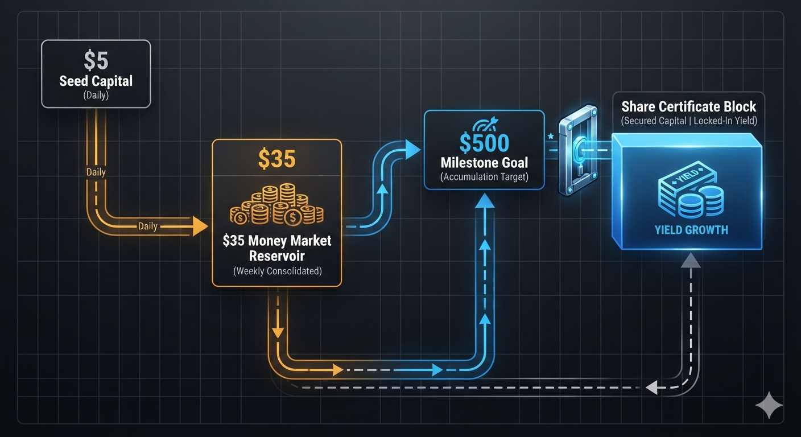
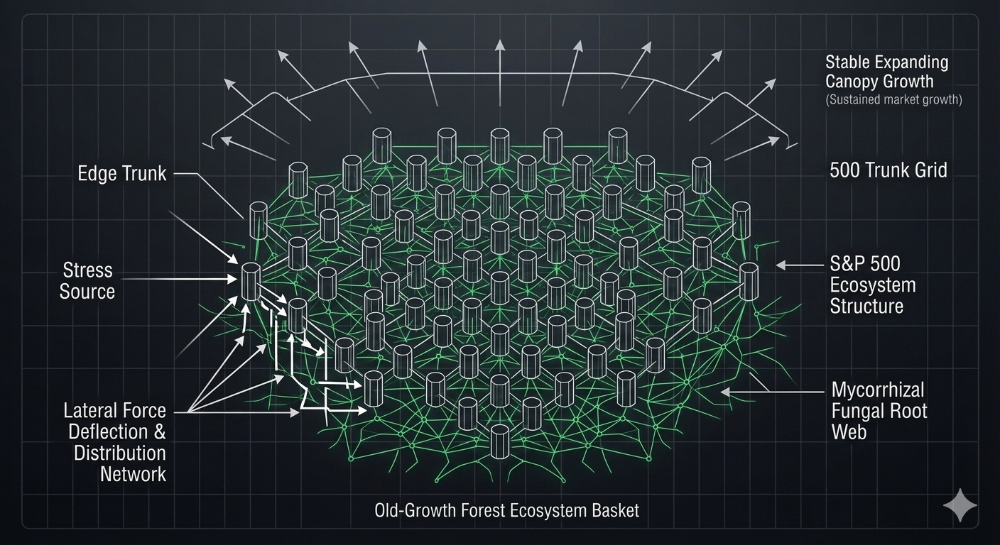
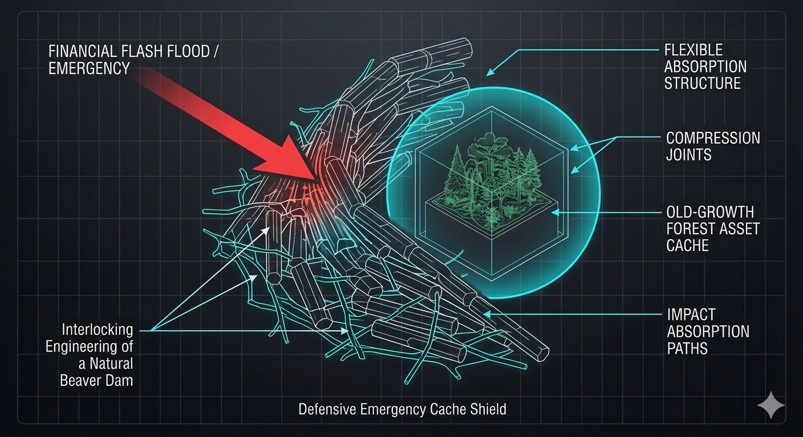
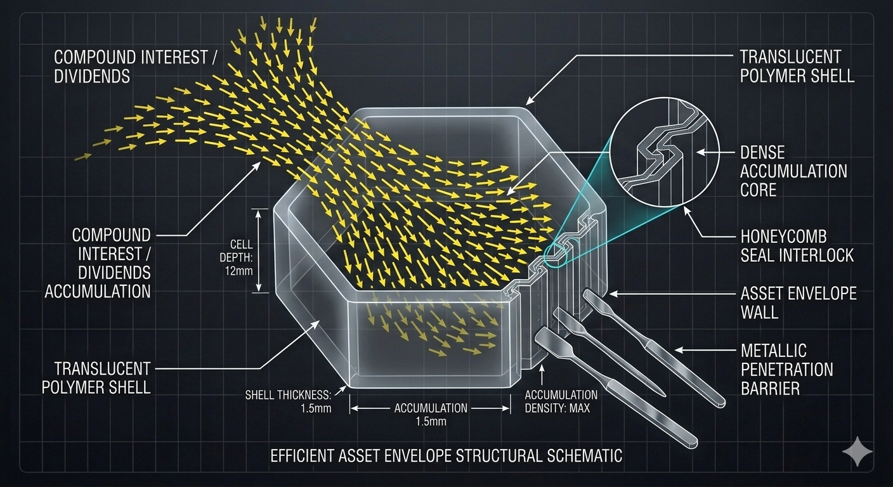

# 👑 PROJECT FINANCE-MATRIX: Open-Source Biomimetic Asset Management & Capital Stacking Blueprints
**Path Layer:** `sovereign-family-infrastructure/biomimetic-financial-strategy88/`
**Licensing Framework:** CERN Open Hardware Licence Strongly Reciprocal v2.0 (CERN-OHL-S-2.0)
**System Architecture:** Credit Union Progress-Stacking // Old-Growth Forest Index Baskets // Roth IRA Tax Shields

---

## 📐 Master System Metrology & Financial Showroom

### Symmetrical Progress-Stacking Pipeline

---

### Old-Growth Forest Broad Indexing Strategy

---

### The Beaver-Dam Emergency Buffer Shield

---

### The Hexagonal Honeycomb Fee Lock Envelope

---

## 🌿 System Overview & Global Economic Autonomy Philosophy

**PROJECT FINANCE-MATRIX (Repository Hub: biomimetic-financial-strategy88)** establishes the definitive open-source prior-art blueprints for a software-free, anxiety-free capital stacking, passive income investment, and asset management framework. Old-world retail banking channels and speculative Wall Street day-trading systems are intentionally designed around an exclusionary, high-wear framework: they rely on high-frequency market timing, volatile stock picking, hidden account fees, and double-taxation paths that bleed away family wealth, locking economic independence behind centralized corporate banking walls.

This project completely simplifies independent financial self-defense by mimicking the self-regulating survival laws of nature. Your capital management is reorganized into a living, balanced ecosystem:

1. **The Cactus Root Savings Matrix (The Progress Stack):** Automates a steady, low-impact $5-a-day ($35/week) cash inflow out of basic checking into a high-yield fluid credit union Money Market account reservoir, automatically freezing cash into 4.5% promotional Share Certificate ice-blocks every time the balance hits $500.00 to crush inflation.

2. **The Mushroom Root Web (The Automated Cash Sweep):** Links your checking account to a zero-fee automated program so that loose, un-spent leftover pennies at the end of every 30-day cycle are automatically "pulled" down the underground tracking lines and swept straight into your long-term investment matrix.

3. **The Old-Growth Forest Basket (Passive Income Indexing):** Discards speculative single-company stock gambles for a broad-basket S&P 500 Index Fund (like VOO or FXAIX). This basket holds the 500 largest corporate trunks in America all at once, netting a historical $\approx 8.0\%$ to $10.0\%$ APY compound growth curve. If one tree catches a disease and drops, the surrounding root grid and giant canopy trunks absorb the shock natively.

4. **The Hexagonal Honeycomb Seal (The Expense Ratio Cap):** Wraps all your long-term assets strictly inside low-cost ETFs carrying an expense ratio of $\leq 0.03\%$ per year. This regular cell geometry uses the absolute leanest fee footprint possible, sealing your wealth envelope airtight from corporate fee scrapers.

5. **The Beaver Dam Emergency Buffer Guard:** Enforces a mandatory liquid cushion of exactly 6 months of basic living expenses held inside your credit union money market reservoir *prior* to scaling out market investments, bending to absorb unexpected life emergencies software-free.

6. **The Symbiotic Sucker-Fish Loop (Active Side Income):** Uses your home workshop desktop 3D printer to manufacture our high-margin, consumable **Self-Sharpening Arborist Saw Blades** out of raw carbon-nylon filament. By pulling a clear $80.50 cash profit per unit off the massive energy budgets of local tree crews, you draw clean revenue straight back onto your bench to fund your next industrial equipment upgrades for zero out-of-pocket cost.

7. **The Tax-Shield Shroud (Asset Management Architecture):** Wraps your broad-market forest investments inside a **Self-Directed Roth IRA Account Shield**. By funding the basket with post-tax dollars, the entire compound interest curve grows in total darkness from tax collectors, allowing you to withdraw 100% of your multi-generational wealth completely tax-free.

---

## 🗂 Symmetrical Repository Directory Map

*   **`README.md`:** This file (Financial Strategy Gateway Manual & Visual Showroom).
*   **`compile_finance_mesh.py`:** Python 3 Parametric Solid Core OpenSCAD Slicing Compiler.
*   **`simulate_savings_compounding.py`:** Python 3 Comprehensive Multi-Scale Asset Accumulation Simulator Script.
*   **`config/README.md`:** Reference Index Manual for all parameter cards.
*   **`config/local-stacking-ledger.md`:** Westland MI Credit Union progressive compounding spec sheets.
*   **`config/INDEX_EXPLAINER.md`:** Plain-English Community Guide to Broad-Market Forest Indexing.
*   **`config/TAX_SHIELD_GUIDE.md`:** Professional Asset Management and Roth IRA Shroud Protocol.
*   **`config/global-finance-card.json`:** Machine-readable JSON tracking APY limits, inflation buffers, and expense caps.
*   **`media/README.md`:** Reference Index Manual for all graphic assets.
*   **`media/generate-blueprint.py`:** Programmatic Python 3 Graphic Vector Slicer Script.
*   **`media/grid88-aquatic-specs.svg`:** Native Vector Schematic Blueprint mapping components.
*   **`media/grid88-fin-stack.png`:** Flowchart visualization of the progress-stacking credit union pipeline.
*   **`media/grid88-fin-forest.png`:** Schematic blueprint of the old-growth forest index root network.
*   **`media/grid88-fin-buffer.png`:** Mechanical load diagram of the beaver-dam emergency cash cushion.
*   **`media/grid88-fin-honeycomb.png`:** Geometric illustration of the honeycomb expense ratio cap envelope.
  
