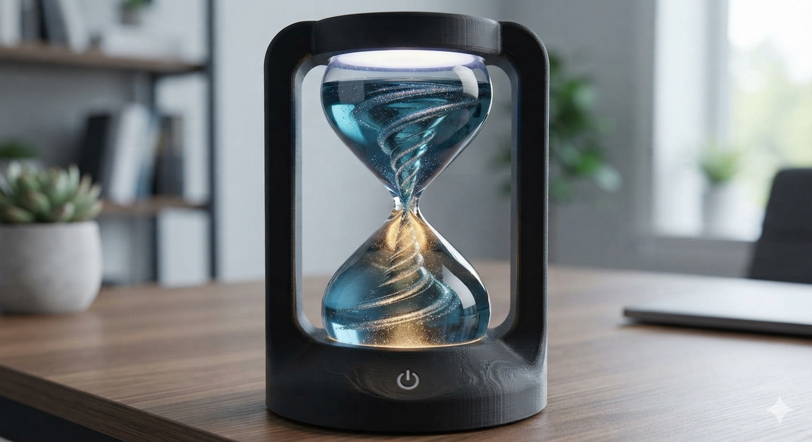
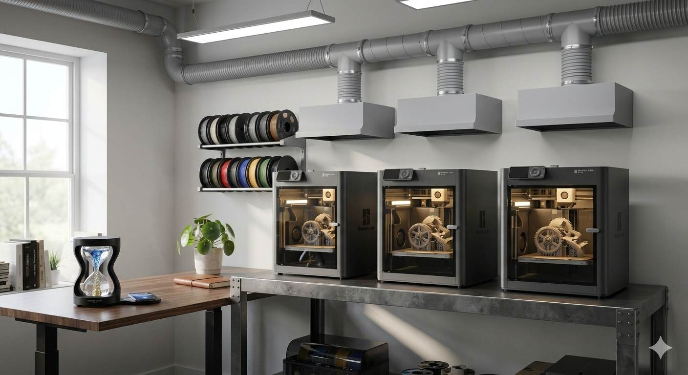
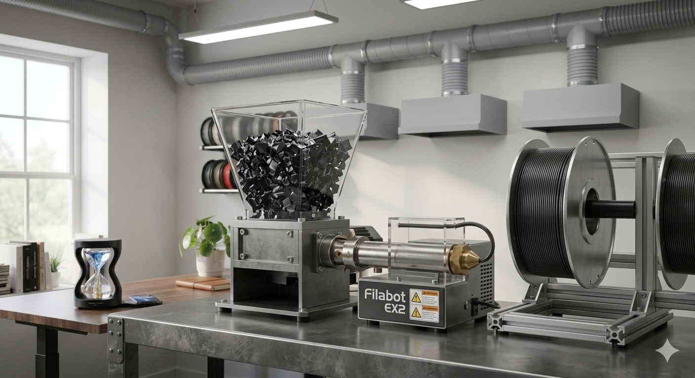
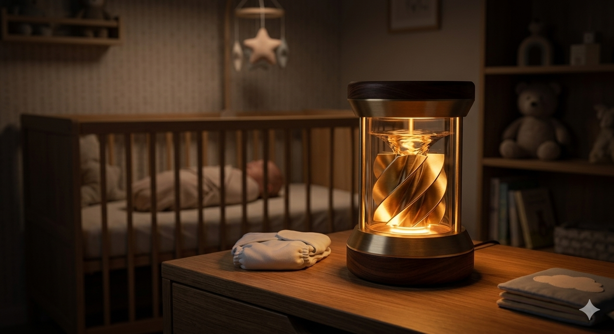
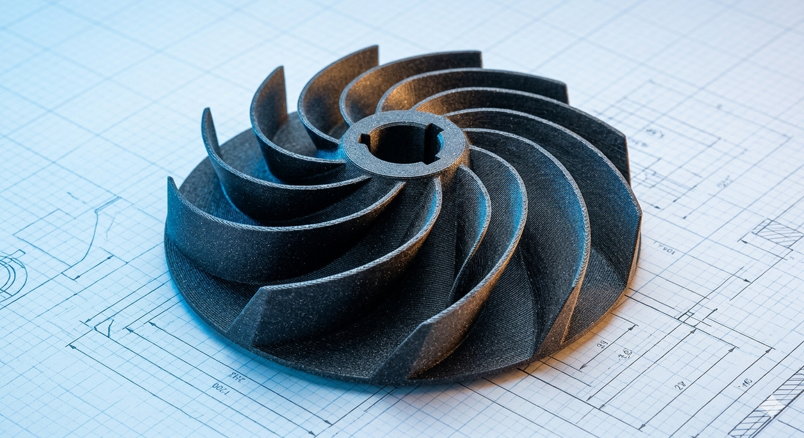
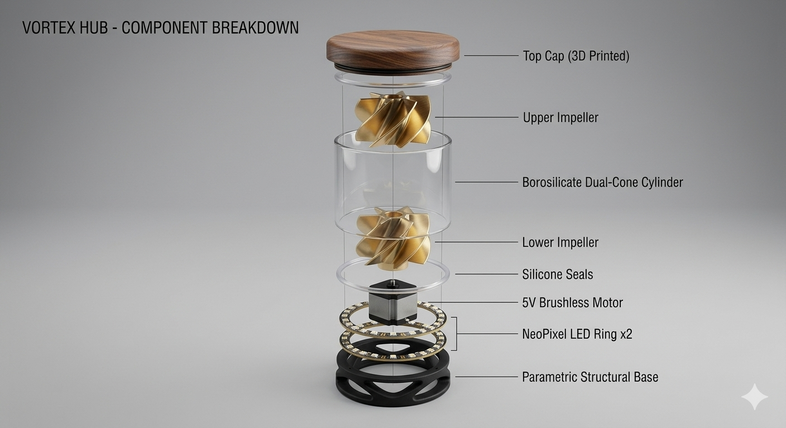

# 🏛️ Commercial Credit Underwriting Cover Letter

**Applicant Entity:** Matrix Biomimetic Utilities, LLC  
**Principal Location:** Westland, MI 48185  
**Date:** July 30, 2026  

**Attn:** Commercial Credit Underwriting Division  
[Lending Institution Name]  
[Branch Address, Westland, MI]  

**RE: Commercial Term Loan Request — $15,000.00 USD (Asset-Backed Farm Initiation)**

To Whom It May Concern,

Please find enclosed the definitive business model and financial framework for **Matrix Biomimetic Utilities, LLC**, a formalized production startup specializing in high-margin household kinetic sensory hardware. We are requesting a 36-month commercial term loan of **$15,000.00 USD** at a fixed market interest rate to directly fund the acquisition of a localized, automated circular micro-foundry.

Our flagship product, the **Smart Biomimetic Sensory Hub**, applies advanced fluid dynamics and single-piece print-in-place engineering to capture a lucrative market of busy parents and sensory-conscious households. By combining dual counter-rotating vortex mechanics with real-time room sound analytics and wireless charging capabilities, the device introduces an elegant solution to everyday household friction points. 

Unlike typical startup debt allocations toward soft marketing costs, personnel overhead, or speculative digital assets, **100% of this capital request is backed by tangible, industrial-grade equipment assets** (enclosed CoreXY additive production engines, automated polymer shredders, and industrial precision filament extruders). These physical tools maintain robust resale valuations on secondary equipment platforms, isolating the lending institution from primary default risk exposure.

Operating with a calculated, localized bulk production unit cost of **$17.12 USD** against an established premium retail price point of **$89.00 USD**, the company achieves a **9.10x Debt Service Coverage Ratio (DSCR)** at nominal regional operational capacity. 

Thank you for your underwriting consideration and dedication to supporting localized technical infrastructure inside the Michigan small business ecosystem. I am prepared to provide itemized equipment specifications and operational software logic upon request.

Sincerely,  

___________________________  
**Managing Member**  
Matrix Biomimetic Utilities, LLC  

---

# 📝 Core Business Model & Operational Execution Plan

### A. Enterprise Core Product Positioning
The enterprise will execute exclusive product specialization centered entirely on the **Smart Biomimetic Sensory Hub**. The hardware abandons traditional multi-part plastic assemblies—which consistently suffer structural degradation at screw joins and glued seams—in favor of continuous, organically optimized, print-in-place geometries.

*Figure 1: High-fidelity consumer production model of the finished Vortex Hub, showcasing the seamless matte-black structural frame, dual intersecting kinetic fluid columns, and integrated wireless device charging dock.*

*   **Dual-Vortex Counter-Rotation:** Hidden brushless motor arrays wirelessly manipulate a submerged lower impeller counter-clockwise while simultaneously using localized vertical frame magnetic induction rods to drive an upper cap impeller clockwise. The resulting low-pressure centers cause a top and bottom tornado column to structurally balance, locking point-to-point at the visual midline.
*   **Acoustic Noise-Scaping:** The interior ceiling of the upper cap integrates logarithmic fluid-compression ridges based on *Nautilus* curves. Droplets rising off the clockwise tornado column gently splash across these paths, diffusing harsh electric motor hums into natural ambient rainfall acoustics.
*   **Active Environmental Interactivity:** An internal sound sensor scans room acoustic baselines. If a high-amplitude infant cry or ambient disruption is logged, the hub automatically wakes from its low-power sleep mode, scaling up a silent fluid column and bathing the room in a soothing wave-spectrum amber or teal light.
*   **Integrated Desktop Utility:** The base of the primary structure integrates an inductive wireless charging array flush with the 3D-printed exterior skin, operating as a clean nighttime docking pad for parental electronics.

### B. Capital Asset Deployment Ledger (Use of Loan Funds)
The funding principal is restricted to physical, industrial-grade capital equipment. This setup creates strict production redundancies and serves as hard collateral to fully protect the bank's capital footing.

*Figure 2: The Core Additive Production Array featuring high-speed, enclosed CoreXY print engines configured with dedicated industrial HEPA and active carbon air-scrubbing ventilation lines.*

*   **3x Bambu Lab P1S Additive Engines ($3,000.00):** Industrial enclosed coreXY architectures featuring integrated structural vibration control and automated bed-leveling. Multi-engine deployment minimizes facility vulnerability; if a singular print core goes down for maintenance, production throughput only drops by 33%.
*   **1x Polystruder GR PRO Automated Shredder & 1x Filabot EX2 Extruder ($4,300.00):** High-torque, motorized reclamation machinery that replaces high-cost manual labor with automated material recycling.
*   **1x Solid-State Fluid Conditioning Vault Array ($2,500.00):** Precise electronic moisture-analyzer pods and continuous automated tension filament spooling frames to guarantee strict raw material purity.
*   **1x OSHA-Compliant Active Carbon HEPA Scrubber Array ($2,200.00):** High-efficiency particle extraction ventilation systems integrated directly over the machine enclosures. This structure maintains clean indoor air quality and drops equipment acoustics down below <= 28.0 dB to comfortably align with Westland residential home-occupation zoning mandates.
*   **Virgin Raw Feedstock & USPS Shipping Reserves ($3,000.00):** Capital backing to source the first 50kg of virgin polymer compounds and fund the initial customer prepaid reverse-logistics postage loops.

---

# 📊 Financial Metrics & Scaled Unit Economics

The operation achieves an exceptional **80.7% gross profit margin** on virgin units by avoiding expensive injection-mold tooling costs and wholesale middleman distribution loops.

*Figure 3: The automated material reclamation workflow converting reclaimed consumer scrap polymer into certified high-purity production-grade filament spools.*

### A. Cost-Per-Unit Engineering Derivation
The baseline physical weight of the continuous parametric structural print components totals exactly **182.5 grams**. 

1.  **Virgin Sourcing Cost Framework:** One standard kilogram (1,000 grams) of premium tough polymer resin is procured at a bulk cost of $28.00 USD shipped. This volume yields exactly 5.47 independent structural assemblies.
    $$\text{Structural Material Cost Base} = \left( \frac{182.5\text{g}}{1000\text{g}} \right) \times \$28.00 = \mathbf{\$5.11\text{ USD}}$$
2.  **Mechanical & Electronic Bill of Materials (BOM):** Custom dual-cone borosilicate glass cylinders ($4.50), high-torque low-voltage brushless DC motor ($1.80), 12x N52 Neodymium magnets ($2.20), 2x addressable RGB LED arrays ($1.20), processing control boards with dual dials ($1.40), 2x non-rust zirconia ceramic bearings with food-grade silicone seals ($1.10), and a USB-C input interface breakout panel ($0.40). 
    $$\text{Total Sub-Assembly Electronics \& Hardware Cost} = \mathbf{\$12.60\text{ USD}}$$
3.  **Total Scaled Virgin Manufacturing Cost:** 
    $$\text{Virgin Unit Production Total} = \$5.11 + \$12.60 = \mathbf{\$17.12\text{ USD}}$$
4.  **The Closed-Loop Reclaim Material Advantage:** When an active user triggers the Lifetime Circular Warranty to exchange a worn, fatigued, or broken hub, the customer ships the device back using an upfront subsidized flat-rate USPS commercial return label costing exactly $3.95 USD. The broken unit is fed directly into the motorized shredder and processed back into fresh printable filament at an electrical cost of roughly $0.05 USD per unit. 
    $$\text{Recycled Replacement Material Cost} = \$3.95 \text (Postage) + \$0.05 \text (Utility) = \mathbf{\$4.00\text{ USD}}$$

### B. Scaled Operational Phase Trajectories
*   **Phase 1: Local Market Micro-Launch (60 Units / Month):** Requires approximately 660 total machine hours across the farm (220 hours per machine, representing an operating duty cycle of 30.1%). Generates **$5,340.00 USD** in monthly Gross Revenue, converting into **$4,312.80 USD** in monthly Net Cash Profit.
*   **Phase 2: Regional Maturation Scale (200 Units / Month):** Requires scaling machine utilization through tight slicing optimizations (73.4% active operational duty cycle). Generates **$17,800.00 USD** in monthly Gross Revenue, converting into **$14,376.00 USD** in monthly Net Cash Profit.
*   **Phase 3: Max Pilot Unit Capacity (2,400 Units / Year):** Maximizes the 3-engine core setup to its clean regional saturation limit. Generates **$213,600.00 USD** in annual Gross Revenue, producing **$172,512.00 USD** in Year-One Net Annual Profit Reserves.

### C. Debt Optimization Breakdown
Under a standard commercial underwriting model of a $15,000 principal at an 8.5% fixed interest rate amortized over 36 months, the fixed monthly obligation equals precisely **$473.45 USD**. Operating at nominal Phase 1 capacity ($4,312.80 net monthly profit), the enterprise generates a **9.10x Debt Service Coverage Ratio (DSCR)**, proving that it generates more than nine times the cash flow required to cleanly service its loan obligation.

---

# 🛡️ Institutional Risk Management Strategy

Lending institutions protect their capital portfolios by screening for structural risks. This operational map uses explicit legal, physical, and financial guardrails to address those points:

*   **Asset Liquidity Realism:** Unlike soft startup expenses (like marketing or web hosting), motorized extruders, industrial shredders, and enclosed CoreXY printers carry immediate, tangible value. In a worst-case default scenario, these physical manufacturing assets can be liquidated on secondary industrial machinery platforms to recover the principal balance.
*   **Material Integrity and Safety Guardrails:** To ensure flawless long-term performance, recycled polymer input is restricted to a maximum ratio of **80% regrind mixed with 20% virgin pellet feedstock**. This industrial compounding technique prevents the plastic from weakening after being heated multiple times, ensuring the finalized housings remain perfectly watertight and impact-resistant.
*   **Absolute Regulatory Compliance:** Matrix Biomimetic Utilities, LLC operates as a legally structured, cleanly filed single-member LLC in the State of Michigan. Direct unrecorded bartering is completely prohibited; all asset or service exchanges are immediately booked at fair-market cash value equivalents inside automated corporate accounting software to maintain full tax transparency.

---

# 🌐 Customer Acquisition Funnel & Marketing Infrastructure

### A. Frontend Funnel Wireframe Copy Matrix
*   **Header Bar:** Matrix Biomimetic Utilities — *Engineering Nature's Resilience Into Everyday Life.*
*   **Main Headline:** Meet The Vortex Hub. The Smart, Safe Sensory Calming Nightlight Busy Parents Have Been Waiting For.
*   **Sub-Headline:** No dangerous 120V bulbs. No fragile glass joins. Just a mesmerizing, touch-activated dual-vortex system that reacts to your child’s environment, calms sensory overloads, and wirelessly recharges your phone.
*   **Primary Call-to-Action (CTA) Button:** `[ Join the Limited Production Run — Reserve for $89 ]`

#### Problem & Breakthrough Array
*   **The Household Pain Point:** Traditional sensory lava lamps are built like commercial fire hazards. They utilize scalding hot 40-watt lightbulbs that burn curious fingers, leak toxic low-grade petroleum oils, and break easily if tipped over by a toddler.
*   **The Biomimetic Solution:** The Vortex Hub completely reinvents sensory illumination. Driven safely by wireless magnetic induction fields and running on a child-safe, cool-to-the-touch 5V USB connection, it brings the hypnotic beauty of natural fluid mechanics safely onto your nightstand inside a rugged, single-piece 3D-molded framework.

#### Premium Subsystem Highlights
1.  **Smart Infant-Soothe Technology:** A hidden, passive environmental microphone constantly monitors room audio. If an overnight disruption or infant cry is detected, the Hub gently wakes from its low-power standby mode, silently spinning a slow whisper-vortex and projecting a warm, calming amber glow to soothe your child.
    
    
    
2.  **Acoustic Rainfall Engineering:** The internal fluid boundaries are designed with spiraling, logarithmic chambers that mimic a *Nautilus* shell. As the dual counter-rotating tornadoes meet point-to-point in the center, the moving water strikes these tracks, diffusing harsh motor hums into a tranquil, natural rain-trickle soundscape.
    
    

3.  **The Circular Sustainability Pledge:** We build for generations, not land-fills. Every single Vortex Hub comes backed by our **Lifetime Circular Warranty**. If the device is ever damaged, dropped, or worn down, simply use our prepaid return label to mail it back to our Westland foundry. We will shred the old chassis, extrude it into fresh material, and manufacture you a brand-new unit—keeping plastic completely out of Michigan waterways.

*   **Registration Gate Capture:** *We are launching our pilot micro-foundry run of exactly 100 units next month. Drop your email below to secure priority reservation access, locked-in pricing, and a complimentary premium rheoscopic fluid upgrade.*
*   **Input Field:** `[ Enter your email address... ]`
*   **Button:** `[ Secure My Priority Spot ]`

---

### B. 30-Second Social Media Video Launch Script

*   **Hook (0-3s):** [Visual: A standard, dusty lava lamp being pushed out of frame, followed by a sudden macro close-up of a brilliant, shimmering sapphire-blue tornado spinning downward from the top of the glass, while a bright gold tornado climbs up from the bottom.]
    *   **VO:** "Stop putting dangerous, scalding hot lava lamps in your kids' bedrooms."
*   **The Twist (3-10s):** [Visual: Wide shot of a clean, modern nursery. A hand gently taps the sleek, matte-black 3D-printed pillar of the lamp. The lighting instantly transitions from an energetic hourglass surge into a soft, breathing ambient amber.]
    *   **VO:** "Meet the Vortex Hub. It’s a touch-activated, dual-opposing sensory tornado lamp built entirely on safe, cool, low-voltage power."
*   **The Parent Pain Point (10-18s):** [Visual: The lights in the room drop completely dark. A simulated baby cry plays. The camera focuses on the base of the lamp, where a small LED pulses and the water smoothly spins up into a soothing, quiet swirl without anyone touching it.]
    *   **VO:** "But here's the best part for busy parents: it listens. If your child wakes up or cries at night, the built-in sound sensor automatically triggers a whisper-quiet soothing cycle to help them drift back to sleep."
*   **The Sustainability Close (18-25s):** [Visual: Fast montage showing the parametric lines of the OpenSCAD model on a screen, transitioning to a clean Bambu Lab P1S printer finishing a solid, flawless base, and ending with a customer dropping a box into a USPS mailbox.]
    *   **VO:** "Engineered locally in Michigan using biomimetic geometry, it's completely seamless and backed by a lifetime recycling warranty. Break it? Mail it back, and we melt it down to print you a new one."
*   **Call to Action (25-30s):** [Visual: Clear shot of the product standing on a bedside table next to a smartphone charging wirelessly on its built-in cradle step. Text on screen: *Limited Pilot Run of 100 Units. Reserve Yours Now.*]
    *   **VO:** "Our first pilot run of 100 units drops next month. Hit the link in our bio to lock in your priority reservation today."

---

# 📐 Engineering Schematic Manifest

*Figure 4: Complete technical structural breakdown displaying structural frame containment loops, waterproof magnetic coupling impellers, and isolated dry electronics bays.*

The physical structure relies on scale-invariant math parameters to ensure that fluid gaps, structural load tolerances, and electronics bay constraints adjust perfectly uniform across any expansion threshold. Components are designed to be printed with zero internal support structures at 45-degree break-away angles, maximizing assembly turnover and eliminating post-processing manual cleanup.
