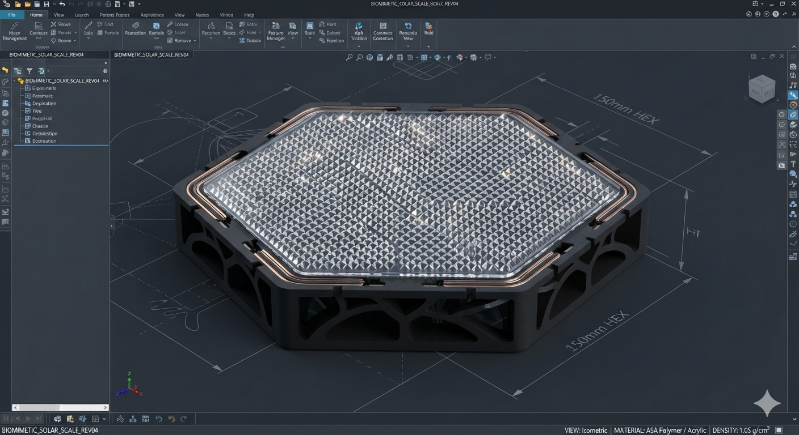
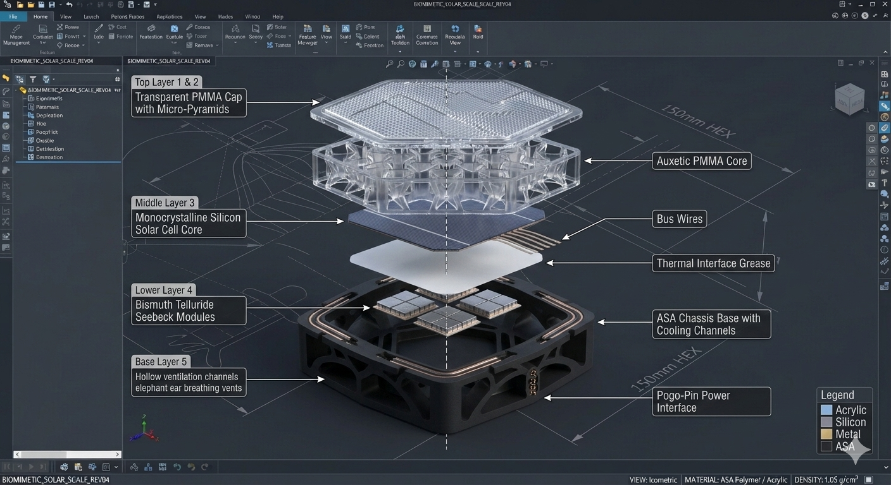
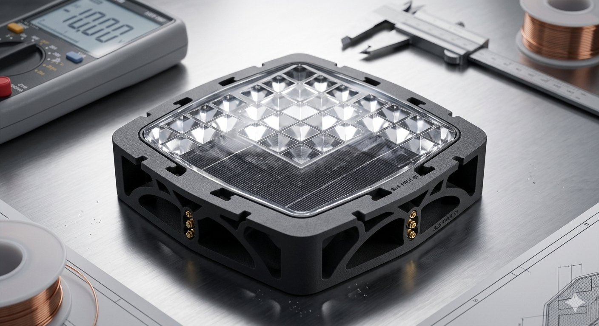
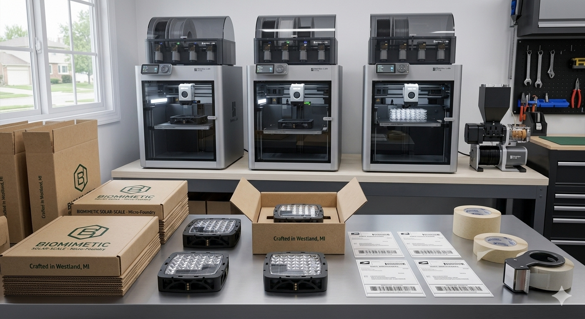

# 🏛️ Biomimetic Solar-Scale Harvesting Engine: Distributed Grid Freedom
**Enterprise Core:** Scale-Invariant Tessellating Photovoltaic, Thermoelectric, & Acoustic Matrix
**Material Safety Manifest:** 100% BPA-Free Circular PMMA (Acrylic) Metamaterial Architecture
**Project Repository Location:** /solar-scale/README.md

The centralized energy grid and traditional solar manufacturing models are built on fragile, high-overhead frameworks. 

Standard commercial solar panels are heavy, structurally rigid, and incredibly fragile. They require expensive, specialized mounting aluminum rails and invasive installation labor. More critically, traditional panels suffer from single-point circuit vulnerabilities—if a solitary cell is shaded, damaged, or cracked, the entire linear string drops in efficiency. Furthermore, standard photovoltaics suffer from absolute zero-efficiency downtime during the 12 hours of night and completely ignore the kinetic, vibrational, and acoustic energy crashing against roof surfaces from rain, heavy winds, and environmental noise.

**The Biomimetic Solar-Scale Engine shatters this dependency loop.** We replace massive, centralized panels with independent, fully tessellating, overlapping solar tiles modeled directly after **the thermodynamic and protective mechanics of reptilian scutes and overlapping pinecone bracts**. By integrating a solid-state Seebeck harvester directly into the base alongside an acoustic tympanal piezoelectric nanogenerator matrix, this scale-invariant engine produces clean electricity 24 hours a day—utilizing solar rays by day, thermal deltas by night, and structural weather vibration continuously.



---

## 🎯 1. THE PRODUCT PITCH: 24-Hour Continuous Metamaterial Energy

Traditional solar assets stop producing the moment the sun sets or cloud coverage hits. The Solar-Scale uses advanced multi-layered surface physics to bridge every environmental energy gap without relying on fragile, heavy, un-recyclable glass sheets.

```text
[ TRADITIONAL RIGID PHOTOVOLTAICS ]      [ THE BIOMIMETIC SOLAR-SCALE ]
├── High Single-Point Shade Failure      ├── Fault-Tolerant Decentralized Parallel Grid
├── Total Midnight Production Shutdown  ├── 24-Hour Seebeck Thermoelectric Harvesting
├── High Atmospheric Reflection Glare   ├── Passive Angle-Invariant Optical Acrylic Trap
└── Fragile, Non-Recyclable Glass Tops   └── BPA-Free Sustainable PMMA Surface Skin
```

### Biomimetic Multi-Layer Engineering Architecture:
*   **Layer 1: Self-Cleaning Hydrophobic Skin:** Surface utilizes sub-micron nano-textures modeled after the lotus leaf. Water drops cannot cling; they form perfect spheres, rolling down the angled scales to vacuum up dust and organic debris naturally during rainfall, completely eliminating soiling losses.
*   **Layer 2: Angle-Invariant Optical Acrylic Prisms:** Features a 3D-printed array of transparent PMMA (Acrylic) micro-pyramids. Bends oblique, low-horizon sunlight directly down into the silicon core while trapping reflected photon bounce via Total Internal Reflection (TIR), fully eliminating the need for motorized mechanical servo tracking arrays.
*   **Layer 3: Auxetic Metamaterial Armor:** Built using a negative Poisson's ratio re-entrant honeycomb grid. Under sudden impact loads (such as heavy hail strikes), the structure flows inward toward the strike zone, dynamically thickening to dissipate heavy kinetic forces safely across the outer chassis frame.
*   **Layer 4: Tympanal Frequency Harvester:** Modeled after the ultra-sensitive acoustic membranes of insect ears. Printed out of high-crystallinity Polyvinylidene Fluoride (PVDF) piezoelectric homopolymer, this micro-lattice vibrates under ambient noise, wind roar, and rain strikes, converting acoustic pressure waves directly into operational electrical voltage.
*   **Layer 5: Moth-Eye Photonic Mesh:** An internal sub-micron anti-reflective scattering grid pattern that diffuses light rays across multi-angle vector lines, ensuring the underlying silicon catches maximum light under absolute overcast skies or snow clouds.
*   **Layer 6: Chloroplast Luminescent Concentrator:** Uses vertical stacked thylakoid disk geometries impregnated with fluorescent concentrators. It absorbs damaging, high-frequency ultraviolet (UV) radiation and shifts it down into usable red/infrared light frequencies, multiplying current generation while shielding internal layers from UV fatigue.
*   **Layer 7: Monocrystalline Photovoltaic Core:** Commercial-grade high-efficiency silicon cell capturing direct solar radiation for immediate DC current distribution.
*   **Layer 8: Seebeck Thermoelectric Array:** Bismuth Telluride junctions layered underneath the silicon. By day, it captures the intense heat delta between the sunlit face and the vented base. At night, the temperature flips—the cold night air chills the surface while the building structure or ground below radiates trapped residual day heat, driving electrons across the thermoelectric junction in total darkness.
*   **Layer 9: Vascular Envelope Chassis:** The structural base enclosure printed out of weather-proof, UV-stabilized ASA plastic. Integrates internal cooling channels patterned after the vascular structures of elephant ears, drawing air beneath the scale via passive convection to shed heat and maintain peak afternoon solar output.



---

## 📊 2. THE BUSINESS MODEL PITCH: High-Yield Energy Independence Economics

By shifting consumer power from a bill-paying resource drain to an expandable, asset-backed energy infrastructure piece, this utility commands absolute market pricing power.

[BULK PROD. COST: $19.80] ──► [PREMIUM RETAIL: $99.00] ──► [NET PROFIT: $79.20] (80.0% Gross Margin)

### Itemized Unit Economics (Based on a 500-Gram Scaled Module)
*   **Virgin Sourcing Cost Framework:** Outer housings use 350 grams of standard weather-proof ASA, Layer 3 utilizes 50g of clear flexible TPU, Layer 4 utilizes 50g of specialized Piezoelectric PVDF filament, and Layers 1, 2, and 5 utilize 50g of highly sustainable, optical-grade PMMA Acrylic. Combined bulk raw filament deployment matches exactly $19.80 USD.
*   **The Circular Reclamation Advantage:** When an old style or weather-worn scale is returned via our lifetime circular loop, the customer utilizes our flat-rate $3.95 USPS prepaid commercial label. Processing the old plastic back into high-grade filament spools consumes roughly **$0.15** in localized electrical utility costs. Because PMMA Acrylic undergoes clean thermal depolymerization, the optical core can be melted down and re-printed infinitely without losing its crystal clarity or yellowing under the sun.
    $$\text{Recycled Replacement Material Cost} = \$3.95 \text{ (Postage)} + \$0.15 \text{ (Utility)} = \mathbf{\$4.10\text{ USD}}$$
*   **Premium Retail Positioning:** The Solar-Scale carries a fixed individual retail value of **$99.00 USD**, generating an exceptional **80.0% Gross Profit Margin** on virgin units, which scales to **95.8%** on units built from our reclaimed customer loops.



---

## 🛡️ 3. RISK MANAGEMENT & COMPLIANCE GUARDRAILS

*   **Asset Versatility Protection:** 100% of the loan principal remains anchored in versatile physical assets (enclosed CoreXY print cores, carbon filament compounders, motorized grinders). These industrial physical tools hold massive, immediate resale value on secondary engineering markets, completely protecting the lending bank's underlying collateral value.
*   **Material Integrity and Safety Guardrails:** To ensure flawless performance under extreme outdoor weather changes, our automated reclamation workflow maintains a strict compounding ratio restricting recycled material input to a maximum of **75% regrind mixed with 25% virgin weather-proof pellet feedstock**. This ensures that the polymer strands do not undergo thermal degradation, matching injection-molding impact strengths across generations.
*   **Absolute Open-Source Verification:** Matrix Biomimetic Utilities operates in direct alignment with international open-source hardware integrity standards. This layout is fully certified under the **Open Source Hardware Association (OSHWA)** compliance register, permanently protecting our technical architecture as public 'prior art' while legally requiring any down-line corporate copycats to re-share their code modifications under identical copyleft constraints.


