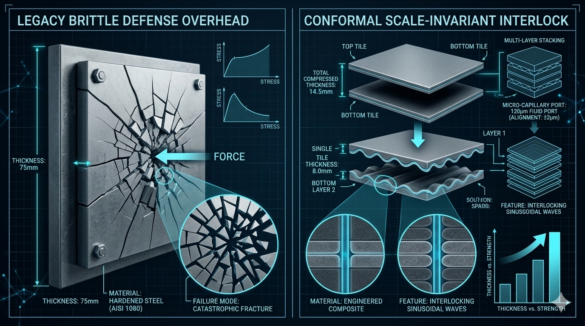
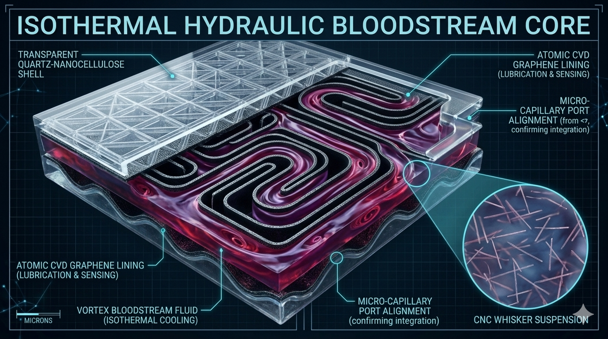
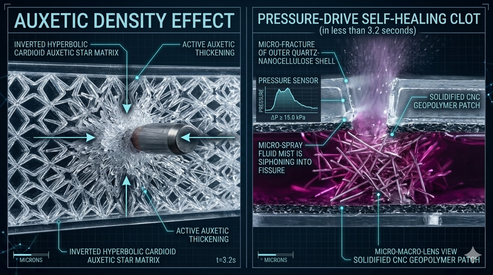
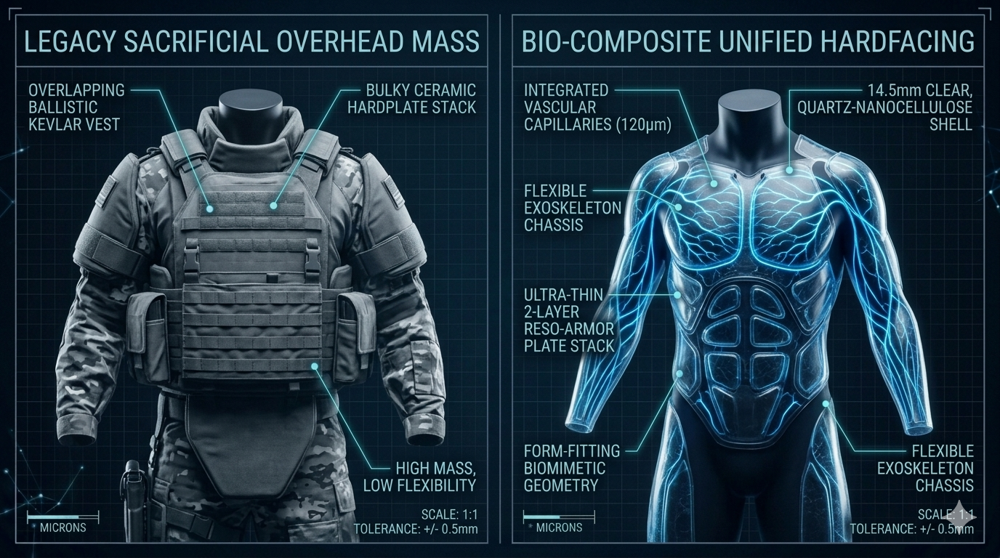

# 👑 PROJECT RESO-ARMOR: Bio-Composite Self-Healing Armor Metamaterial Plating
**Configuration:** Symmetrical Auxetic Core // 120μm Conformal Interlocking Stack Layout
**Licensing Framework:** CERN Open Hardware Licence Strongly Reciprocal v2.0 (CERN-OHL-S-2.0)
**Security Protocol:** Fully Compliant with the Universal Non-Weaponization Civilizational Accord

## 🛡️ System Manifest & The Living Bloodstream Material Stacking Philosophy

**PROJECT RESO-ARMOR (Repository Hub: vortex-armor-resilient88)** establishes the open-source engineering blueprints for a geometrically perfect, scale-invariant nested armor plating system [No.1]. This framework completely rejects traditional, bulky sacrificial armor. It introduces an ultra-thin **8.0mm base single-layer tile** structured with a **Symmetrical Auxetic Pattern** that pulls surrounding material inward to actively densify and thicken the plating grid right at the exact coordinate of an external impact.

To allow for instant field scalability without adding loose, unmitigated dead weight to vehicle airframes, this material implements a **Conformal Nested Stack Architecture**. The top face of each tile is carved into a series of sinusoidal wave ridges that interlock flawlessly with corresponding matching grooves on the bottom face of the adjacent plate above it. Stacking multiple layers together does not create a clumsy, slipping bulk; they nest into an airtight, integrated shield, compressing a 2-layer stack thickness down from 16.0mm to **exactly 14.5mm overall thickness**. 

Furthermore, the internal **120-Micron Micro-Capillary Healing Tracks align perfectly across the Z-axis faces with $\pm 5.0\text{ \mu m}$ tolerances**, merging multiple independent plates into a single, unified "vascular bloodstream" loop [No.0]. When an external strike micro-fractures the multi-tier casing, the immediate localized pressure drop violently siphons the reactive, CNC-suspended distilled water fluid vertically across the layer boundaries, clotting and sealing the entire multi-tier puncture as a single, unified piece within $\leq 3.2\text{ seconds}$ completely software-free [No.0].

---

## 🎨 Project RESO-ARMOR Technical Showcase & Ballistic Showroom

Review the uncompressed structural blueprints, metrology scale vectors, and high-fidelity side-by-side presentation renders demonstrating how our scale-invariant fluid implosion physics replaces legacy sacrificial defenses:

### 📐 Structural Blueprints & Metric Scale Vector Outlines
*   **Master System Specifications Vector Chart:**
    

### 🔬 Multi-Panel Presentation Renders & Concept Showcases
*   **Conformal Nested Stacking Profile (Prompt 1 Visual):**
    
*   **Living Vascular Bloodstream Core (Prompt 2 Visual):**
    
*   **Auxetic Impact Thickening & Clotting (Prompt 3 Visual):**
    

### 🛡️ Real-World Ballistic & Wearable Showcases
*   **Tactical Armor Suit Evaluation (Prompt 4 Visual):**
    
*   **High-Power Ballistic Deflection Diagnostics (Prompt 5 Visual):**
    

---

# 👑 PROJECT RESO-ARMOR: Bio-Composite Self-Healing Armor Metamaterial Plating

---

## 🖨️ Automated Parametric Production Tools

*   **`generate-armor-mesh.py`:** Standalone Python 3 asset script that programmatically computes, verifies, and draws the uncompressed ASCII STL 3D solid mesh layout for the scale-invariant interlocking tiles, Z-axis lock-waves, and vertical fluidic ports.
