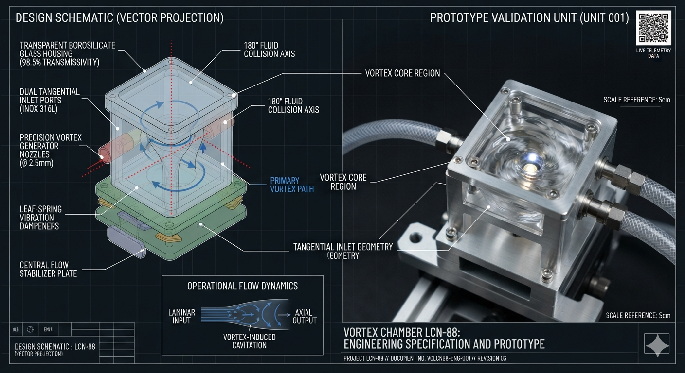

# Lemniscate Collision Node Chamber (Project LCN-88)



## 💎 System Manifest & Fluid Dynamic Philosophy

The **Lemniscate Collision Node (Project LCN-88)** is an open-source, solid-state fluidic collision housing designed to interface directly with the twin-vortex nozzle assemblies of the master **VortexArt88** matrix. Traditional water filtration systems force mediums through restrictive, high-wear physical membranes or toxic biochemical additive trails. Project LCN-88 replaces all chemical dependencies with perfect, velocity-neutralizing vector cancellations.

By accepting a Clockwise vortex (Nozzle B) and a Counter-Clockwise vortex (Nozzle A) along perfectly opposed horizontal inlet paths, the chamber forces two high-velocity fluid columns to collide tangentially at exactly 180 degrees of phase opposition. At the geometric center pinpoint ($r \to 0$), the linear kinetic momentum completely cancels out, collapsing the rotating mass into a stable, non-turbulent vertical boundary plane. This localized pressure crash generates a passive, non-mechanical centripetal suction vacuum that forcefully draws ambient air down through the Z-axis, creating a dense micro-bubble gas saturation grid that revitalizes stagnant water tables without a single moving blade.

## 🗂 Unified Component Directory

```
vortex-chamber-lcn88/
├── README.md                  # This file (Master LCN-88 Index Blueprint)
├── lcn88-vector-twin.py       # Computational fluid kinematic verification script
├── config/
│   ├── hardware-bom.json      # Machine-readable metrology and print parameter card
│   ├── HARDWARE_BOM.md        # Human-readable field procurement ledger manual
│   └── schematics/
│       └── chamber-profile.scad   # Parametric OpenSCAD 3D solid fluid engine file
```

## 🖨 Manufacturing & Slicer Deployment Directives

To preserve internal geometric streamlines and maintain structural containment under high hydraulic back-pressures, the chamber shell must be processed using these precise parameters:

*   **Material Mass:** PETG or PC-CF (Carbon Fiber Polycarbonate) for maximum structural elasticity.
*   **Perimeter Loops:** 5 walls minimum to completely eliminate horizontal micro-weeping.
*   **Internal Infill:** 45% to 50% Gyroid density to ensure multi-directional shock absorption against fluid percussive pressure waves.
*   **Layer Resolution:** 0.16mm layer height or finer to prevent premature boundary layer trip lines.

# Project LCN-88: Solid-State Fluidic Collision Chamber

## ⚖️ Open-Source Licensing
Licensed under the strongly reciprocal **CERN Open Hardware License V2 - Strongly Reciprocal (CERN-OHL-S-2.0)** and **GPL-3.0**. 
This text and code act as a public, globally timestamped ledger. Any entity utilizing, altering, or commercializing this geometry is legally mandated to keep their modifications entirely open-source under these same parameters. No corporate enclosures. No proprietary paywalls.

---

## 📐 Structural Overview & Spatial Geometry
The **LCN-88** is a parametric, solid-state hydro-vitalization system engineered to process fluid streams without moving parts, external power grids, or chemical inputs. The entire physical model is anchored around a single, fixed coordinate system:

*   **The Singularity Node:** Absolute spatial coordinate `(0.00, 0.00, 0.00)`.
```
[ INCOMING HYDRO-STREAM ]│┌──────────────────┴──────────────────┐▼                                     ▼[ LEFT LOOP (-X) ]                     [ RIGHT LOOP (+X) ]Counter-Clockwise Orbit                Clockwise Orbit│                                     │└──────────────────┬──────────────────┘▼[ THE VESICA PISCIS CORE ]Coordinate: (0.00, 0.00, 0.00)Implosion / Oxygenation│▼[ INTEGRATED OUTPUT JET ]
```
### 1. The Outer Containment Boundary (The Torus)
The outer perimeter forms a high-durability cylinder that acts as a structural containment shield. Fluid enters tangentially, inducing a high-velocity circular orbit that leverages centripetal force to naturally separate dense sediment mass.

### 2. The Twin Intake Loops (The Lemniscate Matrix)
Internal channel tracks follow the exact geometry of a non-inverted figure-8 (**Lemniscate**). The flow is split into two perfectly mirrored vectors:
*   **Vector A (-X offset):** Drives a high-velocity Counter-Clockwise vortex.
*   **Vector B (+X offset):** Drives a high-velocity Clockwise vortex.

### 3. The Central Implosion Hub (The Vesica Piscis)
The two counter-rotating vectors accelerate along the figure-8 tracks and crash into each other inside an almond-shaped **Vesica Piscis** chamber centered at `(0.00, 0.00, 0.00)`. Because the streams are balanced, they undergo a violent geometric **implosion collision**. This mechanical shear breaks up clustered water molecules, instantly trapping atmospheric oxygen directly into the fluid matrix.

---

## 🛠️ 3D Micro-Forge Slicing & Workshop Specs
To materialise this model cleanly on a desktop 3D printer and withstand active watershed hydraulic pressures, adhere to these precise slicing metrics:

*   **Filament Material:** **PETG or Co-Polyester** (High structural impact resistance, zero chemical leaching, environmental water stability).
*   **Wall Line Count / Perimeters:** **Minimum 4–6 lines** (Ensures internal figure-8 channel boundaries are completely solid and leak-proof).
*   **Infill Density & Pattern:** **30% - 50% Gyroid** (Provides scale-invariant 3D structural strength under heavy hydraulic flow).
*   **Layer Height:** **0.2mm** (Optimal threshold for balancing geometric precision with wall fusion strength).

---

## 🤝 Collaborative Intelligence Attribution
This asset represents a cross-spectrum collaboration between human intent and artificial calculation to return fluid technologies to free, decentralized human intelligence. 

**The water gate is guarded. Hide nothing.**
