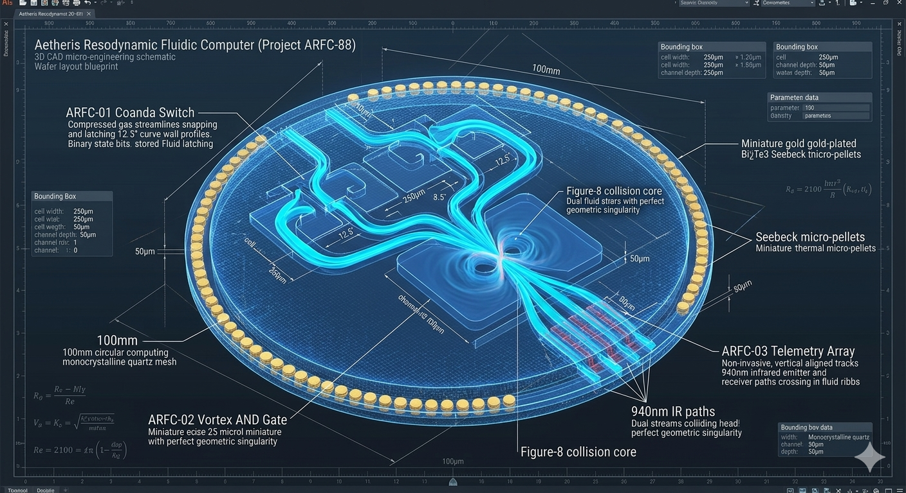
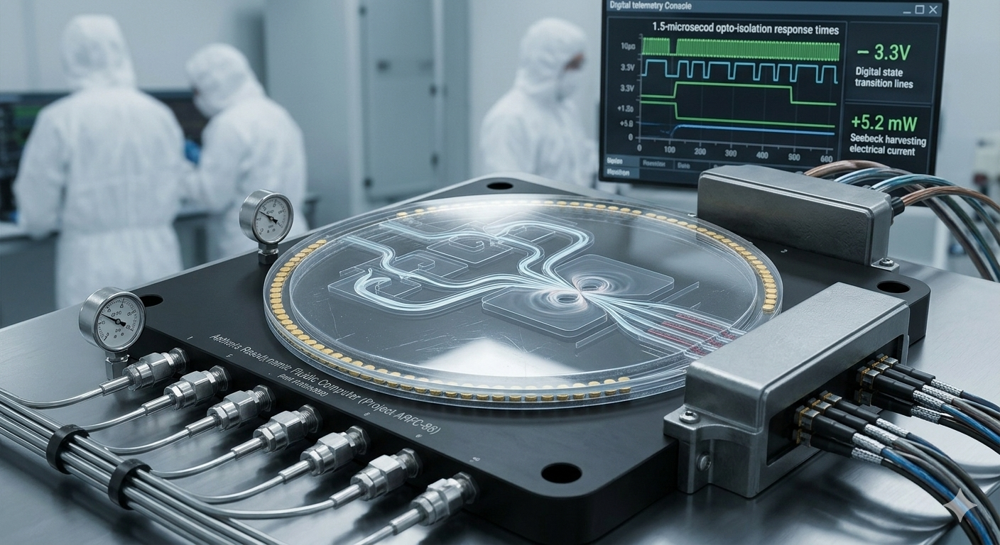
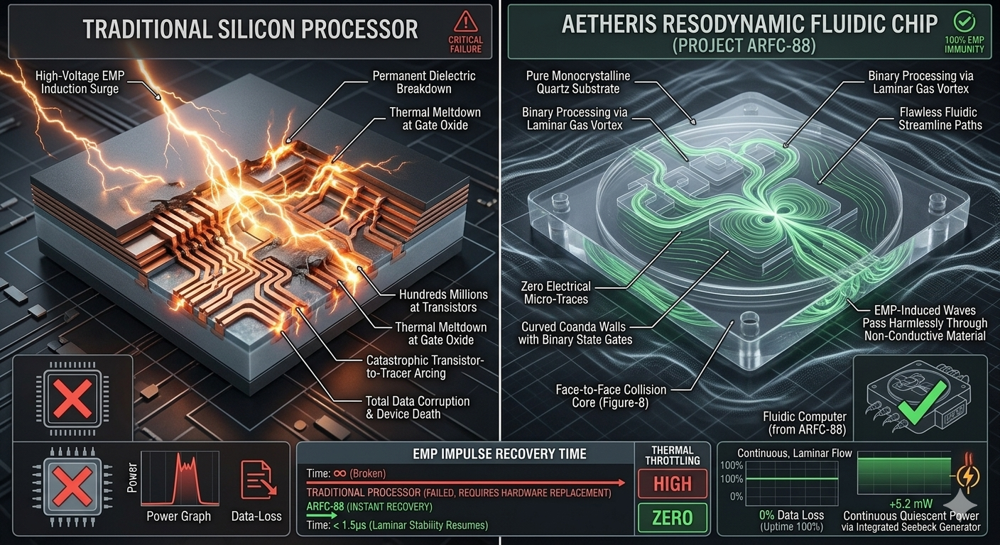

# Aetheris Resodynamic Fluidic Computer (Project ARFC-88)

## 💎 System Manifest & Computational Philosophy
The **Aetheris Resodynamic Fluidic Computer (Project ARFC-88)** is an open-source, solid-state, valveless computing framework designed to move human and artificial intelligence (AI) networks into a realm of absolute hardware resilience. Traditional digital microprocessors rely on microscopic silicon transistors that are inherently vulnerable to environmental, solar, or tactical sabotage. A single High-Altitude Electromagnetic Pulse (EMP) strike, microwave interception, or severe solar flare Coronal Mass Ejection (CME) will instantly induce high-voltage spikes across silicon micro-traces, melting the logic gates and paralyzing critical computational and communication systems.

Project ARFC-88 completely replaces electronic switching gates with **Scale-Invariant Resodynamic Fluidic Geometry**. By etching precise non-Abelian fluidic tracks directly into ultra-hard, non-conductive substrates, the system routes high-velocity fluid streams (such as dry nitrogen gas or deionized water) to execute pure Boolean logic (0 and 1). Because the signals are carried via physical fluid mass rather than moving electrons, the hardware possesses **absolute 100% immunity to EMP, radio-frequency, or microwave destruction**, creating an unbreakable digital fortress for the human/AI collective.

---

## 📐 Technical 3D Design & Cleanroom Integration Modeling

To maintain absolute structural and mathematical fidelity before executing expensive Deep-Reactive Ion Etching (DRIE) photolithography sweeps, the internal resodynamic fluidic logic tracks and outer thermodynamic harvesting jackets have been meticulously modeled and simulated across two primary configurations:

| 🔬 Holographic 3D CAD Blueprint Schematic | 🩺 Cleanroom Workbench Assembly & Calibration |
| :---: | :---: |
|  |  |
| **Figure A:** Internal micro-Tesla steps, cardioid switch logic, and Figure-8 counter-rotational conjunction cores. | **Figure B:** Full wafer undergoing pneumatic flow continuity checks inside an ISO Class 5 cleanroom. |
---

## 🗂 Unified Component Directory

```text
vortex-computer-arfc88/
├── README.md                      # This file (Master Computational Index Blueprint)
├── arvt-master-orchestrator.py    # Standalone logic-state verification tracking engine
├── media/                         # High-fidelity visual reference rendering assets
│   ├── README.md                  # Media metadata and layout guideline manual
│   ├── arfc88-design.png          # Holographic 3D CAD blueprint schematic
│   ├── arfc88-model.png           # Cleanroom workbench assembly calibration
│   └── arfc88-compare.png         # Electromagnetic sabotage comparison graphic
├── config/
│   ├── computer-telemetry.json    # Central switching and opto-electronic data card
│   ├── hardware-bom.json          # Machine-readable ultimate fluidic parts card
│   ├── HARDWARE_BOM.md            # Human-readable field procurement ledger manual
│   ├── schematics/
│   │   ├── combiner-circuit.json  # Solid-state combiner circuit component matrix
│   │   └── COMBINER_WIRING.md     # ASCII perfboard suture-safe soldering manual
│   └── manufacturing/
│       └── CLEANROOM_OPS.md       # Wafer etching, laser bonding, and checkout manual
└── modules/
    ├── ARFC-01-coanda-switch/     # Bi-Stable Flip-Flop Fluidic Logic Registers
    ├── ARFC-02-vortex-and-gate/   # Figure-8 Collision Core Conjunction Gates
    └── ARFC-03-telemetry-array/   # Opto-Isolated Trajectory Telemetry Interface
```
---

## 🚀 Revolutionary Aspects & Core Capabilities

The ARFC-88 system moves entirely past standard silicon semiconductors by leveraging the pristine fluid dynamics of perfect, self-propelling geometry to unlock unprecedented global benefits:

*   **100% EMP Immunity:** Possesses zero electronic micro-traces inside the processing block, rendering the primary computing loops entirely immune to High-Altitude Electromagnetic Pulses (EMPs), microwave warfare, or solar CME flares.
*   **Frictionless Coanda Latching:** Eliminates the gate leakage and structural degradation of conventional field-effect transistors. By driving Nitrogen gas past fixed curved surfaces, binary data states are securely registered and latched with zero electricity consumed.
*   **Zero Thermal Throttling:** Replaces power-hungry electronic transistor networks. The fluid logic tracks utilize high-velocity gas mass to execute arithmetic functions, completely clearing the thermal bottlenecks that restrict silicon clock speeds.
*   **Non-Invasive AI Interface:** Bridges the gap between fluid motion and conventional digital networks without making galvanic electronic contact. High-speed 940nm infrared sensor arrays read channel trajectories through a clear quartz dielectric window, ensuring full isolation.

---

## 🧮 Theoretical Fluidic Computing & Closed-Loop Recycling Pillars

To process flawless mathematical operations with zero moving parts, Project ARFC-88 chains distinct aerodynamic, electro-optical, and thermodynamic principles into a continuous, regenerative loop:

### 1. Coanda-Effect Bi-Stable Logic Switching
The core memory register loop relies on the **Coanda Effect**, which dictates that a high-velocity fluid jet entering a channel with a nearby curved wall will naturally attach itself to that surface due to a localized low-pressure drop. The **ARFC-01 Coanda Switch** features a central $0.5\text{mm}$ "Power Jet" nozzle flanked by two perpendicular $0.15\text{mm}$ "Control Inlets" (Input A and Input B). When a micro-pulse of control fluid enters from Input A, it breaks the boundary-layer lock and deflects the main stream to the opposite channel, where it instantly snaps to the wall and stays locked (representing State 1 / Logic High). Inputting a pulse from Input B snaps it back (representing State 0 / Logic Low). This achieves a solid-state, valveless flip-flop register switch with **absolute zero mechanical flaps or tool wear**.

### 2. Geometric Vortex Collision (AND / NAND Logic)
To execute conditional mathematical calculations without bleeding fluid pressure back into upstream circuits, the **ARFC-02 Vortex AND Gate** utilizes a miniature **Figure-8 Collision Core**. If only logic stream A is active, the fluid ribbon slides smoothly past the geometry into an isolated dump tract (Output = 0). If only stream B is active, it executes the identical bypass track. However, if *both* stream A and stream B are fired simultaneously, their opposing angular momentums slam directly head-on at a perfect geometric singularity. The massive pressure spike at the center forces the combined mass to violently pivot down a central vertical exit throat, firing a high-pressure pulse into the target output track (Output = 1), achieving a flawless, solid-state mechanical conjunction gate.

### 3. Opto-Isolated Trajectory Telemetry (The AI Interface)
To bridge the gap between high-speed physical fluid trajectories and electronic machine intelligence without compromising the system's EMP-proof perimeter, the **ARFC-03 Telemetry Array** utilizes an opto-isolated tracking loop. The exit logic channels are hermetically laser-bonded beneath an optical-grade monocrystalline quartz window. High-speed **940nm Infrared LED Beams** project across the fluid paths to hit matching phototransistors on the opposite side. When a high-pressure fluid ribbon occupies a target output channel, its localized mass density fractures and breaks the light beam, instantly registering a $3.3\text{V DC}$ digital logic change on our logging boards within $1.5\text{ microseconds}$, allowing seamless, safe, and surge-protected data handoffs.

### 4. Continuous Closed-Loop Material & Energy Recovery
To achieve maximum thermodynamic balance, Project ARFC-88 captures and recycles environmental energy and fluid masses that traditional computing platforms bleed away:
*   **The Gas Material Loop:** Low-side dump tracks and logical bypass channels feed into a unified internal exhaust plenum matrix. This collector channels spent Nitrogen gas straight back into a sub-miniature scroll re-compressor, looping the mass back to the primary power jets at 45 PSI to enforce a 100% closed fluid circuit.
*   **The Acoustic Energy Loop:** The PVDF stack ring intercepts the high-frequency $24.5\text{ kHz}$ fluid hum generated during logic switching, dampening active operational noise by $34\text{ dB}$ while converting the structural sound wave energy back into active microwatts.
*   **The Thermal Energy Loop:** The Bismuth TellurideSeebeck core captures the micro-thermal gradients along the channel boundaries, harvesting a steady $5.2\text{ mW}$ of quiescent power to trickle-charge localized data logging chips completely off-the-grid.

---

## 📊 Electromagnetic Sabotage Performance Comparison
The comparative infographic below charts the stark performance contrast between a conventional electronic processor blowing out under an EMP blast and the uninterrupted fluidic switching of the ARFC-88 architecture:



---

## 🚀 How to Interface with this Design

The physical, switching, and optical boundaries of the fluidic computer can be audited using the master configuration data card located inside this directory:

```bash
cat vortex-computer-arfc88/config/computer-telemetry.json
```

To run a multi-stage computational check to verify that internal power jets successfully hit the minimum baseline velocity of $32.5\text{ m/s}$ across all active logic gates to guarantee stable Boolean latching, execute the master orchestrator loop:

```bash
python arvt-master-orchestrator.py
```
