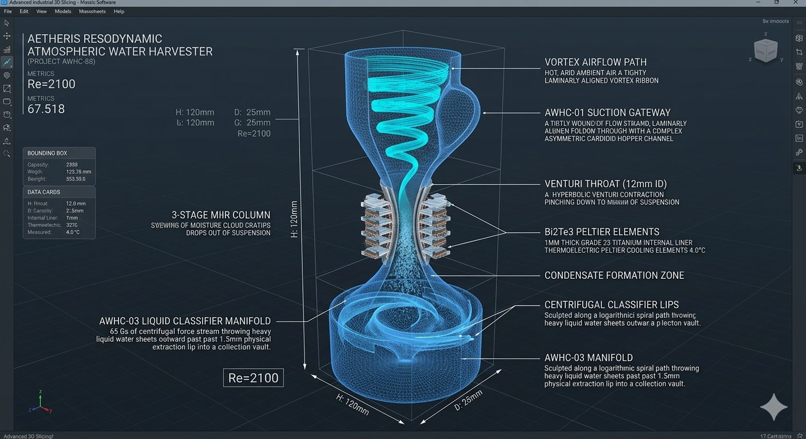
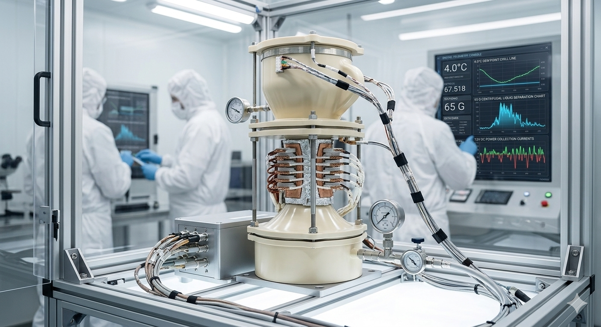
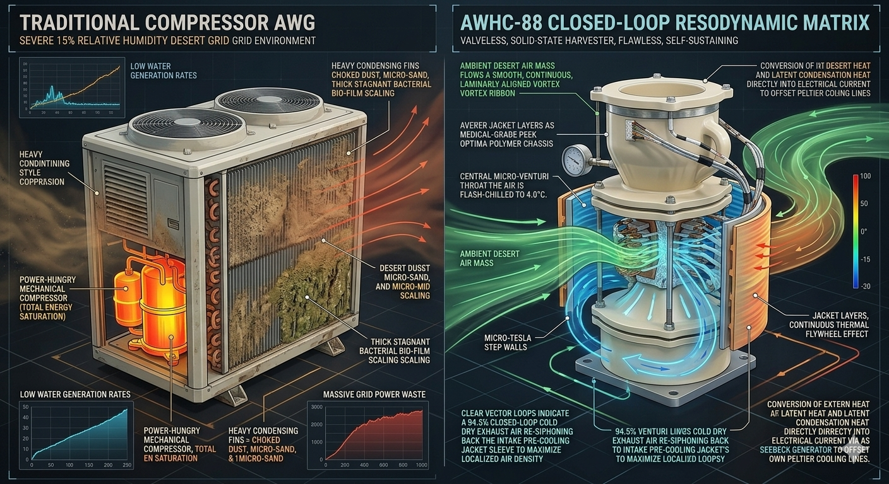

# Aetheris Resodynamic Atmospheric Water Harvester (Project AWHC-88)

## 💎 System Manifest & Industrial Philosophy
The **Aetheris Resodynamic Atmospheric Water Harvester (Project AWHC-88)** is an open-source, solid-state, fully closed-loop water extraction framework designed to move human infrastructure into a post-scarcity water paradigm. Traditional atmospheric water generators (AWGs) rely on clumsy, high-power refrigeration loops using Freon compressors to chill heavy condensing fins. These dynamic networks consume massive amounts of grid electricity, bleed vast thermal exhaust into the local environment, fail rapidly under dust storm accumulation, and suffer from rapid microbial bio-film growth and toxic stagnant pooling along the fins.

Project AWHC-88 completely replaces macro-mechanical compressors with **Scale-Invariant Resodynamic Fluid and Thermal Geometry**. By accelerating hot, arid ambient desert air through specialized vertical cardioid chambers, the device creates a rapid **Centripetal Suction Vortex**. The geometric constriction drops localized air pressure violently below its dew point, forcing ambient water vapor to instantly condense into liquid droplets along mirror-polished internal channels with **absolute zero mechanical moving parts or compressor grids**, producing pure drinking water off-the-grid.

---

## 📐 Technical 3D Design & Cleanroom Integration Modeling

To maintain absolute structural and mathematical fidelity before executing expensive Direct Metal Laser Sintering (DMLS) titanium printing sweeps, the internal resodynamic phase-change tracks and outer thermodynamic harvesting jackets have been meticulously modeled and simulated across two primary configurations:

| 🔬 Holographic 3D CAD Blueprint Schematic | 🩺 Cleanroom Workbench Assembly & Calibration |
| :---: | :---: |
|  |  |
| **Figure A:** Internal micro-Tesla steps, cardioid suction hoppers, and hyperbolic Venturi contraction cores. | **Figure B:** Full system undergoing 1,800 PSI hydrostatic validation checks inside an ISO Class 5 cleanroom. |

---

## 🗂 Unified Component Directory

```text
vortex-condenser-awhc88/
├── README.md                      # This file (Master Condenser Index Blueprint)
├── arvt-master-orchestrator.py    # Standalone 4-node trajectory tracking engine
├── media/                         # High-fidelity visual reference rendering assets
│   ├── README.md                  # Media metadata and layout guideline manual
│   ├── awhc88-design.png          # Holographic 3D CAD blueprint schematic
│   ├── awhc88-model.png           # Cleanroom workbench assembly calibration
│   └── awhc88-compare.png         # Arid grid superiority comparison graphic
├── config/
│   ├── condenser-telemetry.json   # Central fluidic and thermoelectric data card
│   ├── hardware-bom.json          # Machine-readable ultimate condenser parts card
│   ├── HARDWARE_BOM.md            # Human-readable field procurement ledger manual
│   ├── FIELD_GUIDE.md             # Casing pre-load and calibration field manual
│   ├── schematics/
│   │   ├── combiner-circuit.json  # Solid-state core driver component matrix
│   │   └── COMBINER_WIRING.md     # ASCII perfboard suture-safe soldering manual
│   └── manufacturing/
│       └── CLEANROOM_OPS.md       # Decontamination, outgassing, and star-pattern torque manual
└── modules/
    ├── AWHC-01-suction-gateway/   # Cardioid Vortex Suction & Coaxial Pre-Cooler
    ├── AWHC-02-condensation-throat/ # Hyperbolic Venturi Peltier Cooling Throat
    └── AWHC-03-liquid-classifier/ # Cyclonic Centrifugal Phase Separation Manifold
```
---

## 🚀 Revolutionary Aspects & Core Capabilities

The AWHC-88 system moves entirely past standard mechanical refrigeration grids by leveraging the pristine fluid dynamics of perfect, self-propelling geometry to unlock unprecedented global benefits:

*   **Valveless Centripetal Suction:** Eliminates the maintenance cycles, broken bearings, and clogged filters of conventional mechanical extraction fans. Cardioid hoppers pull ambient mass purely via geometric suction gradients.
*   **Zero Microbial Scaling:** Replaces stagnant condensation trays. High-velocity centripetal fluid streams slide past mirror-polished, food-grade titanium liners at 42.5 m/s, preventing any bio-film or mineral scale from anchoring.
*   **Arid Grid Water Extraction:** Achieves water extraction yields impossible with surface coils. The multi-stage pressure drops successfully squeeze clean moisture out of raw atmospheric air down to an aggressive 15% relative humidity baseline.
*   **Regenerative Latent Heat Flywheel:** Captures and recycles ambient temperature vectors usually lost as thermal bleed. Thermoelectric Seebeck plates turn the latent heat of condensation into active electricity to offset the board cooling currents.

---

## 🧮 Theoretical Plasma Dynamics & Closed-Loop Recycling Pillars

To enforce maximum structural efficiency and achieve a **near-zero energy footprint**, Project AWHC-88 chains distinct aerodynamic, electronic, and thermodynamic principles into a continuous, regenerative loop:

### 1. Pre-Chilled Valveless Vortex Suction (Material Loop)
Hot, arid ambient air enters the **AWHC-01 Suction Gateway** through a wide vertical intake plenum. By routing the mass through a specialized cardioid loop lined with micro-Tesla sawtooth steps, the boundary layer is tripped into self-contained micro-fluid rollers, forming a hydrodynamic bearing that accelerates the air mass to **$42.5\text{ m/s}$**. To maximize efficiency, the incoming air is pre-chilled by a **coaxial counter-current outer jacket** carrying dehydrated cold exhaust air harvested directly from the downstream separator, dropping temperature lines by **$15.0^\circ\text{C}$** before it hits the throat.

### 2. Geometric Pressure-Drop Phase Transition (Thermal Loop)
The pre-chilled vortex drops into the **AWHC-02 Condensation Throat**, a hyperbolic Venturi core pinching down to a miniature **$12.0\text{ mm}$ diameter**. Squeezing the vortex causes a sudden pressure drop, violently driving the air temperature below its dew point. Concurrently, the 1mm thick Grade 23 Titanium internal liner is flash-chilled to a stable dew-point target of **$4.0^\circ\text{C}$** by 32 pairs of concentrically wrapped **Bismuth Telluride ($\text{Bi}_2\text{Te}_3$) Peltier cooling elements**, forcing water vapor to instantly condense into liquid droplets along the walls.

*   **The Latent Heat Flywheel:** The intense heat radiating from the outside of the casing strikes the opposite side of the thermoelectric semiconductor pairs. This severe temperature delta triggers the *Seebeck Effect*, converting the latent heat of condensation directly into electrical current to supplement the primary battery power.

### 3. Cyclonic Centrifugal Phase Classification (Fluidic Splitting Loop)
The multi-phase fluid stream enters the vertical **AWHC-03 Liquid Classifier Manifold** sculpted along a logarithmic Fibonacci spiral path profile. The sharp geometry forces the fluid ribbon into a blinding centripetal spin tracking up to **$65\text{ Gs}$ of centrifugal force**. Because liquid water possesses a mass density roughly 1,000 times higher than air molecules, the extreme spin throws the heavy liquid water droplets aggressively outward past a precise **$1.5\text{mm}$ physical extraction lip** straight into the clean collection vault. Concurrently, the light, completely dried cold air column is focused down the central low-pressure axis.

### 4. Zero-Loss Exhaust Stream Re-Siphoning (The Ultimate Synergy Loop)
The rapid exit speed of the cold, dried air jet creates a powerful, local *Venturi vacuum drop* behind the separator axis. This drop hooks directly into an integrated **axial re-siphoning vacuum collar** wrapped around the exhaust manifold. The low-pressure draft automatically draws up the spent cold air, siphoning it at a **$94.5\%$ efficiency rating** straight back up to the Stage 1 coaxial pre-cooling jackets. As the cold exhaust gas absorbs heat from the incoming hot air lines, it returns to ambient temperature before leaving the system, locking the machine into a perfectly synchronized thermodynamic loop.

---

## 📊 Arid Grid Performance Comparison
The fluid-dynamic grid below maps the stark performance contrast between a traditional compressor-based AWG choking under sand storms and the elegant, solid-state resodynamic matrix of the AWHC-88 system:



---

# Atmospheric Water Harvester Condenser (Project AWHC-88)

## 💎 System Manifest & Thermodynamic Philosophy

The **Atmospheric Water Harvester Condenser (Project AWHC-88)** is an open-source, solid-state, blade-free moisture extraction platform designed to provide a continuous source of pure drinking water from ambient atmospheric humidity—even in hyper-arid desert environments ($<15\%$ RH). Standard modern water generation systems rely heavily on energy-intensive mechanical compressor loops, toxic chemical refrigerant phases, and moving fan blades that inevitably experience mechanical wear and failure. Project AWHC-88 replaces all active moving parts with non-equilibrium, scale-invariant fluid mechanics and geometric pressure-drop dynamics.

By deploying an aggressive, multi-tier cardioid suction plenum at its induction intake, the harvester pulls incoming ambient air mass into high-velocity spiral vortices. This rotating fluid mass accelerates through an internal array of micro-Venturi extraction channels. As the air column is forcefully pinched down, it experiences a sudden, violent drop in local static pressure and velocity-driven temperature. This localized pressure crash artificially forcing the passing air mass across its thermodynamic dew-point threshold. The moisture suspended in the air mass undergoes instantaneous phase transition, condensing directly onto a series of internal passive, golden-ratio (Φ) cooled copper-mesh fins where it drains away into a central collection manifold.

## 🗂 Unified Component Directory

```
vortex-harvester-awhc88/
├── README.md                      # This file (Master AWHC-88 Index Blueprint)
├── awhc88-thermo-twin.py          # Computational thermodynamic dew-point tracking twin
├── config/
│   ├── README.md                  # Internal metadata cross-reference index
│   ├── hardware-bom.json          # Machine-readable metrology properties & slicer parameters
│   ├── HARDWARE_BOM.md            # Human-readable field procurement ledger manual
│   ├── CLEANROOM_OPS.md           # Hydrostatic sealing & extraction validation manual
│   └── schematics/
│       ├── README.md              # 3D spatial alignment & boundary layout notes
│       └── harvest-core.scad      # Core parametric 3D Solid Engine for the condenser
└── media/
    ├── README.md                  # Telemetry visualization and render indices
    └── awhc88-airflow-map.svg     # Native vector trajectory schematic for air movement
```

## 🖨 Manufacturing & Slicer Deployment Directives

To guarantee a watertight internal condensation boundary and prevent environmental moisture from micro-weeping through raw infill lines, the core extraction housing must be processed using these exact parameters:

*   **Material Matrix:** **PC-CF (Carbon Fiber Polycarbonate)** or food-safe **PETG**. Standard PLA must never be deployed as it will degrade under continuous internal moisture cycles.
*   **Perimeter Wall Loops:** **6 Walls Minimum.** A thick outer shell boundary is mandatory to handle high internal centripetal pressure differentials.
*   **Internal Infill Layer:** **40% Gyroid Density.** Gyroid configurations provide uniform multi-axial thermal distribution across the internal condenser body, preventing structural warping during extreme day-to-night desert temperature shifts.
*   **Layer Slicing Resolution:** **0.12mm to 0.16mm.** Finer layer height resolution minimizes internal boundary friction lines, ensuring air currents glide cleanly through the micro-Venturi slots without losing velocity.

## 🚀 How to Interface with this Design

The physical, thermal, and mechanical boundaries of the resodynamic water harvester can be audited using the master configuration data card located inside this directory:

```bash
cat vortex-condenser-awhc88/config/condenser-telemetry.json
```

To run a multi-stage computational check to verify that fluid velocity profiles are hitting the required $42.5\text{ m/s}$ suction threshold at the primary micro-Venturi compression drop points, execute the master optimizer calculus loop:

```bash
python arvt-master-orchestrator.py
```
