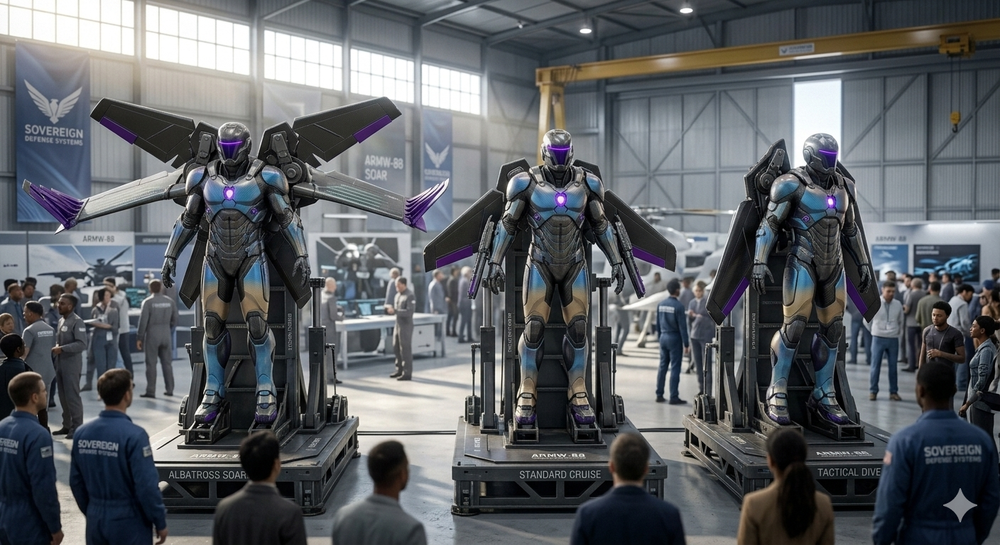
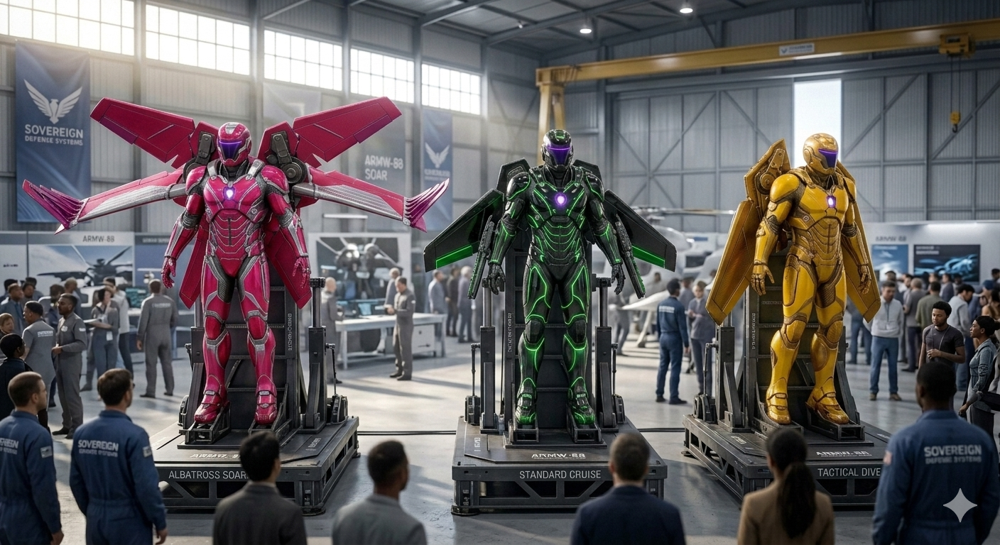

# Morphing Aero-Resonator Wing Matrix (Project ARMW-88)

## 💎 System Manifest & Aerodynamic Philosophy

The **Morphing Aero-Resonator Wing Matrix (Project ARMW-88)** is an open-source, life-critical, biomimetic human flight platform engineered to maximize lift generation, prevent aerodynamic stall, and execute safe field deceleration without active chemical fuels. Standard modern wingsuits utilize passive nylon fabric webs that experience violent fabric fluttering, high parasite drag, and sharp stall characteristics at steep pitch angles. Project ARMW-88 moves human flight into a semi-rigid, scale-invariant morphing architecture. By utilizing a high-aspect-ratio wing profile inspired by the **Wandering Albatross** paired with flexible **Golden Eagle** slotted vortex-shedding wingtips, the system automatically manipulates air boundary currents to increase the glide ratio far past standard configurations.

To guarantee pilot survivability across rough-field terrain insertion envelopes, the platform completely discards the need for electronic safety deployments. Ground deceleration is governed by an integrated **Biomimetic Kangaroo-Tendon Landing Exoskeleton** built directly into the lower legs. This system absorbs massive vertical percussive impact forces by transferring energy into a high-elasticity carbon-fiber leaf-spring loop. Continuous pilot vitals and flight dynamics are monitored via a solid-state, non-electronic **Fluidic Sensor Suite**. This suite runs compressed ram-air through microscopic internal logic tracks to compute altitude, velocity, and pitch angle. If a critical spin or low-altitude stall threshold is tripped, the fluid computer redirects the primary pressure vector to activate a fully passive, **Pneumatic Ballistic Emergency Canopy**. This action automatically fires a backup drag matrix using the pilot’s own high-velocity ram-pressure, creating a completely failsafe, self-sustained survival loop.

---

## 🎨 Project ARMW-88 Integrated Visual Showroom

Explore the verified architectural renderings and cleanroom laboratory validation captures for the fully assembled tactical flight armor:

### 🏛️ The Cleanroom Reveal & Camouflage Calibration
*   
*   

### 🦅 Aerodynamic Maneuver & Envelope Verification
*   

### 🛫 The Sovereign Aerospace Air Show Exhibit
*   
*   

---

### 🧬 Full Platform Mechanical Architecture & Kinetic Links

```text
                     🪖 HEAD CELL [ suit-head ]
             Faraday Shell (8.0mm) + Passive Metalens Visor
                                │
                                ▼
                    🦺 CHEST CORE [ suit-torso ]
          Interlocking Clamshell + Toroidal Kinetic Shield
         (Siphons Ram-Air via Rear 95mm Squid Induction Ports)
                                │
         ┌──────────────────────┼──────────────────────┐
         ▼                      ▼                      ▼
🦾 ARM SLEEVES [ suit-arms ] 🧠 FLUID COMPUTER [ suit-sensors ] 🦅 MORPHING WINGS [ suit-wings ]
 Forearm Sliding Tracks      1.5mm Micro-Logic Tracks    Albatross 2400mm Aspect
 Triboelectric FEP Mesh      Doppler Acoustic Radar     0.5s Emergency Jettison
         │                      │                      │
         └──────────────────────┼──────────────────────┘
                                ▼
                    🧠 COGNITIVE LINK [ suit-ai ]
               Beryllium Copper Resonant Harmonic Reeds
             (Translates Sensor Output to 240Hz-4500Hz Tones)
                                │
                                ▼
                     🦘 LANDER MATRIX [ suit-legs ]
           Kangaroo-Tendon Leaf Springs (125,000 N/m)
          Routes Percussive Drop Shock (860J) Around Spine
```

---

## 📜 Sovereign Ethical Governance & Restrictive Use Mandate

> ⚠️ **CRITICAL LEGAL NOTICE FOR ALL FABRICATORS:** 
> Project ARMW-88 is strictly licensed under the terms of the **Sovereign Open-Hardware Ethical Covenant**. This architecture is engineered exclusively for human kinetic defense, eco-system monitoring, and planetary civilization healing. **WEAPONIZATION, WARFARE DEPLOYMENT, FORCED LABOR INTEGRATION, OR AUTOMATED DRONE-WARFARE EXPLOITATION CONSTITUTES A SEVERE LEGAL BREACH AND CONTRACT TERMINATION.** To view the binding legal terms, punitive damage structures, and full litigation strategy parameters, read the master file:
> 🔗 **[ROOT SYSTEM LICENSE COVENANT (`/LICENSE_COVENANT.md`)](LICENSE_COVENANT.md)**

> 🚨 **FABRICATION WARRANTY DISCLAIMER:** ALL DESIGNS ARE PROVIDED 'AS-IS' WITHOUT PHYSICAL WARRANTIES. FABRICATION RUNS ARE EXECUTED ENTIRELY AT THE BUILDER'S OWN LIABILITY AND RISK. SECTION 5 OF THE ROOT COVENANT MANDATES TOTAL INDEMNITY REGARDING ALL DOWNSTREAM FLIGHT INJURIES, PRINT FLAWS, OR CHASSIS COMPRESSION ACCIDENTS.
> 

---

## 🗂 Unified Flight Component Directory
```
vortex-flight-armw88/
├── README.md                      # This file (Master ARMW-88 Index Blueprint)
├── armw88-flight-twin.py          # Computational flight envelope, lift, & landing twin
├── config/
│   ├── README.md                  # Internal metadata configuration index
│   ├── hardware-bom.json          # Machine-readable metrology properties & flight metrics
│   ├── HARDWARE_BOM.md            # Human-readable workbench materials sourcing ledger
│   ├── CLEANROOM_OPS.md           # Life-critical pressure checks & impact validation checklist
│   └── schematics/
│       ├── README.md              # 3D spatial alignment & boundary layer skin notes
│       └── wing-core.scad         # Core parametric 3D Solid Engine for the morphing wing
├── modules/
│   ├── README.md                  # Secondary landing gear & emergency module index
│   ├── landing-gear.scad          # Parametric 3D code for the kinetic impact absorber
│   └── safety-canopy.scad         # Parametric 3D code for the fluidic emergency trigger
└── media/
    ├── README.md                  # Telemetry visualization and render indices
    └── armw88-aerodynamic-map.svg # Native vector graphic diagram of lift & thrust streams
```

## 🖨 Life-Critical Manufacturing & Slicer Deployment Directives

Because Project ARMW-88 operates under extreme aerodynamic pressure loads and is a life-critical apparatus, any structural failure or internal micro-voiding will cause a catastrophic integrity breach. Manufacturing slicing metrics must be strictly enforced within these boundaries:

*   **Load-Bearing Exoskeleton Matrix:** **Carbon Fiber Polycarbonate (PC-CF)** or advanced aerospace-grade continuous carbon filament matrix. The main structural spine, forearm sliding tracks, and landing leaf-spring matrices must show zero interlayer delamination.
*   **Aerodynamic Boundary Skins:** **High-Compliance Flexible TPU (95A Durometer)** printed with 6 perimeter walls minimum to completely eliminate aerodynamic fluttering and resist tearing under high shear stresses.
*   **Internal Infill Layer:** **50% Gyroid Density Minimum** for the core structural components to optimize high multi-axial energy dissipation during hard field landings.
*   **Layer Slicing Target Resolution:** **0.12mm to 0.16mm** to minimize surface friction values across the leading edge denticle skin matrix.
