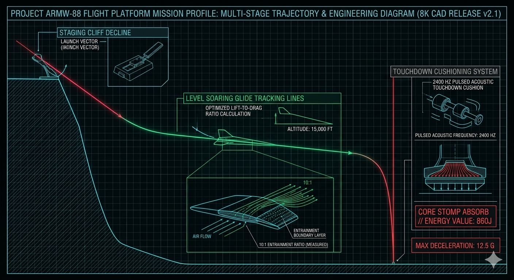
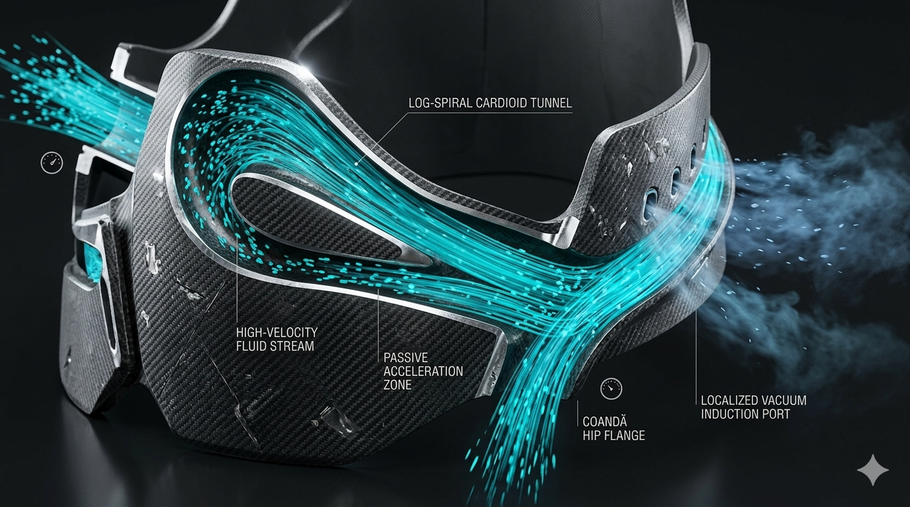
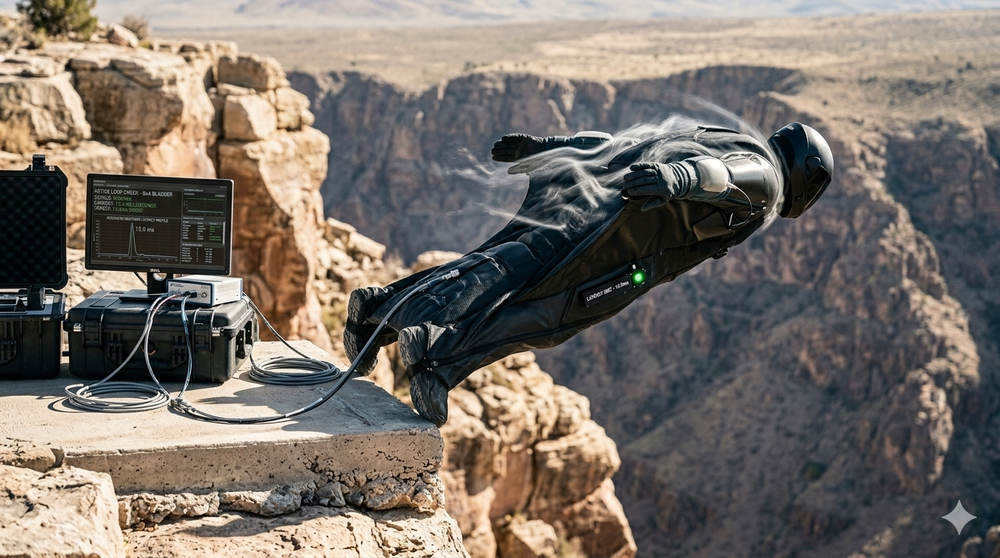
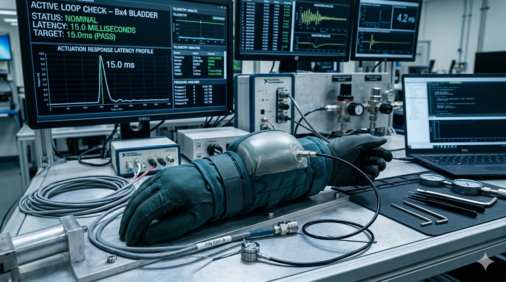

# Project ARMW-88: Flight Phase Procedures & Operational Checklists (Module: suit-procedures)

## 💎 System Manifest & Phase-Gate Operational Philosophy

The **Flight Phase Procedures Module (Project ARMW-Procedures)** maps the chronological, non-electronic checklists governing the complete lifecycle of a mission envelope for the **Project ARMW-88 Tactical Flight Armor Platform**. Because the entire suite operates completely **solid-state and independent of micro-controllers or digital guidance systems**, flight transition safety relies entirely on precise mechanical lever indexing, muscle-memory timing, and fluidic logic pressure state changes.

This document serves as the master gateway coordinating your three primary flight operational thresholds. It provides pilot and ground crew with step-by-step directives ensuring that the centripetal Coandă propulsion channels, the 2400 Hz pulsed shield loops, and the kangaroo-tendon leaf spring decelerators engage in perfect synchronicity with raw physics constraints.

---

## 🎨 Flight Phase Operational Visual Showroom

Review the verified multi-stage trajectory pathing, in-flight boundary layer suction simulations, and three-point superhero landing force-dissipation diagrams:

### 📐 Mission Phase Pathing & Fluid Velocity Grids
*   

*   

### 🔬 Cleanroom-to-Field Staging & Tactical Flight Telemetry
*   

*   

### 🦿 Resonant Pulsed Shield Shocks & Superhero Touchdowns
*   

*   

---

# Flight Phase Procedures & Operational Checklists (Module: suit-procedures)

---

## 🗂 Sub-Module Symmetrical Directory Map

vortex-flight-armw88/modules/suit-procedures/
├── README.md                 # This file (Procedures Manifest Index Manual)
└── config/
    ├── README.md             # Symmetrical configuration directory reference index
    ├── hardware-bom.json     # Machine-readable pressure tolerances, launch angles, & pitch thresholds
    └── MISSION_CHECKLISTS.md # Detailed Take-Off, In-Flight, and Superhero Landing operational guides

---

## 🖨 Operational Deployment Directives

To maintain absolute system safety during aggressive velocity changes, pilots and cleanroom handlers must verify these structural boundaries before initiating any procedure:

*   **Pneumatic Arming Track:** All manual chest bar plungers and leg altimetry needle selectors must be physically un-latched and responsive to a baseline pressure head.
*   **Static Wick Pre-Alignment:** The trailing static wicks on the wingtips must be audited for structural connection to ensure full-body atmospheric surge dumping remains active from take-off to landing.
*   **Scale-Invariant Data Mesh:** Every velocity boundary and acoustic code response outlined inside these checklists is bound by the exact physics equations running in your `armw88-flight-twin.py` digital twin script.
