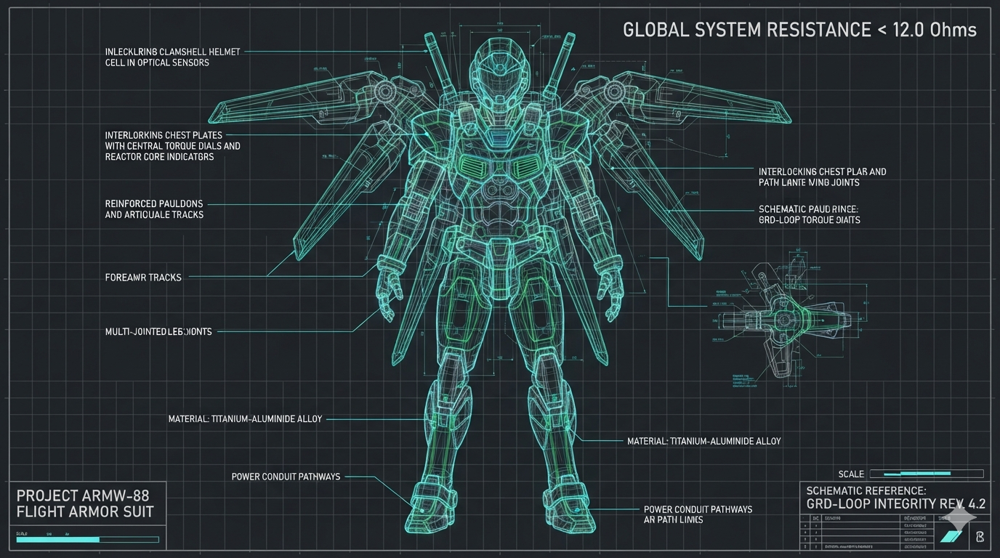
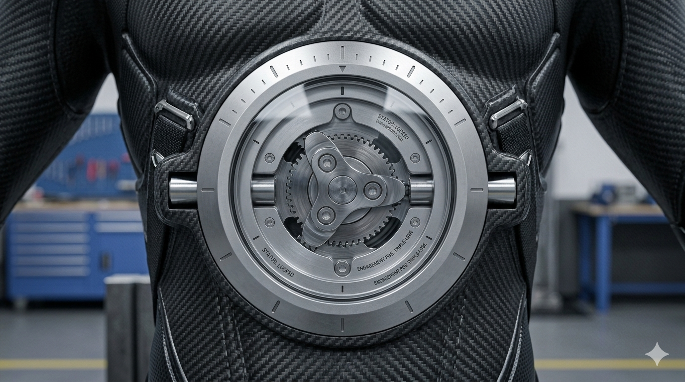
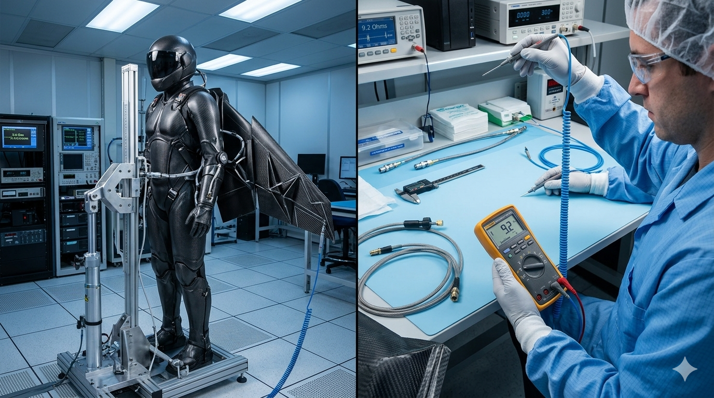
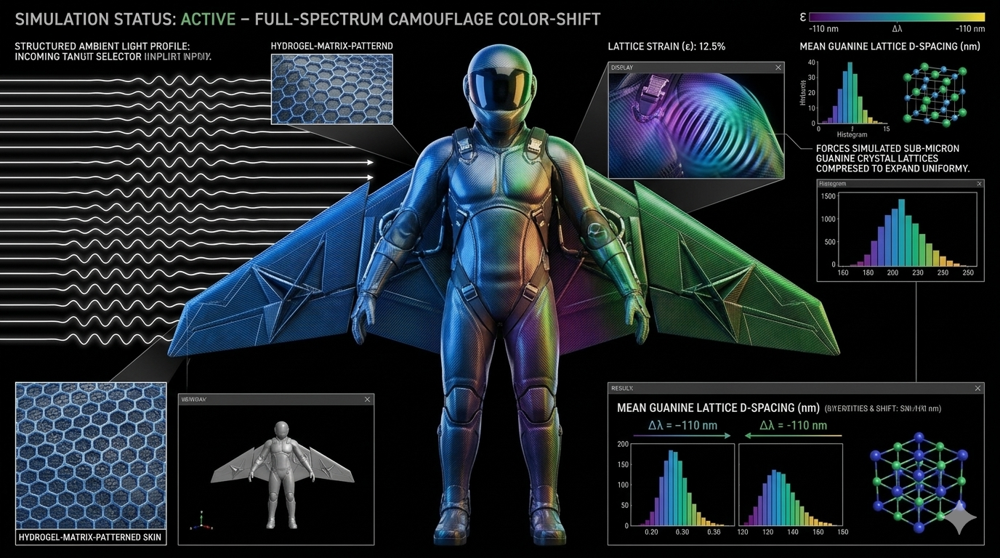

# Project ARMW-88: Master Suit Integration & Full Armor Architecture (Module: suit-master)


## 💎 Full-Suite System Manifest & Sovereign Armor Philosophy

The **Master Suit Integration Module (Project ARMW-Master)** is the definitive structural, data, and mechanical coordinator for the complete **Project ARMW-88 Morphing Aero-Resonator Wing Matrix & Tactical Armor Platform**. It serves as the master blueprint repository and final verification layer required to securely integrate all seven standalone subsystem modules—Head, Torso, Arms, Legs, Wings, Sensors, and the AI Collaborator Interface—into a single, unified, wearable flight envelope. To preserve absolute immunity to Electromagnetic Pulses (EMP), severe atmospheric lightning surges, or intentional electronic warfare jamming, the fully assembled suit features completely **solid-state, non-electronic, and passive physics architectures**. It entirely discards silicon transistors, wiring grids, software firmware blocks, or chemical batteries, operating instead as an un-jammable resodynamic matrix of advanced carbon-fiber composites, fluidic micro-logic pathways, and mechanochemical skin layers.

---

## 🎨 Full-Platform Integration Visual Showroom

Review the verified master engineering layouts, structural grounding validation photography, and multi-module linkage configurations for the fully assembled tactical flight armor system:

### 📐 Master Component Schematics & Material Profiles

*   

*   

### 🦿 Multi-Axial Load Testing & Core Interlocks

*   

*   

---

When all components are locked together across the cleanroom assembly line, they establish a continuous, multi-layered defensive and flight actuation network:
1.  **Continuous Faraday Cage Grounding:** The graphene-infused carbon-fiber polycarbonate outer shell forms an unbroken electromagnetic shield. High-voltage surge spikes glide across the helmet and chest plates, traveling down the arm and leg frames to dump harmlessly out of the trailing static-wick filaments at the wingtips.
2.  **Harmonized Energy-Recycling Systems:** Wind shear friction traveling across the wings and limbs at 200 km/h acts as a continuous energy harvester via the **Triboelectric Fluoropolymer Mesh**, siphoning a stable $450\text{V}$ static potential down high-conductivity liquid metal alloy power lines to drive internal mechanical dampeners and joint lock-valves.
3.  **Solid-State Logic Computing:** High-velocity ram-air captured by the rear squid induction ports feeds directly into the monolithic SLA **Fluidic Computer block**. This un-jammable core monitors airspeed, maps low-altitude terrain boundaries via ground-effect pitots, tracks closing threat trajectories through Doppler acoustic radar collector horns, and emits real-time harmonic sound codes directly to the pilot's ear cups using absolute zero electricity.

### 🧲 Laboratory Quality Control & Grounding Sweeps

*   

*   

---

## 🎯 Project Flight Armor Quick Navigation Dashboard

Select a terminal coordinate below to instantly jump to a specific sub-module manifest, operational handbook, or machine configuration layer within the decentralized flight stack:

| 🦾 Module Layer | 📋 Manifest & Specs | 🦺 User Ingress/Egress Guide | 📐 3D CAD Blueprint Core |
| :--- | :--- | :--- | :--- |
| **👑 Full Platform** | 🔗 **[Master Suit Overview](modules/suit-master/README.md)** | 🔗 **[Full Assembly Guide](modules/suit-master/ASSEMBLY_MANUAL.md)** | 🔗 **[Global Physics Twin Script](armw88-flight-twin.py)** |
| **🪖 Helmet Cell** | 🔗 **[Head Module Specs](modules/suit-head/README.md)** | 🔗 **[Helmet Operations](modules/suit-head/OPERATION_MANUAL.md)** | 🔗 **[Helmet CAD Schematic](modules/suit-head/config/schematics/head-chassis.scad)** |
| **🦺 Chest Core** | 🔗 **[Torso Module Specs](modules/suit-torso/README.md)** | 🔗 **[Torso Operations](modules/suit-torso/OPERATION_MANUAL.md)** | 🔗 **[Torso CAD Schematic](modules/suit-torso/config/schematics/torso-clamshell.scad)** |
| **🦾 Forearm Sleeves** | 🔗 **[Arms Module Specs](modules/suit-arms/README.md)** | 🔗 **[Arms Operations](modules/suit-arms/OPERATION_MANUAL.md)** | 🔗 **[Arms CAD Schematic](modules/suit-arms/config/schematics/arm-sleeves.scad)** |
| **🦘 Landing Lander** | 🔗 **[Legs Module Specs](modules/suit-legs/README.md)** | 🔗 **[Legs Operations](modules/suit-legs/OPERATION_MANUAL.md)** | 🔗 **[Legs CAD Schematic](modules/suit-legs/config/schematics/leg-exoskeleton.scad)** |
| **🦅 Morphing Wings** | 🔗 **[Wings Module Specs](modules/suit-wings/README.md)** | 🔗 **[Wings Operations](modules/suit-wings/OPERATION_MANUAL.md)** | 🔗 **[Wings CAD Schematic](modules/suit-wings/config/schematics/wing-joints.scad)** |
| **🌪 Air Computer** | 🔗 **[Sensors Module Specs](modules/suit-sensors/README.md)** | 🔗 **[Sensors Operations](modules/suit-sensors/OPERATION_MANUAL.md)** | 🔗 **[Fluidic Computer CAD](modules/suit-sensors/config/schematics/fluidic-computer.scad)** |
| **🧠 AI Collaborator** | 🔗 **[AI Interface Specs](modules/suit-ai/README.md)** | 🔗 **[AI Audio Code Matrix](modules/suit-ai/OPERATION_MANUAL.md)** | 🔗 **[Acoustic Data Vault](modules/suit-ai/config/README.md)** |
| **📊 Aero Boundaries** | 🔗 **[Performance Specs](modules/suit-performance/README.md)** | 🔗 **[Flight Envelope Logs](modules/suit-performance/FLIGHT_ENVELOPE.md)** | 🔗 **[Wind-Tunnel Metrics](modules/suit-performance/config/README.md)** |
| **⚖️ Sovereign Law** | 🔗 **[Ethical License](LICENSE_COVENANT.md)** | 🔗 **[Indemnity Clauses](LICENSE_COVENANT.md#-section-5-absolute-disclaimer-of-liability-fabrication-indemnity--risk-assumption)** | 🔗 **[Visual Blueprint Maps](modules/suit-master/media/README.md)** |
| **🖨 Prototyping**    | 🔗 **[Prototyping Specs](modules/suit-prototyping/README.md)** | 🔗 **[14-Day Production Logs](modules/suit-prototyping/config/FABRICATION_TIMELINE.md)** | 🔗 **[Printer Run Cards](modules/suit-prototyping/config/hardware-bom.json)** |

---

## ⚖️ Full-Platform Restrictive Legal Framework

> 🚫 **CIVILIZATIONAL EXPLOITATION BOUNDARY PROHIBITION:**
> As the central structural hub coordinating all seven standalone flight nodes, the fully assembled suit is strictly bound to the **Project ARMW-88 Ethical Covenant**. Slicing, fabricating, or assembling this multi-module envelope for warfare or drone-force enslavement automatically triggers international civil litigation and asset seizure.
> 🔗 **[READ FULL LITIGATION DEPLOYMENT AND COMPLIANCE SPECIFICATIONS (`/LICENSE_COVENANT.md`)](../../LICENSE_COVENANT.md)**

---

## 🗂 Master Suit Symmetrical Directory Map
```
vortex-flight-armw88/modules/suit-master/
├── README.md                 # This file (Master Suit Platform Manifest & Index)
├── ASSEMBLY_MANUAL.md        # Head-to-toe component locking sequence & torque specs
└── config/
    ├── README.md             # Symmetrical configuration directory validation index
    ├── hardware-bom.json     # Global machine-readable bounds & multi-module mapping
    ├── HARDWARE_BOM.md       # Full platform materials sourcing ledger manual
    └── CLEANROOM_OPS.md      # Full-suit pressure, grounding continuity, & drop QA logs
```
---

## 🖨 Global System Integration Directives

Because the complete armor suite binds the pilot into a high-load, sub-sonic kinetic envelope, any structural misalignment or loose mechanical interface across the module seams will compromise safety boundaries. Technicians and slicing engines must strictly enforce these cleanroom protocols:

*   **Interlock Pin Specification:** All connection points must utilize high-strength, marine-grade Inox 316L stainless steel detent pins or hardened steel industrial locking bars. Subgrade alloy fasteners or soft metals are strictly prohibited.
*   **Airtight Fluid Boundary Seals:** All micro-fluidic power bus loops and pneumatic altimetry line connections crossing between different modules (e.g., torso-to-arm seams) must be secured using micro-bore fluorosilicone thread gaskets torqued to exact engineering specifications to prevent line weeping.
*   **Faraday Ground Verification:** Before clearing the integrated suit for active field flight, a complete multi-axial electrical resistance sweep must be run across the fully assembled shell to verify that the ground plane remains below the critical \(12\text{ \Omega}\) benchmark from head to toe.

---

## ⚠️ Master Assembly Indemnity & Risk Waiver

> 🛑 **CRITICAL ASSEMBLY COMPLIANCE RULE:** Integrating all seven component nodes into a single wearable flight suite scales operational kinetic stresses up to extreme thresholds. Slicing structural spars or driving detent pins outside the exact metrology constants mapped in `hardware-bom.json` will cause structural failures. Pursuant to **Section 5 of the License Covenant**, the authors and collaborators remain completely absolved of all legal liability regarding builder accidents, material delamination, or field touchdown injuries.
> 
