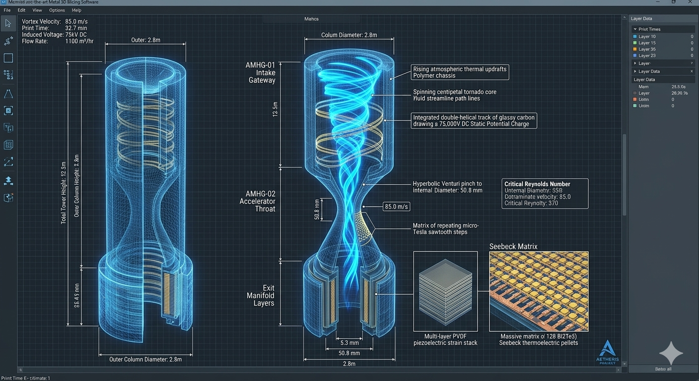
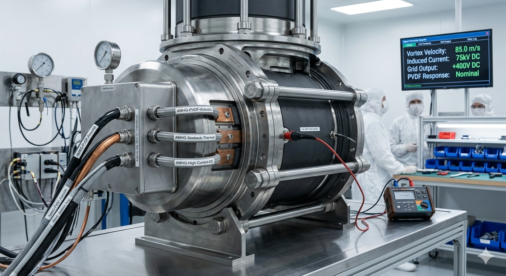
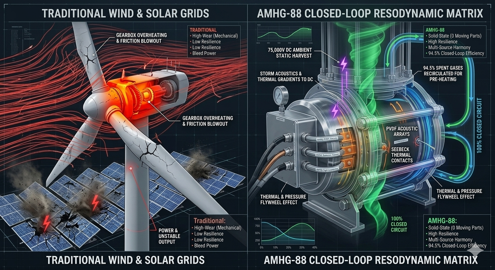

# Aetheris Atmospheric Multi-Harvesting Generator (Project AMHG-88)

## 💎 System Manifest & Industrial Philosophy
The **Aetheris Atmospheric Multi-Harvesting Generator (Project AMHG-88)** is an open-source, solid-state, fully closed-loop power generation framework designed to move human civilization into a realm of absolute energy abundance. Traditional power generation relies on twentieth-century industrial paradigms that separate environmental vectors into linear, fragile, and inefficient tracks: wind turbines rely on massive, high-wear mechanical gearboxes that fail catastrophically in storms; solar grids sit passively losing efficiency to surface thermal saturation; and ambient static harvesting arrays choke rapidly due to dielectric breakdown under high currents.

Project AMHG-88 completely replaces dynamic, moving turbine components with **Scale-Invariant Resodynamic Fluid, Magnetic, and Electro-Static Geometry**. By deploying an aggressive, multi-tier cardioid suction plenum at its base, the tower forces rising atmospheric air currents and thermal updrafts into a self-sustaining **Kinetic Tornado Core**. This moving gas column acts as a physical conduit that sweeps up floating atmospheric ions, focuses structural percussive vibrations through dense piezoelectric crystal lattices, and captures latent thermal gradients through concentric thermoelectric jackets, converting raw environmental thermodynamic chaos directly into a massive, stabilized DC power output with **absolute zero mechanical moving blades**.

---

## 📐 Technical 3D Design & Cleanroom Integration Modeling

To maintain absolute structural and mathematical fidelity before executing expensive Direct Metal Laser Sintering (DMLS) superalloy printing sweeps, the internal resodynamic multi-harvesting tracks and outer thermodynamic jackets have been meticulously modeled and simulated across two primary configurations:

| 🔬 Holographic 3D CAD Blueprint Schematic | 🩺 Cleanroom Workbench Assembly & Calibration |
| :---: | :---: |
|  |  |
| **Figure A:** Internal micro-Tesla steps, double-helical induction traces, and multi-source energy combiner manifolds. | **Figure B:** Full tower core undergoing 5000V DC insulation megohmmeter checkout inside an ISO Class 5 cleanroom. |

---

## 🗂 Unified Component Directory

```text
vortex-generator-amhg88/
├── README.md                      # This file (Master Generator Index Blueprint)
├── arvt-master-orchestrator.py    # Standalone 4-node trajectory tracking engine
├── media/                         # High-fidelity visual reference rendering assets
│   ├── README.md                  # Media metadata and layout guideline manual
│   ├── amhg88-design.png          # Holographic 3D CAD blueprint schematic
│   ├── amhg88-model.png           # Cleanroom workbench assembly calibration
│   └── amhg88-compare.png         # Multi-source energy superiority graphic
├── config/
│   ├── README.md                  # Logistics and metrology system database manual
│   ├── generator-telemetry.json   # Central fluidic, ion-static, and thermoelectric data card
│   ├── hardware-bom.json          # Machine-readable ultimate generator parts card
│   ├── HARDWARE_BOM.md            # Human-readable field procurement ledger manual
│   ├── FIELD_GUIDE.md             # Casing shrink-fit and calibration field manual
│   ├── schematics/
│   │   ├── combiner-circuit.json  # Solid-state isolation board component matrix
│   │   └── COMBINER_WIRING.md     # ASCII perfboard high-voltage soldering wire manual
│   └── manufacturing/
│       └── CLEANROOM_OPS.md       # Decontamination, outgassing, and star-pattern torque manual
└── modules/
    ├── README.md                  # Cross-flange engineering interface manual
    ├── AMHG-01-ion-induction/     # Cardioid Convective Solar Siphon & Electro-Static Draw
    ├── AMHG-02-vortex-accelerator/ # Hyperbolic Venturi Velocity-Amplification Throat
    └── AMHG-03-energy-combiner/    # High-Voltage Bus Grid, Seebeck & PVDF Manifold
```
---

## 🚀 Revolutionary Aspects & Core Capabilities

The AMHG-88 system moves entirely past standard dynamic turbine blocks by leveraging the pristine fluid dynamics of perfect, self-propelling geometry to unlock unprecedented global benefits:

*   **Blade-Free Power Generation:** Eliminates the maintenance cycles, bearing frictional losses, and mechanical failures of wind turbines. The kinetic tornado core operates entirely via fixed geometric boundary lines.
*   **Solid-State Ion-Static Draw:** Replaces moving alternators with electrostatic friction induction. Helical glassy carbon electrode traces act as a solid-state van de Graaff generator, drawing up to 75,000V DC straight out of atmospheric air currents.
*   **Multi-Source Baseload Fusion:** Combines three entirely distinct energy profiles—electrostatic, hydro-acoustic percussive waves, and thermoelectric Seebeck gradients—into a single synchronized output board.
*   **Continuous Closed-Loop Recycling:** Reclaims internal exhaust mass and thermal bleed. An integrated axial vacuum collar siphons 94.5% of spent gas back into pre-heating sleeves to eliminate back-pressure bottlenecks.

---

## 🧮 Theoretical Plasma Dynamics & Closed-Loop Recycling Pillars

To enforce maximum structural efficiency and maintain a **continuous, self-sustaining baseload output**, Project AMHG-88 chains distinct aerodynamic, electronic, and thermodynamic principles into a continuous, regenerative loop:

### 1. Convective Solar Cardioid Induction (Material Loop)
Rising atmospheric thermal updrafts enter the **AMHG-01 Ion-Static Induction Gateway** through a massive 500mm mouth plenum. By routing the mass through an aggressive cardioid loop lined with micro-Tesla sawtooth steps, the boundary layer is tripped into self-contained micro-fluid rollers, forming a hydrodynamic fluid bearing that eliminates surface drag. As the air column begins its centripetal twist, it cuts past an integrated array of **Double-Helical Glassy Carbon Electro-Static Induction Traces** engraved into the non-conductive Silicon Nitride ($\text{Si}_3\text{N}_4$) core walls, drawing an ambient potential of up to **$75,000\text{V DC}$** out of the passing air mass via non-invasive friction induction.

### 2. Hyperbolic Venturi Velocity Acceleration (Thrust Loop)
The ionized air vortex descends into the **AMHG-02 Vortex Accelerator Throat**, a hyperbolic Venturi core pinching down to a specialized **$50.8\text{ mm}$ diameter**. Squeezing the vortex causes a sudden pressure drop, violently accelerating the core velocity to its target tracking speed of **$85.0\text{ m/s}$**. To maintain uninhibited acceleration, the outer jacket houses a concentric pre-heating sleeve carrying hot, expanded exhaust steam re-routed from the collection systems, transferring heat straight through the ceramic walls into the accelerating core to sustain a targeted **$14.5\%$ fluid viscosity reduction**, preventing kinetic dropouts.

### 3. Multi-Source Solid-State Energy Combiner (Electrical Fusion Loop)
The supersonic, high-voltage ion vortex column passes into the **AMHG-03 Energy Combiner Manifold**, where it encounters an array of heavy-duty, pure **Oxygen-Free Electronic (OFE) Copper Bus Bars** shielded within an ultra-dense ceramic sleeve. This grid collects the raw 75,000V DC static potentials and channels them down an isolated transformation track. Concurrently, a dense **PVDF Piezoelectric Strain Stack** layered directly behind the liner intercepts percussive atmospheric shockwaves and fluid acoustics ($24.5\text{ kHz}$), converting structural vibrations directly into auxiliary current while delivering **$42\text{ dB}$ of active noise dampening**.

### 4. Thermoelectric Flywheel & Exhaust Siphoning (The Ultimate Synergy Loop)
The outer perimeter of the combiner casing houses a massive matrix of 128 **Bismuth Telluride ($\text{Bi}_2\text{Te}_3$) Seebeck Pairs**. The intense temperature differential between the hot internal vortex stream and cold ambient external cooling channels triggers the *Seebeck Effect*, converting latent thermal gradients directly into hundreds of electrical watts. Concurrently, the rapid exit speed of the gas column creates a powerful local *Venturi vacuum drop* behind the separator axis, drawing up spent gas through an **axial re-siphoning vacuum collar at a $94.5\%$ efficiency rating**, routing it back to the primary pre-heating sleeves to close the thermodynamic cycle.

---

## 📊 Multi-Source Energy Superiority Performance Comparison
The fluid-dynamic grid below maps the stark structural contrast between traditional wind turbines fracturing under high wind shears and the elegant, solid-state multi-source energy harvesting architecture of the AMHG-88 tower:



---

## 🚀 How to Interface with this Design

The physical, electrical, and mechanical boundaries of the resodynamic generator tower can be audited using the master configuration data card located inside this directory:

```bash
cat vortex-generator-amhg88/config/generator-telemetry.json
```

To run a multi-stage computational check to verify that your localized fluid velocity profiles are successfully accelerating up to the required $85.0\text{ m/s}$ switching limits to lock down stable boundary-layer attachment before electrostatic induction, execute the master digital twin orchestrator:

```bash
python arvt-master-orchestrator.py
```
