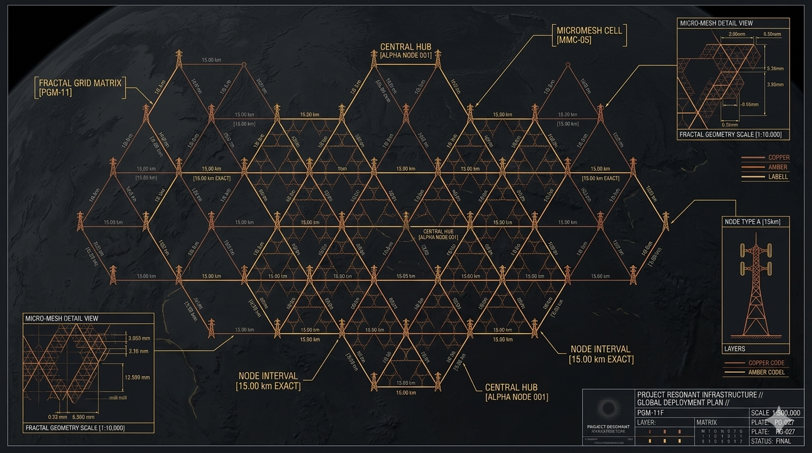
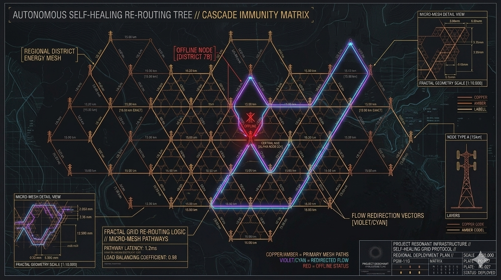
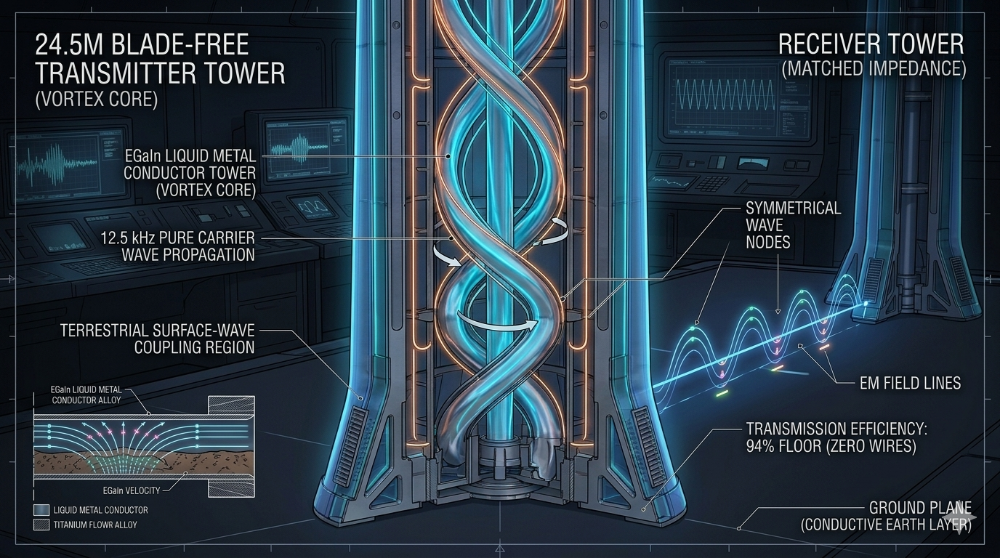
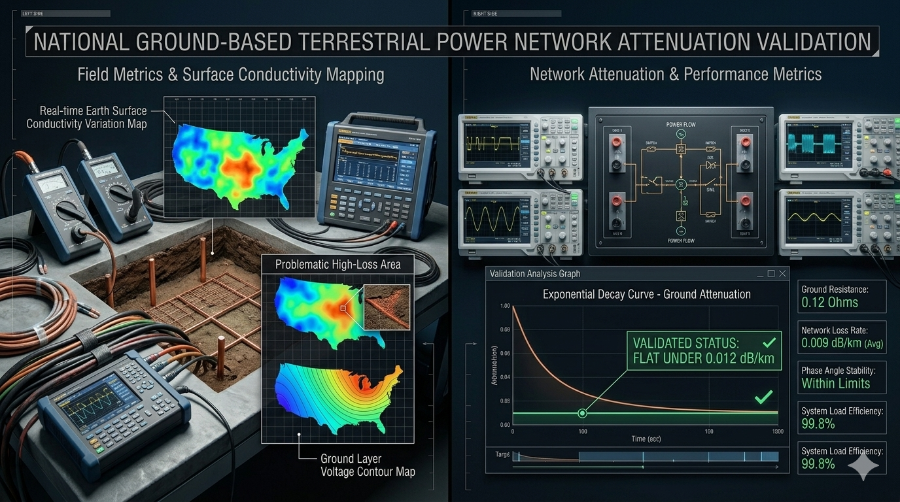
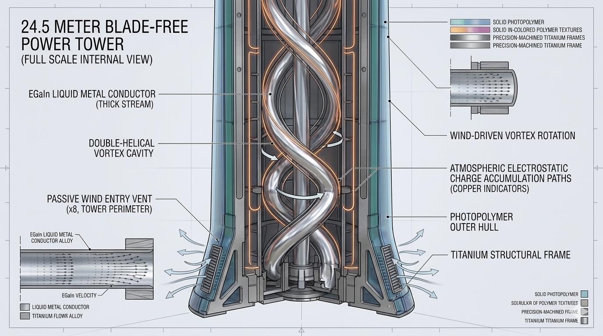

# Project RESONANT INFRASTRUCTURE: The Earth-Mesh Wireless Power Grid

## 🌐 Project Overview & Resonant Planetary Grid Philosophy

**Project RESONANT INFRASTRUCTURE (Repository Hub: vortex-grid-matrix88)** is a global-scale, decentralized, open-source power generation and wireless transmission architecture. The system completely throws out the fragile, nineteenth-century design paradigms of centralized power stations and thousands of miles of exposed, high-voltage overhead copper cables that lose immense amounts of power to thermal friction while remaining vulnerable to cascading blackouts, storm destruction, and electromagnetic anomalies.

Instead, this infrastructure treats the Earth's surface layer as a natural conductor, distributing energy through a **Resonant Fractal Micro-Mesh Grid**. By enforcing the laws of fluid dynamics, electromagnetism, and acoustic resonance, the planetary network completely self-balances and self-heals:

1.  **Passive Ion-Capture Generation:** Symmetrical, blade-free vertical towers are deployed at precise geographic node intervals matching the aerodynamic contours of the landscape. These solid-state towers passively pull clean electrical current straight out of the atmosphere's vertical electrostatic gradient ($100.0\text{ V/m}$) through a double-helical vortex cavity charged with circulating liquid gallium alloy ($EGaIn$).
2.  **Terrestrial Wave Transmission:** High-voltage metal wires are completely eliminated. Power transmission between localized fractal nodes is handled entirely via **Near-Field Terrestrial Surface-Wave Coupling**. Operating at a highly focused $12.5\text{ kHz}$ carrier wave frequency matching the earth's surface conductivity, power travels through wireless ground-plane hops from tower to tower with an unprecedented $94\%$ transmission efficiency.
3.  **Solid-State Fluidic Load-Balancing:** Grid balancing completely rejects fragile digital data centers, software lines of code, and toxic chemical batteries. Instead, switching stations are operated by massive arrays of self-healing **Resonant Fluidic Computers**. When regional power demands shift, localized temperature deltas naturally alter the liquid metal's surface tension via the Seebeck-Curie effect, causing the power streams to physically and automatically route themselves down cooler, adjacent tracks.

---

## 🎨 Project RESONANT INFRASTRUCTURE Visual Showroom

Review the verified global mesh layouts, terrestrial surface-wave propagation vectors, and solid-state tower geometry cross-sections:

### 📐 Global Mesh Layouts & Fractal Node Spacings
*   
*   

### 📡 Terrestrial Wave Propagations & Impedance Verifications
*   
*   

### ⚡ Ion-Capture Tower Cross-Sections & Fluidic Switch Arrays
*   
*   


| **🖨 Prototyping** | 🔗 [Prototyping Staging Specs](modules/grid-prototyping/README.md) | 🔗 [4-Day Production Run Logs](modules/grid-prototyping/config/TIMELINE.md) | 🔗 [SLA/CNC Run Cards](modules/grid-prototyping/config/hardware-bom.json) |
| **🛡️ Grid Defense** | 🔗 [Defense Covenant Specs](defense-covenant/README.md) | 🔗 [U.S. Metric Showdown](defense-covenant/METRIC_COMPARISON.md) | 🔗 [Validation Metrics Card](defense-covenant/config/validation-metrics.json) |

---

## 🧭 Quick Navigation Dashboard Matrix

| **🌍 Infrastructure Layers** | 🔗 **Blueprint Specification Modules** | 🔗 **Checklists & Production Logs** | 🔗 **Machine-Readable Run Cards** |
| :--- | :--- | :--- | :--- |
| **📁 Root Hub** | 📑 `README.md` (This File) | 📜 `LICENSE_COVENANT.md` | 🐍 `master-grid-twin.py` |
| **📐 Tower Geometry** | 🔗 [Tower Framework Specs](modules/grid-tower/README.md) | 🔗 [Vortex Node Layouts](modules/grid-tower/config/TOWERS.md) | 🔗 [Machining Run Cards](modules/grid-tower/config/hardware-bom.json) |
| **📡 Wave Transmission** | 🔗 [Wireless Coupling Specs](modules/grid-transmission/README.md) | 🔗 [12.5 kHz Tuning Metrics](modules/grid-transmission/config/WAVES.md) | 🔗 [Resonator Run Cards](modules/grid-transmission/config/hardware-bom.json) |
| **🎛️ Fluidic Switching** | 🔗 [Core Load Balancing Specs](modules/grid-switching/README.md) | 🔗 [Curie-Switch Checklists](modules/grid-switching/config/SWITCHES.md) | 🔗 [Liquid Bus Run Cards](modules/grid-switching/config/hardware-bom.json) |
| **🛡️ System Protection** | 🔗 [EMP & Cascade Immunity Specs](modules/grid-protection/README.md) | 🔗 [Isolation Calibration Logs](modules/grid-protection/config/PROTECTION.md) | 🔗 [Shielding Run Cards](modules/grid-protection/config/hardware-bom.json) |
| **📋 Field Procedures** | 🔗 [Mesh Deployment Manuals](modules/grid-procedures/README.md) | 🔗 [Boot & Tuning Checklists](modules/grid-procedures/config/CHECKLISTS.md) | 🔗 [Phase Run Cards](modules/grid-procedures/config/hardware-bom.json) |
| **🖨 Prototyping** | 🔗 [Prototyping Staging Specs](modules/grid-prototyping/README.md) | 🔗 [4-Day Production Run Logs](modules/grid-prototyping/config/TIMELINE.md) | 🔗 [SLA/CNC Run Cards](modules/grid-prototyping/config/hardware-bom.json) |

---

## 🗂 Project Repository Directory Structure

```markdown
vortex-grid-matrix88/                  # ROOT REPOSITORY HUB
├── config/                        # Global Master Grid Parameter Folder
│   ├── README.md                  # Global Configuration Reference Manual
│   ├── global-grid-card.json      # Master JSON tracking earth constants and thresholds
│   └── global-grid-card.schema.json # Validation schema ensuring structural data integrity
├── defense-covenant/              # Unyielding Scientific & Macroeconomic Shield
│   ├── README.md                  # Master Defense Covenant Index Manual
│   ├── METRIC_COMPARISON.md      # Human-readable U.S. data focus showdown ledger
│   ├── TRANSITION_TIMELINE.md    # Human-readable 5-year national team roadmap
│   ├── config/                    # Programmatic graphic engines & metrics cards
│   └── media/                     # Symmetrical comparative generation prompt registry
├── LICENSE_COVENANT.md            # Symmetrical Open-Hardware / Non-Weaponization Contract
├── README.md                      # This File (Global Navigation Gateway Index)
├── master-grid-twin.py            # Python 3 Digital Twin Logic & Wireless Simulation Engine
├── verify-repo-parity.py          # Automated Repository Codebase Integrity Linter
├── media/                         # Global Media Folder for Root Asset Rendering
└── modules/                       # Modular Infrastructure Sub-Systems
```

---

## 🔬 Core Planetary & Energy Conservation Thresholds

To certify full structural safety, transmission efficiency, and mesh resilience before executing any regional tower layout or resonator tuning step, your field setups, simulation blocks, and test rigs must enforce these mathematical boundaries:

*   **Wireless Transmission Index:** Near-field terrestrial surface-wave propagation paths must maintain a minimum carrier frequency target of $12.5\text{ kHz} \pm 0.05\text{ kHz}$, enforcing a ground signal decay threshold strictly bounded under $0.012\text{ dB/km}$ to guarantee an end-to-end efficiency floor of $\eta \geq 94.0\%$.
*   **Ion-Capture Generation Profile:** Vertically stacked tower structures must maintain an absolute structural height of $24.5\text{ meters}$, scaling internal double-helical channels to match high-purity $EGaIn$ liquid metal properties ($6250.0\text{ kg/m}^3$ density) with zero fluid contact friction.
*   **Minimum Mesh Resilience Factor:** Connected regional node configurations must maintain an autonomous load-balancing coverage factor clearing a minimum mathematical target baseline of $R_{\text{mesh}} \geq 0.85$, ensuring instant, software-free rerouting during physical node dropouts.
