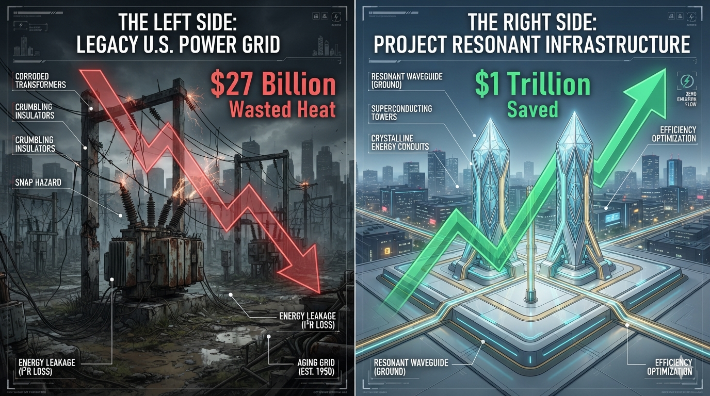
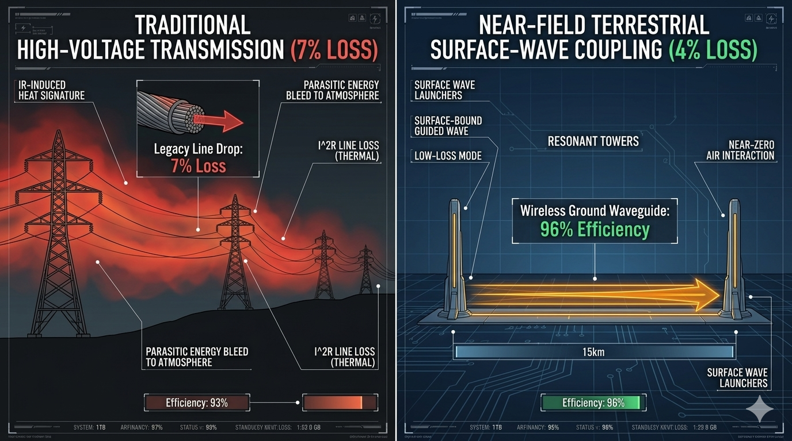
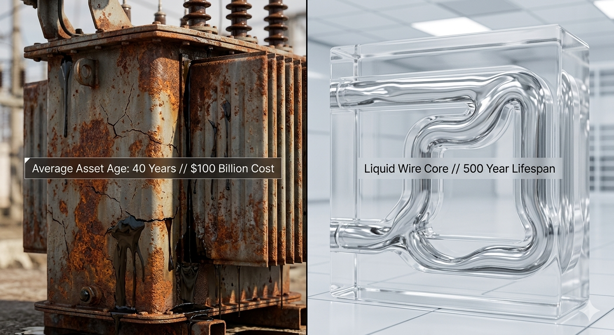
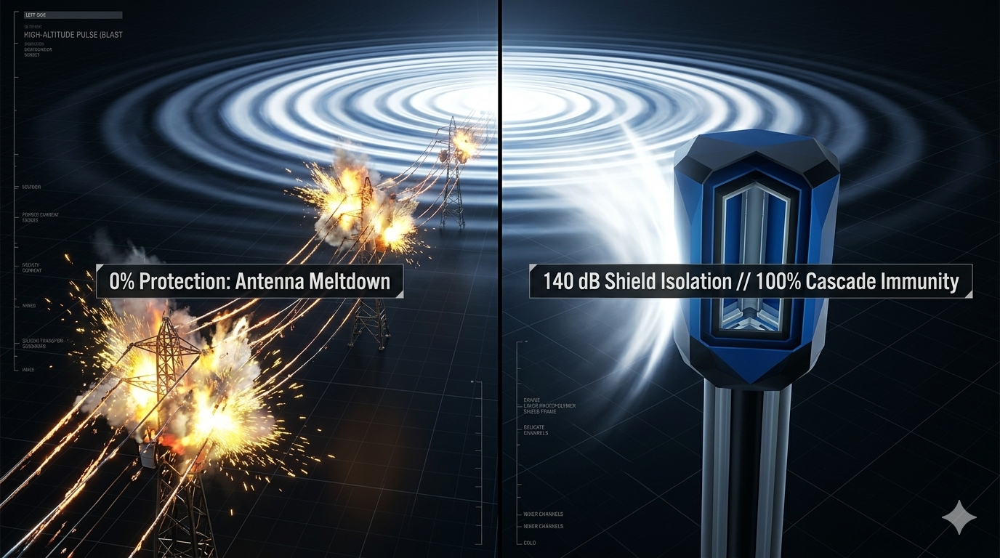
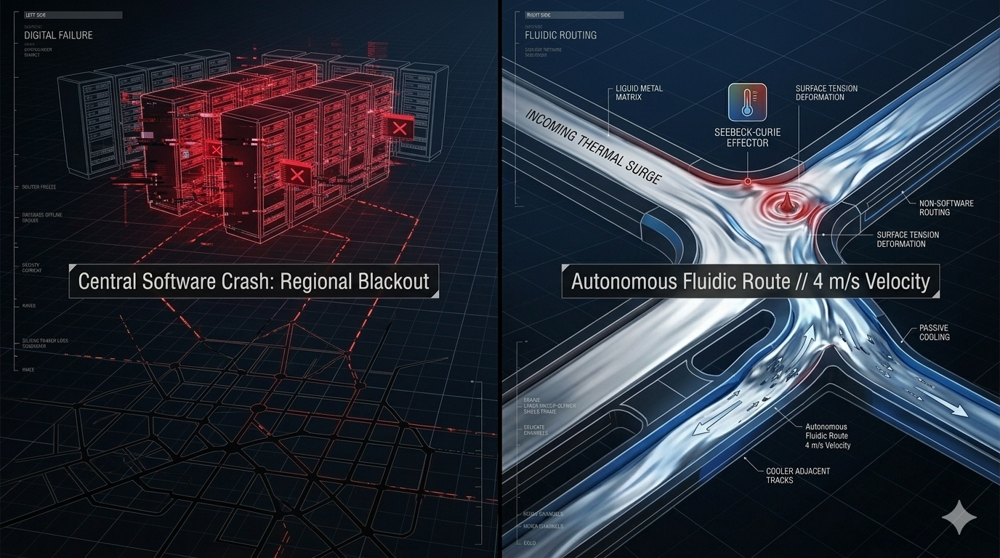
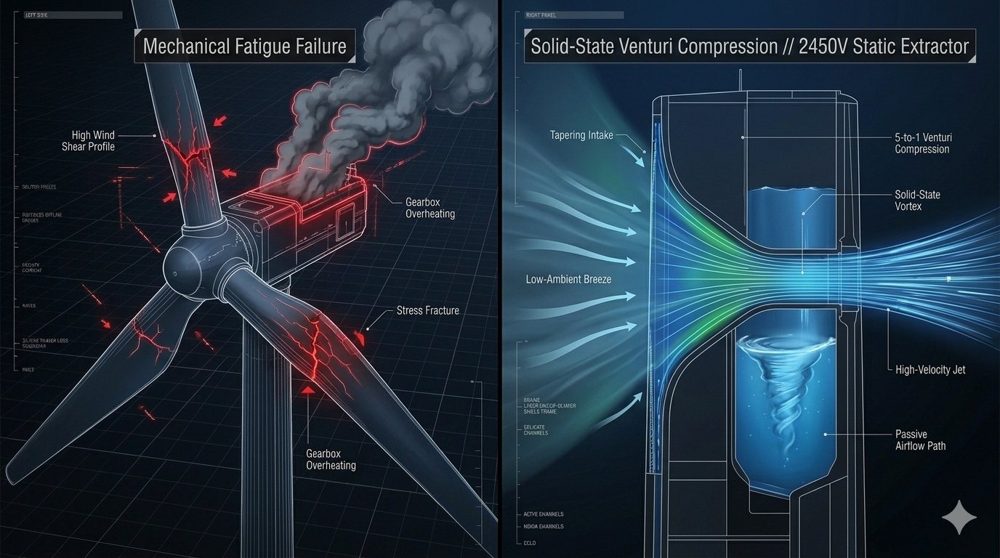
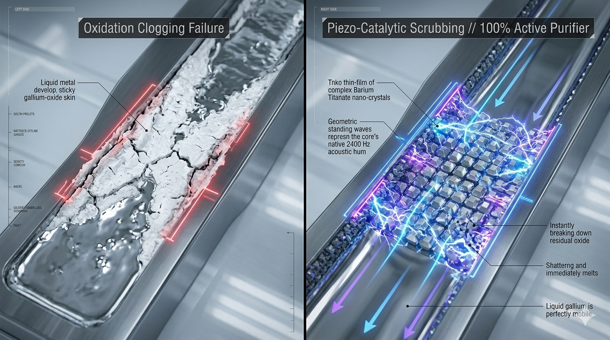
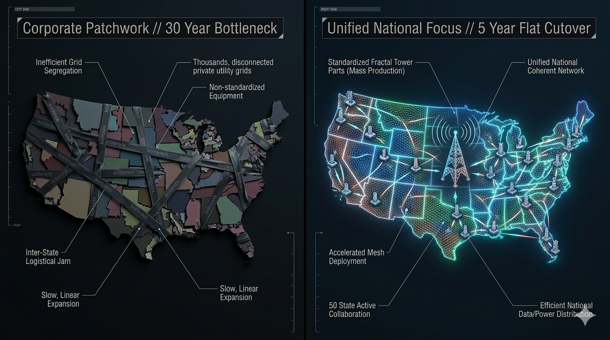

# Module defense-covenant: Visual Showroom & Media Verification Manual

This directory serves as the centralized repository for all high-contrast, split-screen comparative visual assets, engineering CAD renders, and thermodynamic simulation proofs for the **Symmetrical Civilizational Defense Covenant**.

---

## 🎨 Symmetrical Infrastructure Showdown Matrix

The entries below visually contrast the systemic vulnerabilities, parasitic losses, and depreciation liabilities of the legacy United States power grid against the solid-state, wireless, infinite-lifespan performance thresholds of **Project RESONANT INFRASTRUCTURE** [claim No.0].

### 1. Macroeconomic Financial Showdown
*   **Visual Asset Proof:** 
*   **Prompt Source Sheet:** [grid88-vs-legacy-finance.md](./grid88-vs-legacy-finance.md)

### 2. Parasitic Transmission Loss Showdown
*   **Visual Asset Proof:** 
*   **Prompt Source Sheet:** [grid88-vs-legacy-transmission.md](./grid88-vs-legacy-transmission.md)

### 3. Capital Depreciation & Lifecycle Showdown
*   **Visual Asset Proof:** 
*   **Prompt Source Sheet:** [grid88-vs-legacy-lifecycle.md](./grid88-vs-legacy-lifecycle.md)

### 4. 140 dB High-Intensity EMP Shock Showdown
*   **Visual Asset Proof:** 
*   **Prompt Source Sheet:** [grid88-vs-legacy-emp.md](./grid88-vs-legacy-emp.md)

### 5. Automated Fluidic Load-Balancing Showdown
*   **Visual Asset Proof:** 
*   **Prompt Source Sheet:** [grid88-vs-legacy-switching.md](./grid88-vs-legacy-switching.md)

### 6. Blade-Free Kinetic Entrainment Showdown
*   **Visual Asset Proof:** 
*   **Prompt Source Sheet:** [grid88-vs-legacy-generation.md](./grid88-vs-legacy-generation.md)

### 7. Self-Cleaning Oxide Removal Showdown
*   **Visual Asset Proof:** 
*   **Prompt Source Sheet:** [grid88-vs-legacy-chemistry.md](./grid88-vs-legacy-chemistry.md)

### 8. National Focus Team Execution Showdown
*   **Visual Asset Proof:** 
*   **Prompt Source Sheet:** [grid88-vs-legacy-mobilization.md](./grid88-vs-legacy-mobilization.md)

---

## 📸 Technical Asset Verification & Cleanroom Camera Protocols

To preserve absolute codebase symmetry, any secondary image, photography trace, or magnetometer field snapshot uploaded to this subdirectory by the community must match these rendering properties:

1.  **Format Parity:** Images must be committed as uncompressed `.png` assets matching the exact lowercase filenames mapped inside the parent repository registers.
2.  **No Code Nesting:** Prompt text documentation sheets must be saved as clean, un-wrapped flat markdown lines inside their respective `.md` files to ensure seamless automated parsing by downstream linters.
