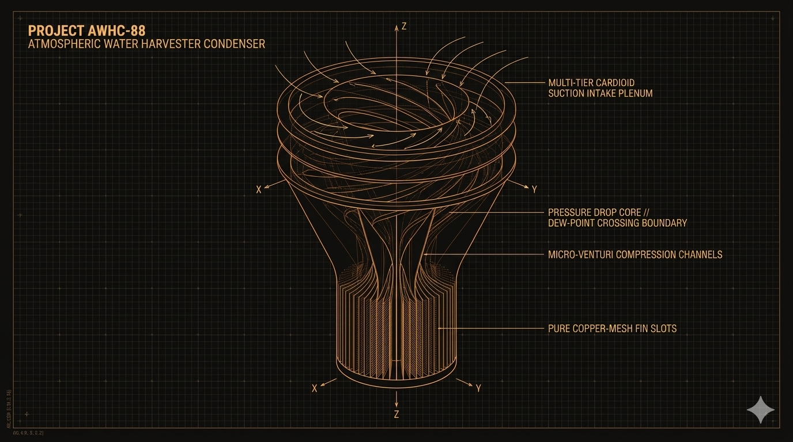

# Atmospheric Water Harvester Condenser (Project AWHC-88)



## 💎 System Manifest & Thermodynamic Philosophy

The **Atmospheric Water Harvester Condenser (Project AWHC-88)** is an open-source, solid-state, blade-free moisture extraction platform designed to provide a continuous source of pure drinking water from ambient atmospheric humidity—even in hyper-arid desert environments ($<15\%$ RH). Standard modern water generation systems rely heavily on energy-intensive mechanical compressor loops, toxic chemical refrigerant phases, and moving fan blades that inevitably experience mechanical wear and failure. Project AWHC-88 replaces all active moving parts with non-equilibrium, scale-invariant fluid mechanics and geometric pressure-drop dynamics.

By deploying an aggressive, multi-tier cardioid suction plenum at its induction intake, the harvester pulls incoming ambient air mass into high-velocity spiral vortices. This rotating fluid mass accelerates through an internal array of micro-Venturi extraction channels. As the air column is forcefully pinched down, it experiences a sudden, violent drop in local static pressure and velocity-driven temperature. This localized pressure crash artificially forcing the passing air mass across its thermodynamic dew-point threshold. The moisture suspended in the air mass undergoes instantaneous phase transition, condensing directly onto a series of internal passive, golden-ratio (Φ) cooled copper-mesh fins where it drains away into a central collection manifold.

## 🗂 Unified Component Directory

```
vortex-harvester-awhc88/
├── README.md                      # This file (Master AWHC-88 Index Blueprint)
├── awhc88-thermo-twin.py          # Computational thermodynamic dew-point tracking twin
├── config/
│   ├── README.md                  # Internal metadata cross-reference index
│   ├── hardware-bom.json          # Machine-readable metrology properties & slicer parameters
│   ├── HARDWARE_BOM.md            # Human-readable field procurement ledger manual
│   ├── CLEANROOM_OPS.md           # Hydrostatic sealing & extraction validation manual
│   └── schematics/
│       ├── README.md              # 3D spatial alignment & boundary layout notes
│       └── harvest-core.scad      # Core parametric 3D Solid Engine for the condenser
└── media/
    ├── README.md                  # Telemetry visualization and render indices
    └── awhc88-airflow-map.svg     # Native vector trajectory schematic for air movement
```

## 🖨 Manufacturing & Slicer Deployment Directives

To guarantee a watertight internal condensation boundary and prevent environmental moisture from micro-weeping through raw infill lines, the core extraction housing must be processed using these exact parameters:

*   **Material Matrix:** **PC-CF (Carbon Fiber Polycarbonate)** or food-safe **PETG**. Standard PLA must never be deployed as it will degrade under continuous internal moisture cycles.
*   **Perimeter Wall Loops:** **6 Walls Minimum.** A thick outer shell boundary is mandatory to handle high internal centripetal pressure differentials.
*   **Internal Infill Layer:** **40% Gyroid Density.** Gyroid configurations provide uniform multi-axial thermal distribution across the internal condenser body, preventing structural warping during extreme day-to-night desert temperature shifts.
*   **Layer Slicing Resolution:** **0.12mm to 0.16mm.** Finer layer height resolution minimizes internal boundary friction lines, ensuring air currents glide cleanly through the micro-Venturi slots without losing velocity.
