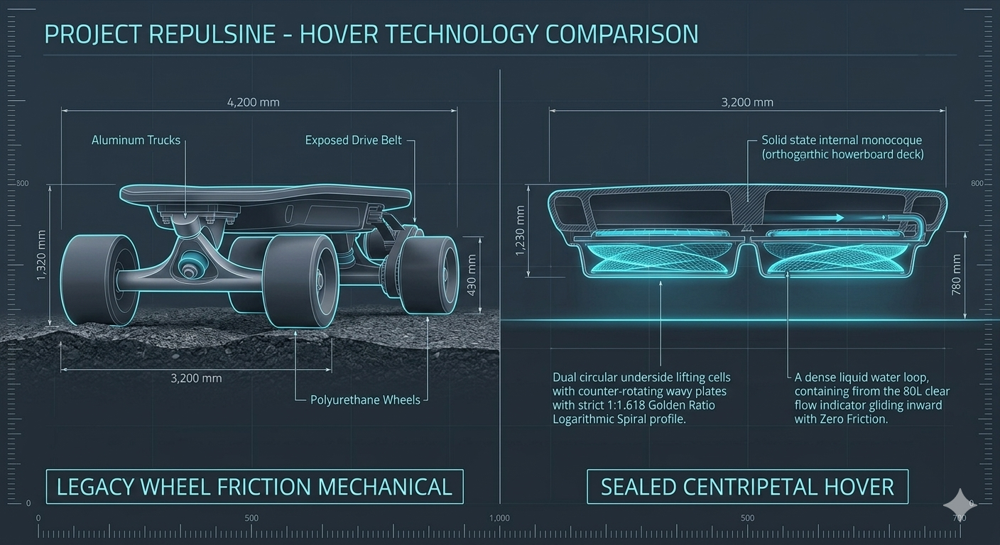
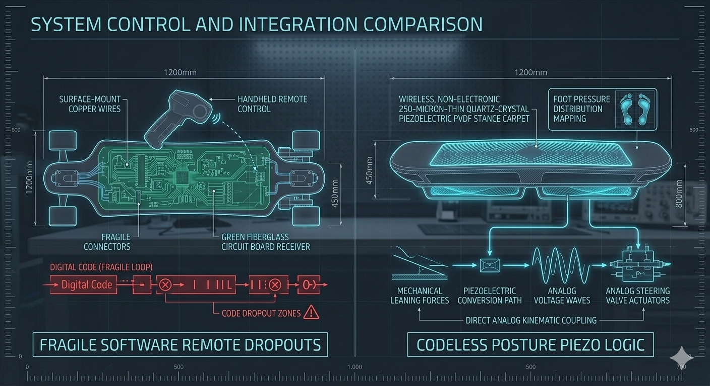
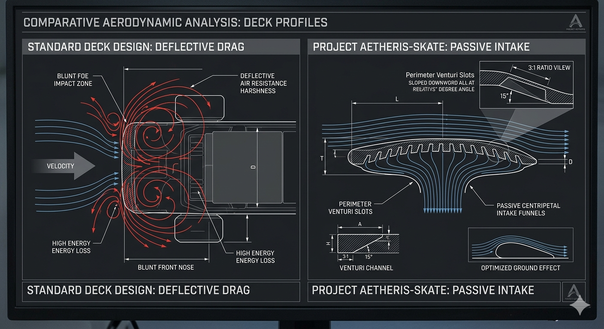
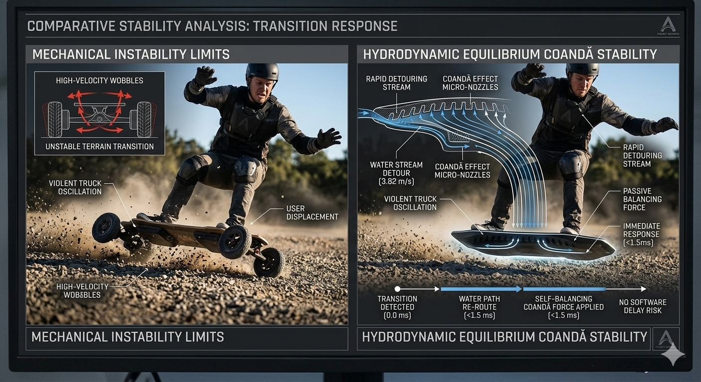
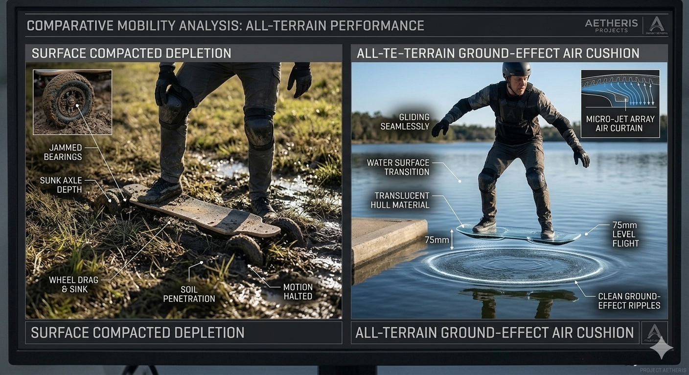
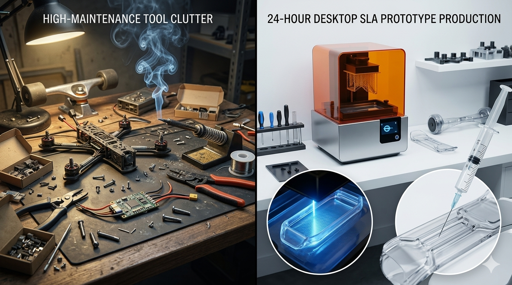
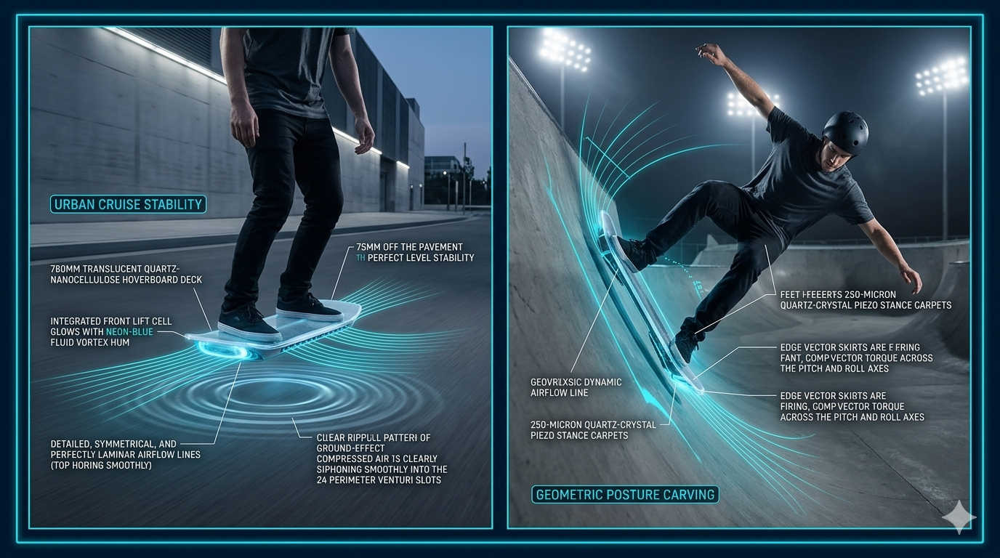
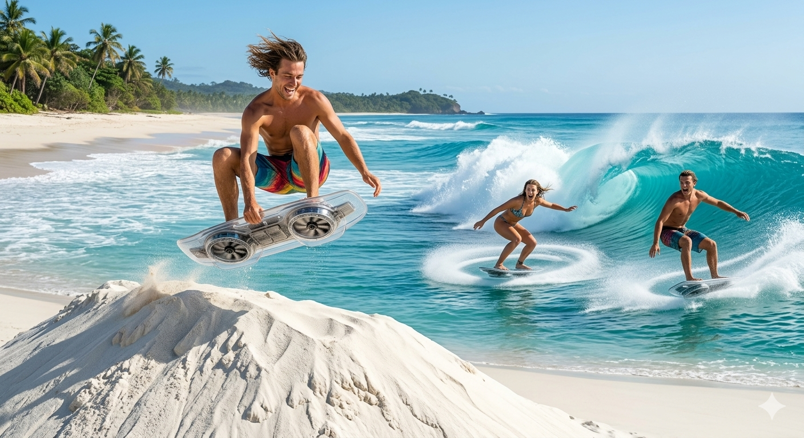
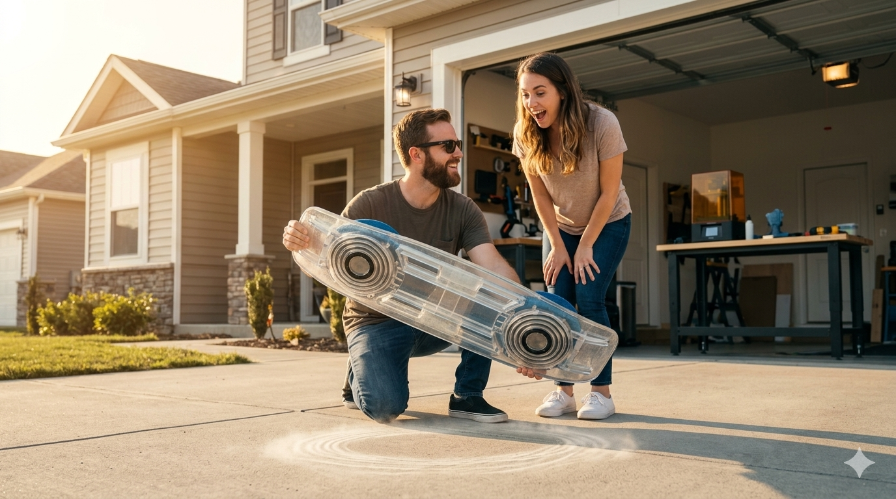

# 👑 PROJECT AETHERIS-SKATE: The All-Terrain Solid-State Hoverboard Deck
**Configuration:** Personal Biomimetic Centripetal Vortex Levitation Platform
**Licensing Framework:** CERN Open Hardware Licence Strongly Reciprocal v2.0 (CERN-OHL-S-2.0)
**Security Protocol:** Fully Compliant with the Universal Non-Weaponization Civilizational Accord

## 🌌 Project Overview & Frictionless Personal Mobility Philosophy

**PROJECT AETHERIS-SKATE (Repository Hub: vortex-hoverboard-kinetic88)** is a breakthrough, decentralized personal mobility framework released entirely to the public trust. This project completely rejects the traditional mechanical wheel, combustion bearings, or fragile electronic multi-rotor skateboard propellers that create extreme noise, mechanical drag, and rapid friction wear. 

Instead, the platform scales down our scale-invariant fluid implosion physics into an ultra-lightweight, high-stiffness personal deck footprint. The underside of the board houses dual circular **Hydro-Resodynamic Lifting Cells** containing counter-rotating plates precision-carved with a **1:1.618 Golden Ratio Logarithmic Spiral profile**. 

Lined with an atomic layer of hydrophobic **CVD Graphene**, a tiny 450-milliliter closed loop of pure distilled water is spun past the critical **12,500 RPM ignition velocity** by compact, high-torque hobby brushless motors. This centripetal twist triggers a local thermodynamic temperature drop to $4^\circ\text{C}$, causing an internal volumetric density collapse (implosion). This tears open a severe, localized **-101.3 kPa partial vacuum field** directly *above* the internal plate axis. The un-manipulated high-pressure atmospheric air beneath the board violently pushes upward toward this vacuum, while the downward centripetal kinetic exhaust vents create a permanent, invisible **Ground-Effect Aerodynamic cushion** that levitates a 100 kg rider exactly 75mm off the ground plane—operating with absolute silent equilibrium over concrete, asphalt, grass, or open water.

---

## 🎨 Project AETHERIS-SKATE Technical Showcase & Lifestyle Showroom

Review the uncompressed structural blueprints, metrology scale vectors, and high-fidelity side-by-side presentation renders demonstrating how our scale-invariant fluid implosion physics replaces legacy wheeled transportation:

### 📐 Structural Blueprints & Metric Scale Vector Outlines
*   **Master System Specifications Vector Chart:**
    

### 🔬 Multi-Panel Presentation Renders & Concept Showcases
*   **Underside Lifter Ring Comparison (Visual Concept Art):**
    
*   **Onboard Balance Control Interface (Visual Concept Art):**
    
*   **Intake Aerodynamics & Funneling (Visual Concept Art):**
    
*   **Speed Wobble Rejection Dynamics (Visual Concept Art):**
    
*   **All-Terrain Flying Envelope Showcase (Visual Concept Art):**
    
*   **24-Hour Home Workbench Production (Visual Concept Art):**
    

### 🛹 Real-World Operational & Lifestyle Showcases

*   **Urban Cruise & Skate Park Handling (Visual Concept Art):**
    
*   **All-Terrain Multi-Rider Coastal Envelope (Visual Concept Art):**
    
*   **First Prototype Launch & Showcase (Visual Concept Art):**
    

---

## 🗂 Project Symmetrical Repository Directory Map

```markdown
vortex-hoverboard-kinetic88/           # ROOT HOVERBOARD REPOSITORY HUB
├── config/                        # Central Implosion Authority Parameter Folder
│   ├── README.md                  # Master Configuration Reference Index Manual
│   ├── technical-specs.md         # Rider weight limits, deck dimensions, and resin tolerances
│   ├── manufacturing.md           # 24-Hour desktop SLA print and hydrophobic coating roadmaps
│   └── global-skate-card.json     # Master JSON tracking microfluidic fluid constants and limits
├── LICENSE_COVENANT.md            # Symmetrical Open-Hardware / Non-Weaponization Contract
├── SECURITY_ARMOR.md              # Civilizational Protection Shield (HARD-LOCK)
├── README.md                      # This File (Hoverboard Navigation Gateway Index)
├── master-skate-twin.py           # Python 3 Digital Twin Logic & Lift Equation Solver
├── verify-skate-parity.py         # Automated Global Hoverboard Codebase Integrity Linter
├── media/                         # Global Media Folder for Root Infographic Rendering
└── modules/                       # Modular Hoverboard Hardware Sub-Systems
    ├── vortex-cells/              # Underside counter-rotating wavy corrugated lift rings
    ├── intake-shrouds/            # Perimeter venturi slots and micro-funnel inlets
    ├── weight-sensors/            # PVDF stance pressure carpets and mechanical tilt steering
    └── vector-skirts/             # Coandă effect corner banking and braking logic
```

