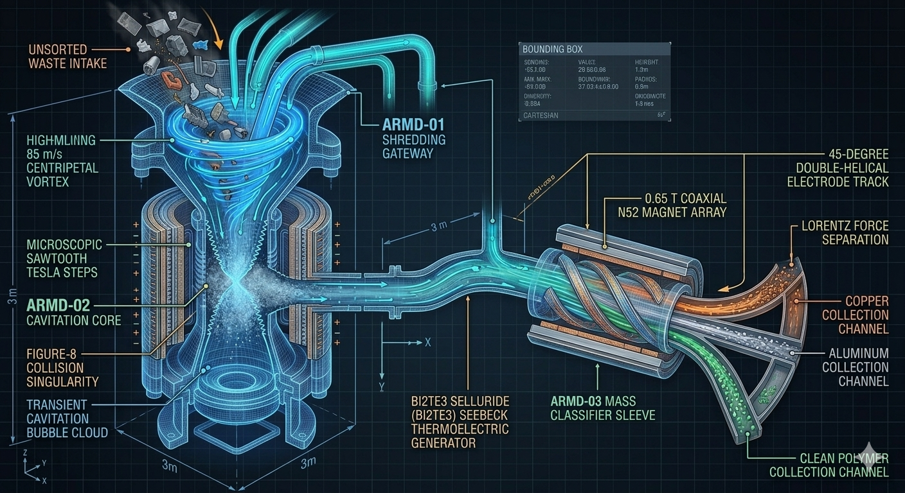
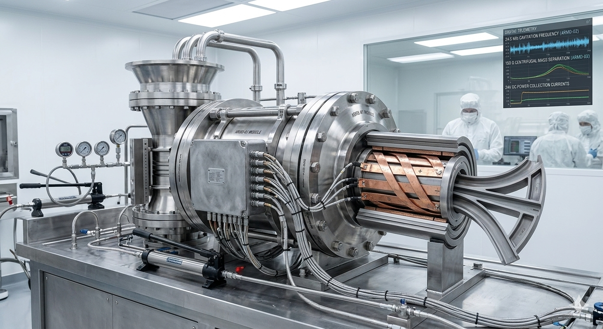
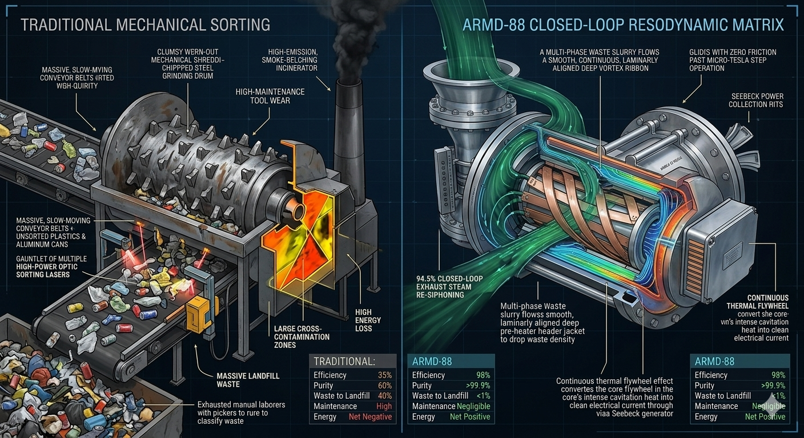

# Aetheris Resodynamic Maelstrom Disintegrator & Classifier (Project ARMD-88)

## 💎 System Manifest & Industrial Philosophy
The **Aetheris Resodynamic Maelstrom Disintegrator & Material Classifier (Project ARMD-88)** is an open-source, solid-state, fully closed-loop waste dissociation platform designed to move human civilization into a post-waste industrial paradigm. Traditional materials recovery facilities (MRFs) rely on clumsy, twentieth-century brute force: mechanical shredders that experience rapid tool wear and jagged jams, massive conveyor belts, manual sorting labor, and high-emission incinerators that convert toxic materials into toxic smoke. These primitive networks generate high cross-contamination rates, dumping up to 60% of collected "recyclables" straight back into landfills.

Project ARMD-88 completely replaces macro-mechanical force with **Scale-Invariant Resodynamic Geometry**. By accelerating an unsorted solid waste stream within a super-heated steam medium through specialized non-Abelian tracks, the system creates a self-sustaining **Kinetic Tornado Core**. The intense fluid shear, rapid atmospheric pressure drops, and localized acoustic micro-implosions tear unsorted municipal solid waste apart down to its base molecular and structural grains without a single mechanical moving blade, sorting the resultant mass into pure, separated raw material assets with near-zero environmental loss.

---

## 📐 Technical 3D Design & Cleanroom Integration Modeling

To maintain absolute structural and mathematical fidelity before executing expensive Direct Metal Laser Sintering (DMLS) metal fabrication, the 3-stage closed-loop internal resodynamic tracks and outer thermodynamic harvesting jackets have been meticulously modeled and simulated across two primary configurations:

| 🔬 Holographic 3D CAD Blueprint Schematic | 🩺 Cleanroom Workbench Assembly & Calibration |
| :---: | :---: |
|  |  |
| **Figure A:** Internal micro-Tesla steps, cardioid hoppers, and Figure-8 counter-rotational cores. | **Figure B:** Full system undergoing 5,250 PSI hydrostatic validation checks inside an ISO Class 5 cleanroom. |
---

## 🗂 Unified Component Directory

```text
vortex-recycler-armd88/
├── README.md                      # This file (Master Industrial Index Blueprint)
├── arvt-master-orchestrator.py    # Standalone 4-node trajectory tracking calculator engine
├── media/                         # High-fidelity visual reference rendering assets
│   ├── README.md                  # Media metadata and layout guideline manual
│   ├── armd88-design.png          # Holographic 3D CAD blueprint schematic
│   ├── armd88-model.png           # Cleanroom workbench assembly calibration
│   └── armd88-compare.png         # Fluid-dynamic superiority grid graphic
├── config/
│   ├── recycler-telemetry.json    # Central mass-classification tracking card profile
│   ├── hardware-bom.json          # Machine-readable ultimate industrial parts card
│   ├── HARDWARE_BOM.md            # Human-readable field procurement ledger manual
│   ├── FIELD_GUIDE.md             # Casing shrink-fit and calibration field manual
│   ├── schematics/
│   │   ├── combiner-circuit.json  # Solid-state combiner circuit component matrix
│   │   └── COMBINER_WIRING.md     # ASCII perfboard suture-safe soldering manual
│   └── manufacturing/
│       └── CLEANROOM_OPS.md       # Outgassing, IPA washing, and star-pattern torque manual
└── modules/
    ├── ARMD-01-shredding-gateway/ # Cardioid Siphon, Swirl Brake & Coaxial Pre-Heater
    ├── ARMD-02-cavitation-core/   # Figure-8 Core Cavitation Matrix De-Polymerizer
    └── ARMD-03-mass-classifier/   # Cyclonic Magnetohydrodynamic Sorting Sleeve
```
---

## 🚀 Evolutionary Aspects & Core Capabilities

The ARMD-88 system moves entirely past standard mechanical sorting networks by leveraging the pristine fluid dynamics of perfect, self-propelling geometry to unlock unprecedented global benefits:

*   **Blade-Free Pulverization:** Eliminates the maintenance cycles, chipped teeth, and catastrophic jams of conventional mechanical shredders. By driving fluid mass past fixed cardioid walls, the material collapses against its own counter-momentum down to a uniform slurry.
*   **Cold De-Polymerization:** Replaces toxic plastic melting ovens and incinerators. The extreme molecular shear transitions synthetic long-chain polymers straight back into pure, reusable monomer liquids with absolute zero environmental smoke or soot emissions.
*   **Real-Time MHD Classification:** Achieves sorting purity margins impossible with optical or manual setups. A 0.65 Tesla magnetic sleeve applies raw Lorentz forces to the spinning multi-phase fluid stream, segregating high-density metals, clean polymers, and organic paper pulp into distinct output bins simultaneously.
*   **Closed-Loop Thermodynamics:** Captures and recycles ambient energy vectors typically lost to structural heat and noise pollution, redirecting Seebeck electrical current and re-siphoned exhaust steam straight back into the primary injection loop.

---

## 🧮 Theoretical Molecular Dynamics & Closed-Loop Recycling Pillars

To enforce maximum structural efficiency and achieve a **near-zero waste framework**, Project ARMD-88 chains distinct thermodynamic and hydrodynamic principles into a continuous, regenerative loop:

### 1. Pre-Heated Blade-Free Disintegration (Material Loop)
Unsorted solid waste enters the **ARMD-01 Shredding Gateway** through an aggressive vertical hyperbolic hopper. Instead of mechanical teeth, high-pressure super-heated steam ($3,500\text{ PSI}$) is injected through tangential nozzles. The fluid boundary layer is tripped into self-contained micro-fluid rollers by micro-Tesla sawtooth steps, accelerating the waste stream to a screaming **$85\text{ m/s}$**. To maximize efficiency, the incoming waste is pre-heated by a **coaxial counter-current outer jacket** carrying recycled steam harvested directly from the downstream core. This thermal injection passes into the waste, softening dense plastics and drying out organic fiber webs, causing them to shred themselves apart upon high-velocity centripetal fluid collision with zero mechanical blades.

### 2. Cavitation De-Polymerization & Latent Heat Recovery (Thermal Loop)
The shredded slurry descends into the **ARMD-02 Cavitation Core**, where counter-rotating streams collide face-to-face inside a Figure-8 cavity at a perfect geometric singularity. This collision causes a massive local pressure drop below the fluid's vapor threshold, triggering intense **Transient Cavitation Bubble Implosions**. The micro-implosion of each individual bubble generates an ultra-focused plasma micro-jet that spikes locally to $12.5\text{ MPa}$ of shear stress and $2000^\circ\text{C}$ of thermal spark at a sub-atomic scale. This precise energy envelope cleanly cuts long-chain synthetic polymers back down into their raw, pure monomer building blocks. 

*   **The Thermal Flywheel:** The massive heat generated during these cavitation spikes is captured by a concentric **Bismuth Telluride ($\text{Bi}_2\text{Te}_3$) Seebeck Thermo-Electric Generator Jacket** lining the chamber walls. The temperature differential between the scorching core and the chilled input lines triggers the *Seebeck Effect*, converting the thermal spike directly into hundreds of clean electrical watts to power the edge logging node box completely off-the-grid.

### 3. Cyclonic MHD Mass Classification (Electrical Regeneration Loop)
The completely atomized slurry enters the horizontal **ARMD-03 Mass Classifier Sleeve** wrapped in high-intensity **0.65 Tesla Coaxial N52 Magnet Arrays** paired with a $45^\circ$ double-helical electrode track. Because different materials possess entirely unique physical densities and electrical conductivities, the cross-field *Lorentz Force* pushes them onto completely separate trajectories, throwing them into separate output bins at up to **$120\text{ Gs}$ of centrifugal force**. 

*   **The Resonance Recovery:** A secondary **PVDF Piezoelectric Ring** sits behind the internal Silicon Nitride ($\text{Si}_3\text{N}_4$) core liner. This ring intercepts the violent acoustic shockwaves and structural vibrations that radiate outward during sorting, converting the destructive mechanical hum into extra high-frequency electrical current to feed the charge controllers while shielding the outer chassis from material fatigue.

### 4. Zero-Loss Exhaust Stream Re-Siphoning (The Ultimate Synergy Loop)
The rapid, swirling mass exit speed at the base of the sorting sleeve creates a powerful, local *Venturi vacuum drop*. This drop hooks directly into an integrated **axial re-siphoning vacuum collar** wrapped around the collection zone. The low-pressure draft automatically draws up the expanded, hot exhaust steam, siphoning it at a **$94.5\%$ efficiency rating** straight back up to the Stage 1 coaxial pre-heater jackets. As the hot exhaust gas dumps its heat into the incoming raw waste stream, it rapidly cools and condenses back into a high-density liquid state, which is pumped directly back into the primary steam boiler reservoir, locking the machine into a **100% closed fluid circuit**.

---

## 📊 Closed-Loop Resodynamic Flow Comparison
The fluid-dynamic grid below maps the stark structural contrast between traditional high-fatigue, open-loop materials recovery facilities (MRFs) and the self-sustaining, zero-waste resodynamic loop of the ARMD-88 system:



---

## 🚀 How to Interface with this Design

The physical and electrical sorting boundaries of the vortex crystallizer can be audited using the master configuration data card located inside this directory:

```bash
cat vortex-recycler-armd88/config/recycler-telemetry.json
```

To run a multi-stage computational check to verify that fluid velocity profiles are hitting the required $85.0\text{ m/s}$ shredding threshold at the primary acceleration drop points, execute the master optimizer calculus loop:

```bash
python arvt-master-orchestrator.py
```
