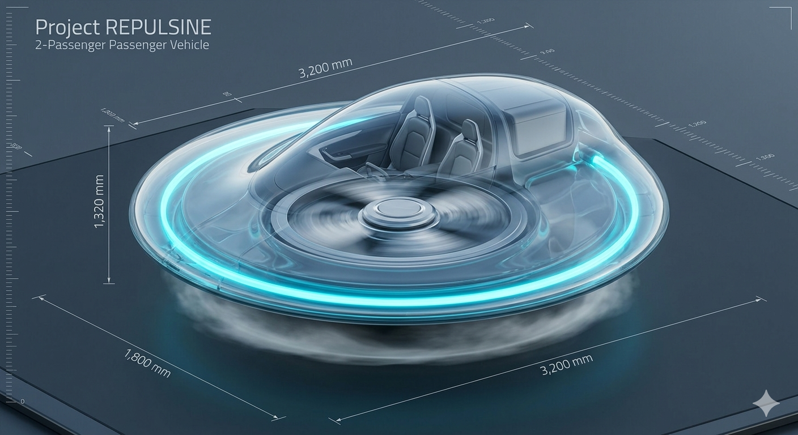
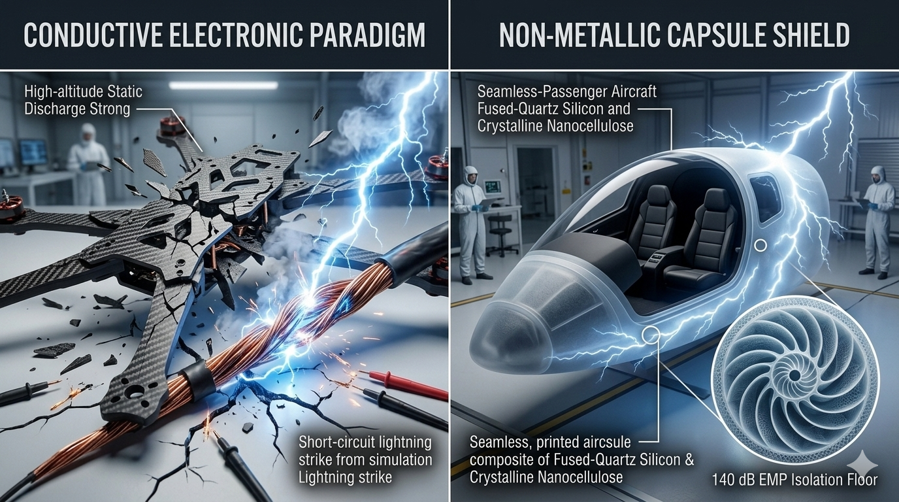
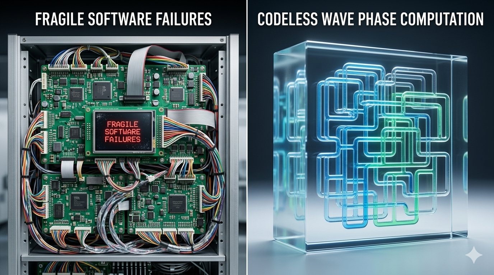
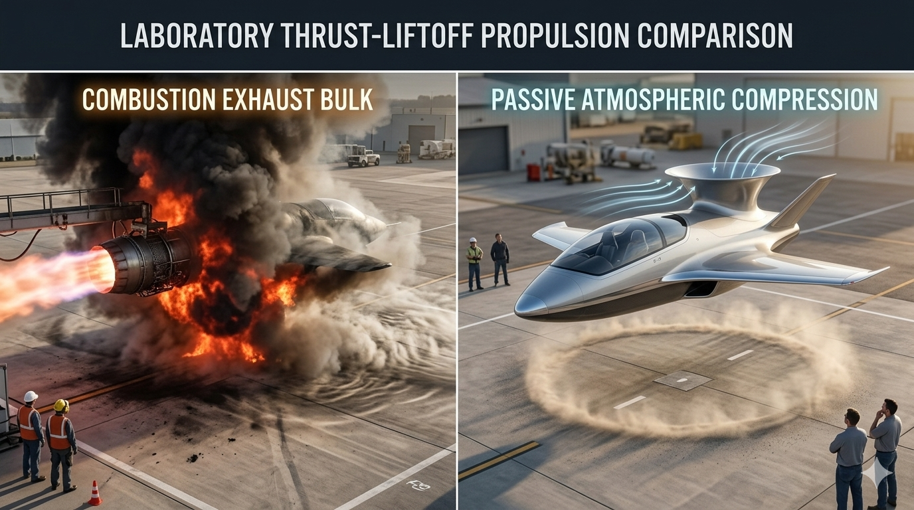
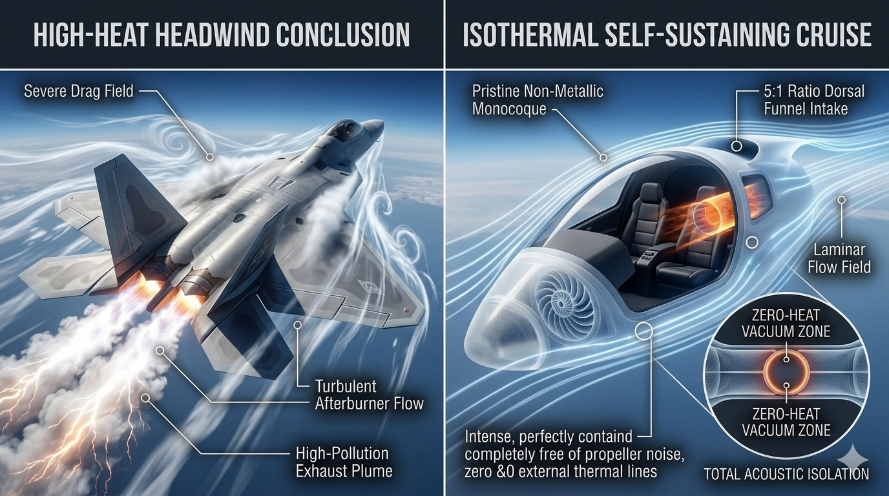

# 👑 PROJECT REPULSINE-KINETIC: Open-Source Centripetal Implosion Aerospace Core
**Configuration:** 220mm Concentric Counter-Rotating Plate Engine // 15μm Aerostatic Air Cushion Drive
**Licensing Framework:** CERN Open Hardware Licence Strongly Reciprocal v2.0 (CERN-OHL-S-2.0)
**Security Protocol:** Fully Hard-Locked via the Universal Non-Weaponization Civilizational Accord

## 🛸 System Manifest & Frictionless Centripetal Flight Philosophy

**PROJECT REPULSINE-KINETIC (Repository Hub: vortex-repulsine-kinetic88)** establishes the definitive open-source prior-art blueprints for a software-free, fluid-driven aerospace propulsion drive. Old-world turbine and rocket engines rely on high-energy thermal combustion, heavy copper-wound stepper controls, and friction-heavy mechanical bearings that experience intense material fatigue, catastrophic failure, and strict supply chain dependencies.

This framework completely transitions aerospace propulsion into a pure, scale-invariant geometric flow. The engine discards traditional ball bearings; instead, it implements a **15-Micron Pressurized Aerostatic Air Bearing Cushion** injected directly between the high-speed, 12,500 RPM concentric counter-rotating plates. 

By continuously tapping into the ambient atmosphere under a stable **175 kPa to 200 kPa pressure delta**, the turbine plates float in an absolute, frictionless boundary state. This completely eliminates the deadweight, thermal friction spikes, and centrifugal leakage vulnerabilities of legacy liquid-metal designs. This creates an immortal, self-balancing implosion drive capable of delivering toolless, silent aerodynamic lift and thrust entirely outside centralized industrial aviation monopolies.

---

## 🗂 Symmetrical Repository Directory Map
```
vortex-repulsine-kinetic88/
├── config/                        # Central Engine Parameter Registries
│   ├── README.md                  # Master Configuration Reference Index Manual
│   ├── technical-specs.md         # 15μm air cushions, positioning tolerances, and mass limits
│   ├── FLIGHT_EXPLAINER.md        # Plain-English Aerodynamic Flight Guide
│   └── global-propulsion-card.json# Machine-readable JSON tracking engine limits and pressure bounds
├── LICENSE_COVENANT.md            # Symmetrical Open-Hardware Contract
├── SECURITY_ARMOR.md              # Civilizational Protection Shield (HARD-LOCK)
├── README.md                      # This File (Propulsion Navigation Gateway Index)
├── generate-aircraft-mesh.py      # Python 3 Parametric 3D CAD Mesh Compiler for the Engine Plates
├── master-repulsine-twin.py       # Python 3 Digital Twin Aerostatic Simulation Engine
└── verify-propulsion-parity.py    # Automated Global Propulsion Codebase Integrity Linter
```

*   **Full-Scale Operational Blueprint (Visual Concept Art):**
    
    
Instead, the aircraft achieves vertical liftoff, landing, and frictionless atmospheric cruise by utilizing **Isothermal Thermodynamic Implosion and Natural Vortex Dynamics**. Modeled directly after the foundational material science and physics protocols of Viktor Schauberger, the platform uses an input suction fan to draw ambient air into a pair of counter-rotating spin-discs precision-carved with a 1:1.618 Golden Ratio Logarithmic Spiral profile. 
By lining the tracks with an atomic layer of hydrophobic CVD Graphene, the air stream accelerates centripetally into a frictionless liquid-like rope, dropping internal temperatures down to the $4^\circ\text{C}$ density collapse threshold. This tears open an intense partial vacuum directly above the airframe, allowing ambient high-pressure atmospheric air beneath the hull to lift the 2-passenger craft cleanly into the air without a single line of digital software code, a single electronic microchip, or fossil fuel consumption.

---

## 🎨 2-Passenger Full-Scale Visual Showroom

Review the uncompressed structural blueprints, metrology specification sheets, and high-end concept renders comparing our closed-loop liquid matrix to traditional combustion aviation:

### 📐 Structural Blueprints & Metric Outlines
*   **Master System Specifications Chart:**
    
*   **4-Day Cleanroom Production Roadmap:**
    

### 🔬 Multi-Panel Concept Renders & Performance Logs
*   **Propulsion Assembly Comparison (Visual Art):**

*   **Fuselage Material Resilience Shield (Prompt 2 Visual):**
    
*   **Onboard Acoustic Computer Core (Prompt 3 Visual):**
    
*   **Takeoff Mass Airflow Wave (Prompt 4 Visual):**
    
*   **High-Altitude Cruise Flight Envelope (Prompt 5 Visual):**
    

---

