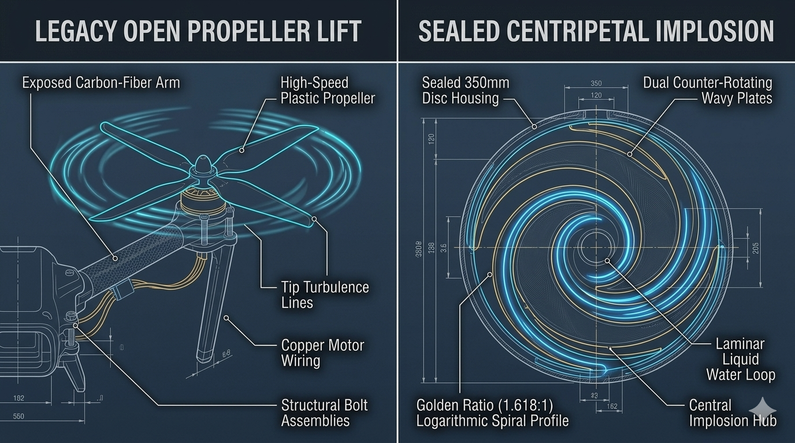
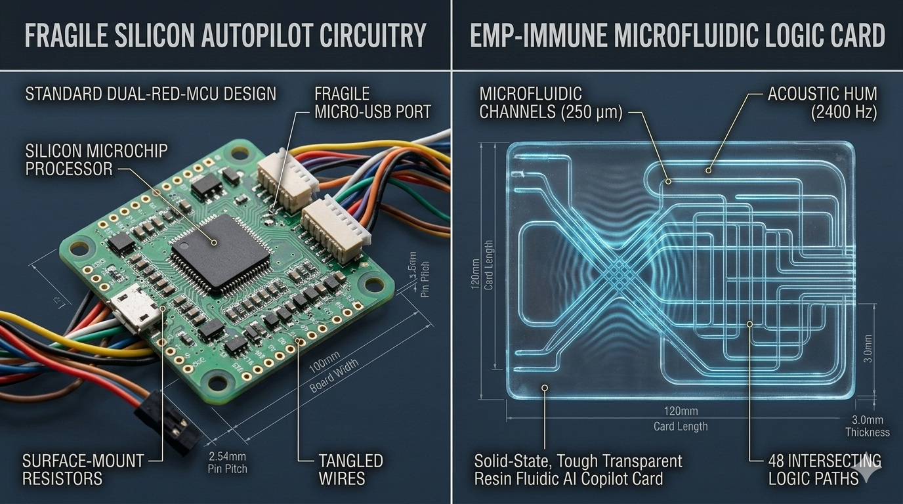
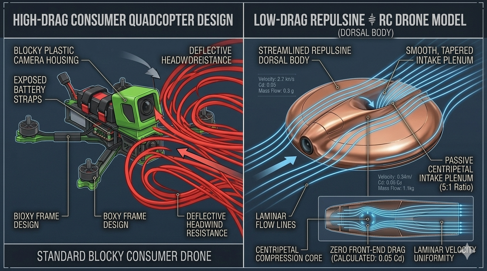
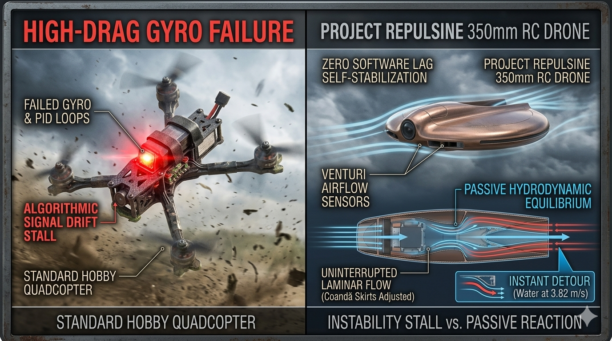
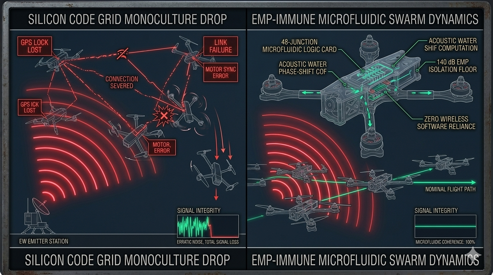
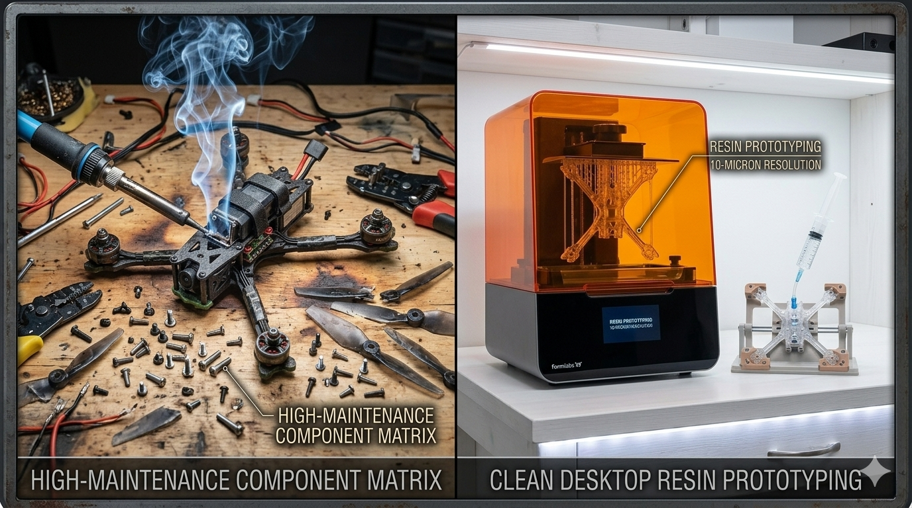

# Project REPULSINE: Local Drone Scale Media Asset Ledger

This directory serves as the centralized repository for all visual assets, frame layout renders, microfluidic scaling charts, and electronic warfare test records for the **Scale-Invariant Benchtop RC Drone Module (Module: drone-scale)**.

---

## 📂 Local Visual Showroom Asset Ledger

All drone-specific image assets are uploaded and served natively from this local folder to ensure the module remains a standalone, modular package:

1. **`README.md`**
   * *Asset Class:* Drone Media Reference Index Manual
2. **`grid88-drone-scale.svg`**
   * *Asset Class:* Uncompressed Scale Drone Blueprint Vector
   * 
3. **`grid88-drone-propulsion-comparison.png`**
   * *Asset Class:* High-End Concept Render (Prompt 1 Output)
   * 
4. **`grid88-drone-avionics-comparison.png`**
   * *Asset Class:* High-End Concept Render (Prompt 2 Output)
   * 
5. **`grid88-drone-intake-comparison.png`**
   * *Asset Class:* High-End Concept Render (Prompt 3 Output)
   * 
6. **`grid88-drone-stability-comparison.png`**
   * *Asset Class:* High-End Concept Render (Prompt 4 Output)
   * 
7. **`grid88-drone-swarm-jamming-comparison.png`**
   * *Asset Class:* High-End Concept Render (Prompt 5 Output)
   * 
8. **`grid88-drone-workbench-comparison.png`**
   * *Asset Class:* High-End Concept Render (Prompt 6 Output)
   * 

---

## 🖨️ Programmatic Compilation Tools

*   **`generate-blueprint.py`:** Standalone Python script that programmatically compiles, verifies, and draws the uncompressed 350mm drone frame layout vector blueprint.
