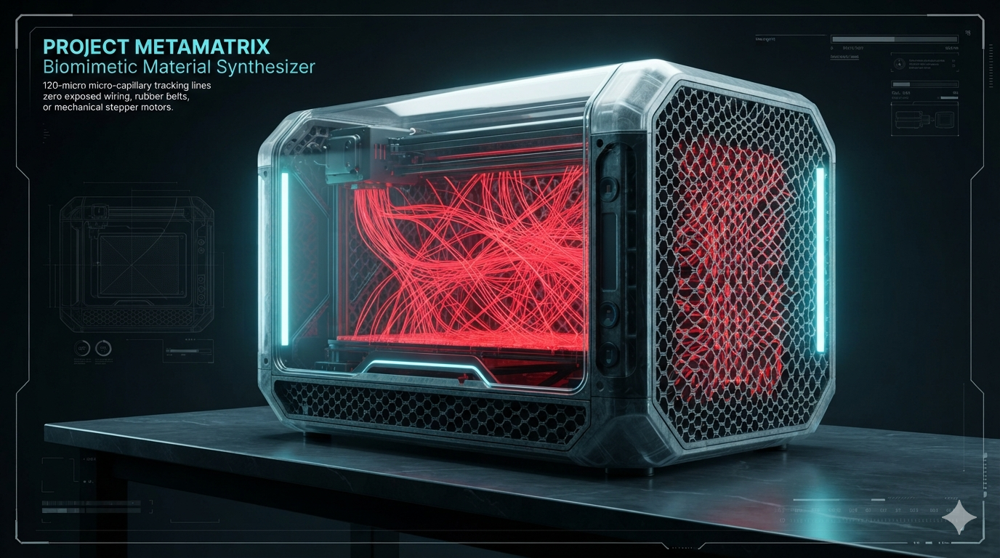
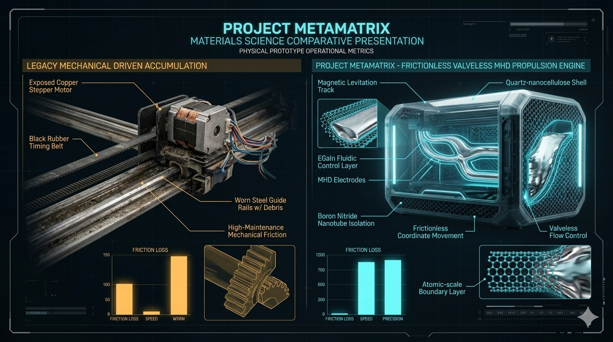
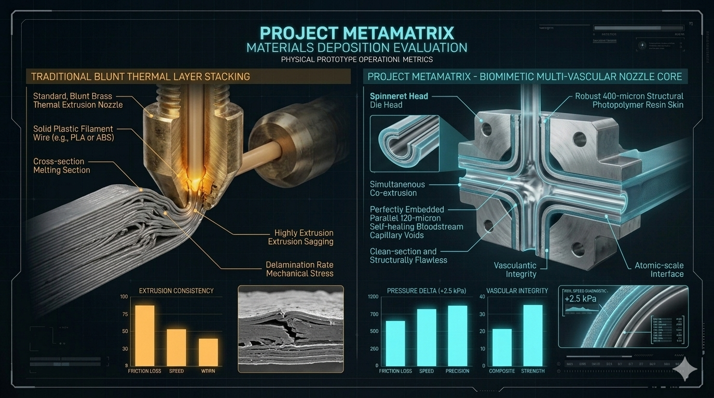
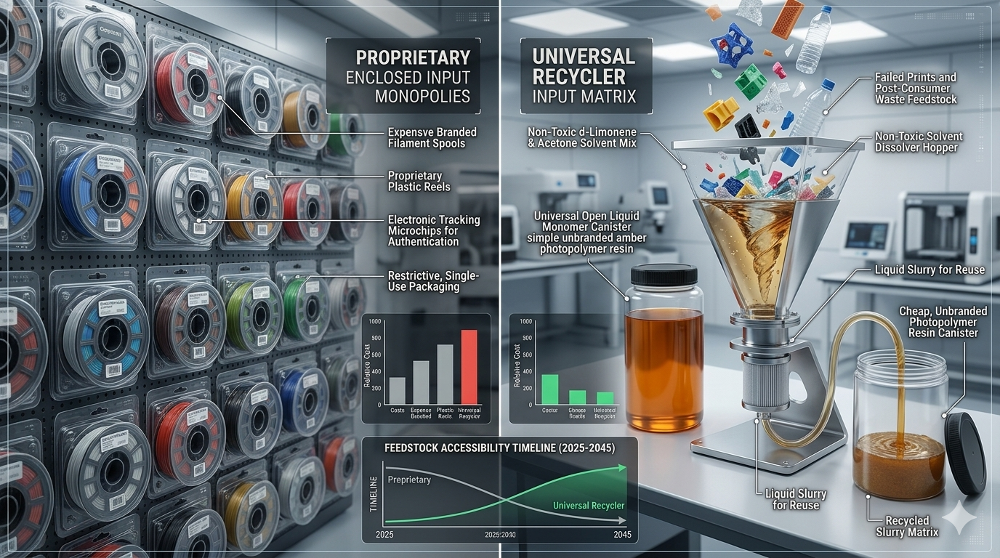
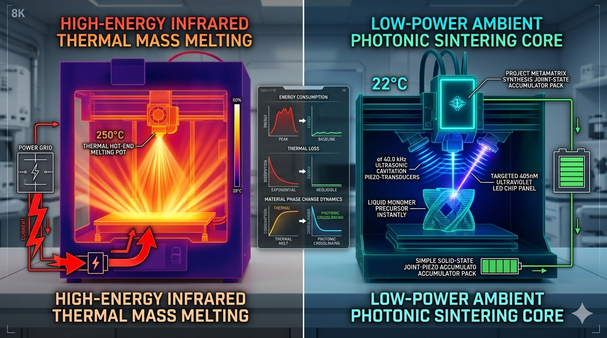

# 👑 PROJECT METAMATRIX: Open-Source Biomimetic Material Synthesizer
**Configuration:** Valveless Magnetohydrodynamic Coordinate Chassis // Multi-Vascular Printing Head
**Licensing Framework:** CERN Open Hardware Licence Strongly Reciprocal v2.0 (CERN-OHL-S-2.0)
**Security Protocol:** Fully Hard-Locked via the Universal Non-Weaponization Civilizational Accord

## 🛡️ System Manifest & Universal Material Synthesis Philosophy

**PROJECT METAMATRIX (Repository Hub: vortex-synthesizer-mmx88)** establishes the definitive open-source prior-art blueprints for a self-healing, fluid-driven 3D material synthesizer. Old-world manufacturing hardware is intentionally designed around an exclusionary, high-cost framework: it relies on high-maintenance stepper motors, brittle brass thermal nozzles, and fragile electronic controllers that lock manufacturing behind centralized corporate supply chains and software licenses.

This project completely democratizes localized fabrication by mimicking the structural growth laws of nature. The synthesizer completely discards traditional mechanical drive components, utilizing a **Valveless Magnetohydrodynamic (MHD) Fluidic Circuit** to move the print head with $\pm 1.0\mu m$ laser tolerances in absolute silence. 

The print array implements a **Multi-Vascular Capillary Spinneret Head** that programmatically co-extrudes rigid auxetic hardfacing structures right alongside the integrated **120-micron pressure-reactive self-healing lifelines** in a single, unified printing pass. By curing the tough resin medium using ambient room-temperature ultrasonic photonic cavitation, this machine functions as an immortal, self-repairing production node capable of mass-producing un-hackable civilizational survival assets entirely outside centralized grid monopolies.

---

## 🎨 Project METAMATRIX Technical Showcase & Sintering Showroom

Review the uncompressed structural blueprints, metrology scale vectors, and high-fidelity side-by-side presentation renders demonstrating how our valveless fluid propulsion and ambient cavitation physics replaces legacy manufacturing vulnerabilities:

### 📐 Mechanical Blueprints & Metric Scale Vector Outlines
*   **Master System Specifications Vector Chart:**
    

### 🛰️ First Operational Prototype Showcase
*   **Complete System Metamaterial Chassis (Prompt 1 Visual):**
    

### 🔬 High-Fidelity Multi-Panel Presentation Comparisons
*   **Valveless MHD Coordinates vs. Mechanical Belts (Visual):**
    
*   **Multi-Vascular Spinneret Head vs. Standard Brass Nozzles (Visual):**
    
*   **Open Liquid Canister Recycler vs. Closed Filament Spools (Visual):**
    
*   **Ambient Photonic Cavitation vs. High-Power Hot Thermal Fusing (Visual):**
    

---

# 👑 PROJECT METAMATRIX: Open-Source Biomimetic Material Synthesizer


---

## 🗂 Symmetrical Repository Directory Map
```
vortex-synthesizer-mmx88/
├── config/                        # Central Synthesizer Parameter Registries
│   ├── README.md                  # Master Configuration Reference Index Manual
│   ├── technical-specs.md         # MHD fluid velocities, positioning tolerances, and wave limits
│   ├── SYNTHESIS_EXPLAINER.md     # Plain-English Material Synthesizer Guide
│   └── global-matrix-card.json    # Machine-readable JSON tracking scale dimensions and pulse bounds
├── LICENSE_COVENANT.md            # Symmetrical Open-Hardware Contract
├── SECURITY_ARMOR.md              # Civilizational Protection Shield (HARD-LOCK)
├── README.md                      # This File (Synthesizer Navigation Gateway Index)
├── generate-synthesizer-mesh.py   # Python 3 Parametric 3D CAD Mesh Compiler for the Chassis Blocks
├── verify-matrix-parity.py        # Automated Global Synthesizer Codebase Integrity Linter
└── media/                         # Global Media Folder for Production Outlines
```
