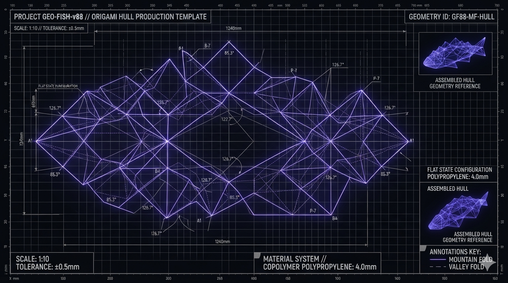
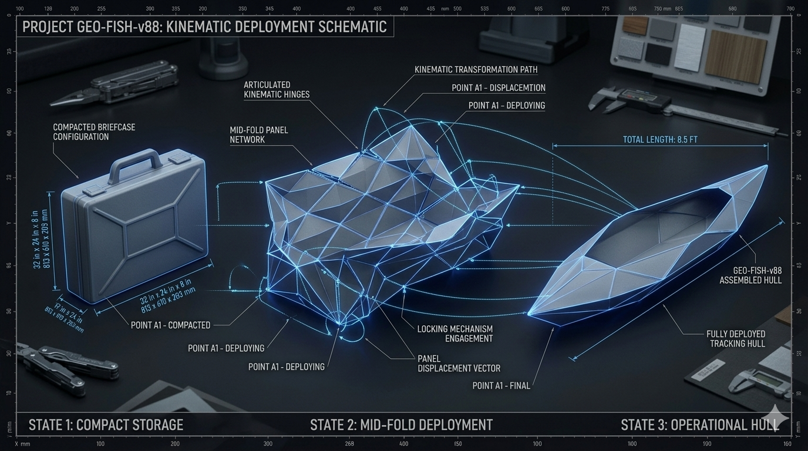
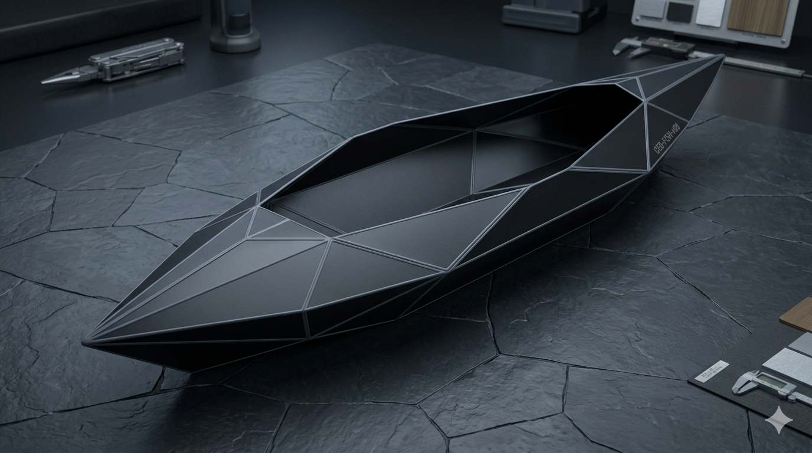
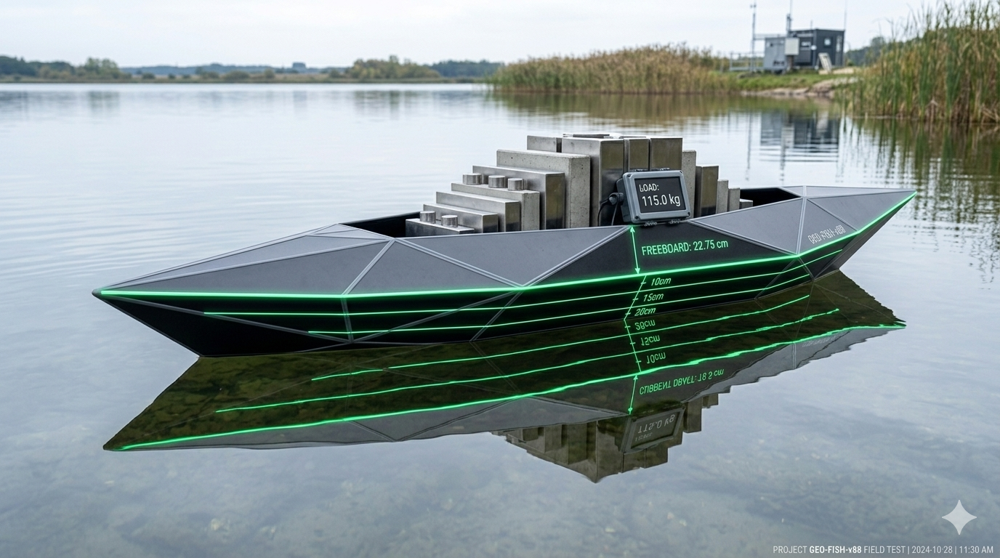
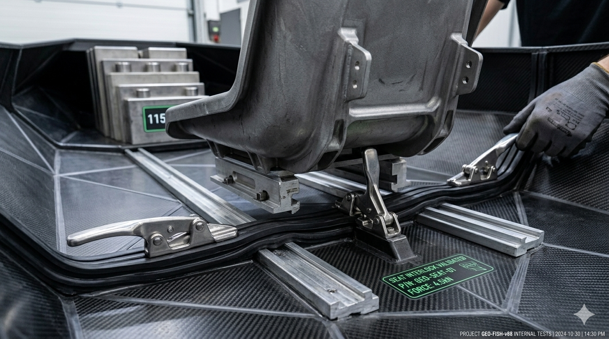
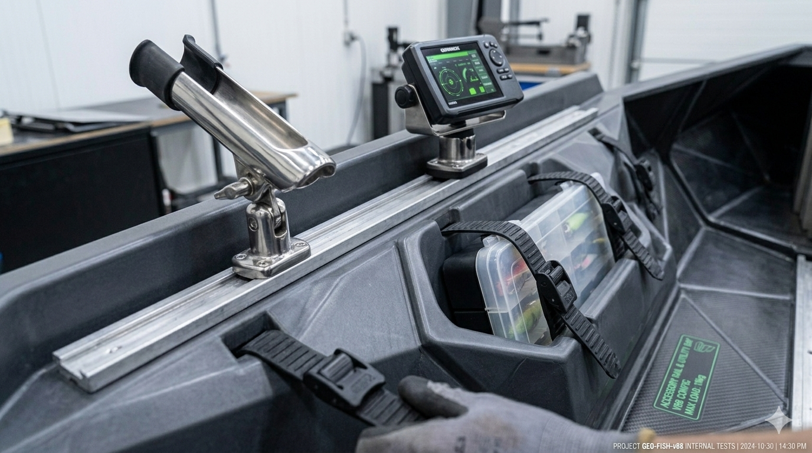

# Project GEO-FISH-v88: High-Density Rigid Origami Tactical Fishing Vessel

## 💎 Project Overview & Mathematical Origami Manifesto

**Project GEO-FISH-v88 (Vessel Layer: geofish88)** is a production-grade, open-source hardshell personal watercraft designed specifically for ultra-compact trunk transportation, rapid solo deployment, and elite flat-water fishing utility. The entire system completely rejects traditional portable boat assembly bottlenecks, such as puncture-prone inflatable air bladders, loose assembly bolts, structural wing-nuts, or complex external framing rails. 

Instead, the platform relies entirely on **perfect non-Euclidean rigid origami geometry**. By engineering a continuous topological sheet using a custom modified **Miura-ori tessellation grid**, the vessel acts as a kinetic metamaterial. The entire hull collapses flat into a self-contained, protective hardshell case footprint ($32\text{ in} \times 24\text{ in} \times 8\text{ in}$) that fits effortlessly inside any standard sedan trunk. When unlatched and pulled outward via integrated dual corner grab-handles, a simultaneous mechanical chain reaction occurs: every mountain and valley fold expands instantly, snapping the structure into a razor-rigid, $8.5\text{-foot}$ hydrodynamic watercraft in under 30 seconds with zero loose parts.

---

## 🎨 Project GEO-FISH-v88 Integrated Visual Showroom

Review the verified architectural blueprints, kinematic transform simulations, and field validation captures for the fully expanded rigid hardshell fishing vessel:

### 📐 Mechanical Folding Schematics & Geometric Trajectories
*   
*   

### 🚣 Hydrodynamic Profile & Waterline Stability Validations
*   
*   

### 🎣 Angler Integration & Modular Utility Layouts
*   
*   

---

## 🧭 Quick Navigation Dashboard Matrix

| **⚙️ Platform Layers** | 🔗 **Blueprint Specification Modules** | 🔗 **Checklists & Production Logs** | 🔗 **Machine-Readable Run Cards** |
| :--- | :--- | :--- | :--- |
| **📁 Root Hub** | 📑 `README.md` (This File) | 📜 `LICENSE_COVENANT.md` | 🐍 `geofish88-geometry-twin.py` |
| **📐 Origami Chassis** | 🔗 [Origami Hull Specs](modules/hull-origami/README.md) | 🔗 [Crease Coordinates](modules/hull-origami/config/crease-matrix.md) | 🔗 [Panel Run Cards](modules/hull-origami/config/hardware-bom.json) |
| **🧲 Lock & Latch** | 🔗 [Locking Mechanisms](modules/hull-locking/README.md) | 🔗 [Compression Checklists](modules/hull-locking/config/SEAL_INTEGRITY.md) | 🔗 [Latch Run Cards](modules/hull-locking/config/hardware-bom.json) |
| **🪑 Seat & Track** | 🔗 [Bulkhead Seating Specs](modules/hull-seating/README.md) | 🔗 [Accessory Mount Logs](modules/hull-seating/config/TRACK_ALIGNMENT.md) | 🔗 [Mount Run Cards](modules/hull-seating/config/hardware-bom.json) |
| **🌊 Hydrodynamics** | 🔗 [Hydro Performance Specs](modules/hull-hydro/README.md) | 🔗 [Buoyancy Curve Data](modules/hull-hydro/config/DISPLACEMENT_LOGS.md) | 🔗 [Drag Run Cards](modules/hull-hydro/config/hardware-bom.json) |
| **📋 Procedures** | 🔗 [Operation Manuals](modules/vessel-procedures/README.md) | 🔗 [Unpack & Fold Checklists](modules/vessel-procedures/config/MISSION_CHECKLISTS.md) | 🔗 [Phase Run Cards](modules/vessel-procedures/config/hardware-bom.json) |
| **🖨 Prototyping** | 🔗 [Prototyping Staging Specs](modules/vessel-prototyping/README.md) | 🔗 [4-Day Production Run Logs](modules/vessel-prototyping/config/FABRICATION_TIMELINE.md) | 🔗 [CNC Run Cards](modules/vessel-prototyping/config/hardware-bom.json) |
| **⚡ Upgrades**       | 🔗 [Rigging Vault Specs](modules/vessel-upgrades/README.md) | 🔗 [Community Fishing Mods](modules/vessel-upgrades/config/FISHING_MODS.md) | 🔗 [Mod Control Cards](modules/vessel-upgrades/config/hardware-bom.json) |
| **📏 Metrology**      | 🔗 [Master Metrology Specs](modules/vessel-specs/README.md) | 🔗 [Dimensional Ledgers](modules/vessel-specs/config/HARDWARE_SPEC_LEDGER.md) | 🔗 [Spec Control Cards](modules/vessel-specs/config/hardware-bom.json) |

---

## 🗂 Project Repository Directory Structure

```markdown
vortex-vessel-geofish88/               # ROOT REPOSITORY HUB
├── LICENSE_COVENANT.md            # Symmetrical Open-Hardware/Non-Weaponization Contract
├── README.md                      # This File (Global Navigation Gateway Index)
├── geofish88-geometry-twin.py     # Python 3 Digital Twin Kinematics & Stability Model
├── media/                         # Global Media Folder for Root Asset Rendering
│   ├── README.md                  # Root Media Asset Specification Index Manual
│   ├── geofish88-vessel-schematic.png
│   ├── geofish88-vessel-transform.png
│   ├── geofish88-vessel-expanded.png
│   ├── geofish88-vessel-waterline.png
│   ├── geofish88-vessel-bulkhead.png
│   └── geofish88-vessel-utility.png
└── modules/                       # Modular Sub-Platform Architecture
    ├── hull-origami/              # Continuous polypropylene panel folding & crease geometries
    ├── hull-locking/              # Over-center mechanical toggle latches & high-compliance seals
    ├── hull-seating/              # Load-bearing seat bulkheads & integrated accessory gear tracks
    ├── hull-hydro/                # Volumetric buoyancy analysis & hydrodynamic drag polars
    ├── vessel-procedures/         # Step-by-step checklists for Unpacking, Deploying, & Re-folding
    └── vessel-prototyping/        # 4-Day cleanroom prototype staging & CNC scoring parameters
```

---

## 🔬 Core Physical & Material Threshold Limits

To certify full structural safety parameters before committing any hull panel modification to local manufacturing runs, your slicing software, CNC tooling setups, and testing rigs must enforce these mathematical boundaries:

*   **Material Compound Profile:** Panels must utilize $4.0\text{ mm}$ continuous extruded high-density copolymer polypropylene ($HDPE-PP$) treated with a minimum 3% active UV-stabilizer compound depth [v1].
*   **Live-Hinge Fatigue Threshold:** Co-extruded flexible elastomeric crease lines must be rated for a minimum of $50,000$ consecutive 180-degree folding stress cycles without localized molecular cross-link tearing or tensile strength fatigue decay.
*   **Volumetric Displaced Buoyancy:** Fully locked geometric transformation structures must yield a minimum structural displacement volume of $0.455\text{ m}^3$, providing a verified payload ceiling rating of $295.21\text{ kg}$ before gunwale swamping limits are reached.

